# Deploying a Java Application from GitHub to AWS App Runner

AWS App Runner is an AWS service that provides a fast, simple, and cost-effective way to deploy from source code or a container image directly to a scalable and secure web application in the AWS Cloud. This is a fully managed, pay as you go service.

You can use AWS App Runner to create and manage services based on two fundamentally different types of service source: source code and source image. Regardless of the source type, App Runner takes care of starting, running, scaling, and load balancing your service. You can use the CI/CD capability of App Runner to track changes to your source image or code. When App Runner discovers a change, it automatically builds (for source code) and deploys the new version to your App Runner service.

App Runner connects directly to your code or image repository. It provides an automatic integration and delivery pipeline with fully managed operations, high performance, scalability, and security.

If you're a developer, you can use App Runner to simplify the process of deploying a new version of your code or image repository.

For operations teams, App Runner enables automatic deployments each time a commit is pushed to the code repository or a new container image version is pushed to the image repository.

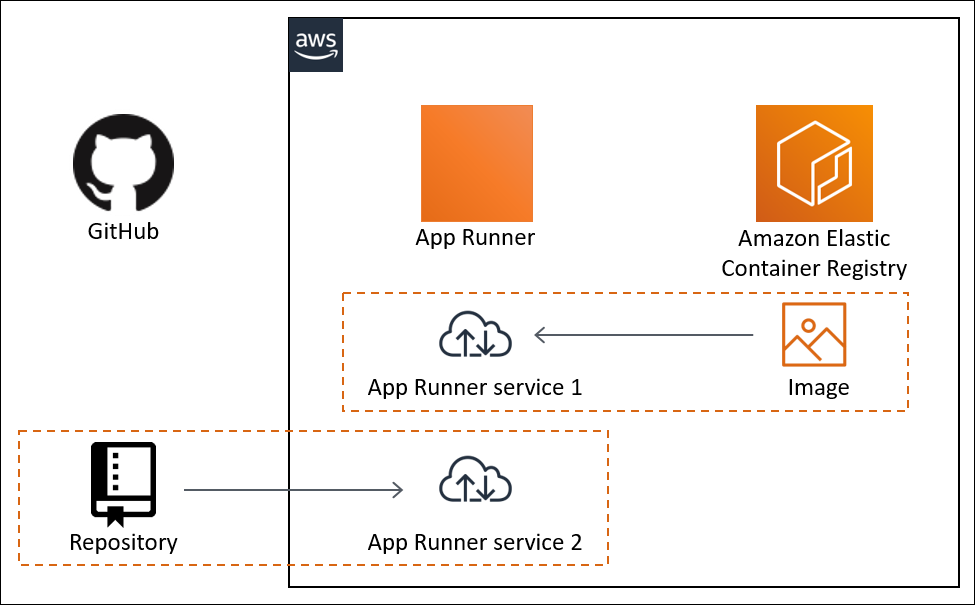

In this article, we will walk through the process of deploying a Java application directly from a GitHub repository to AWS AppRunner.  

## Step 1: Prepare the GitHub Repository

Prepare your code and test it locally. Set up a GitHub repo and push your code to it. I am using a simple Java Spring Boot app which connects to a DynamoDB table and shows random movie or book quotes on the web page, users can click a button and see another quote also.

Code for this app is present at [QuoteApp](https://github.com/sauveerk/quoteapp). I am using apprunner branch for this article.

## Step 2: Create an App Runner Service

- Search for App Runner in AWS Console. On App Runner page, click Create Service button. We can select the source either a code repository (GitHub or BitBucket) or a container registry (AWS Elastic Container Registry). 

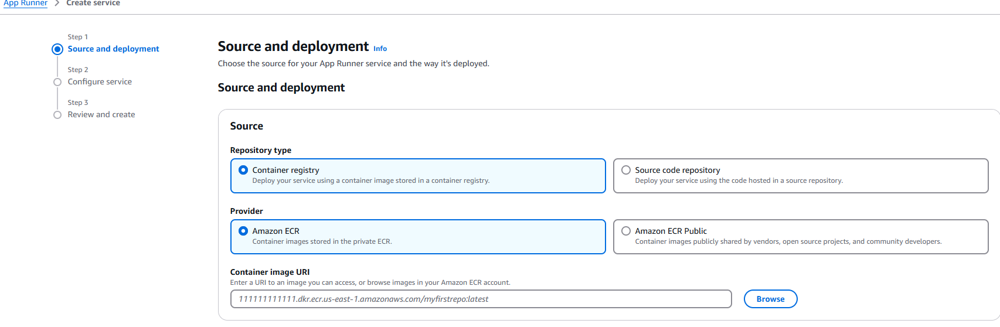

- I have selected GitHub. I already have a connection to my GitHub account, if you don't have one, click on Create New and follow the instructions. Select repository, branch and source directory.

 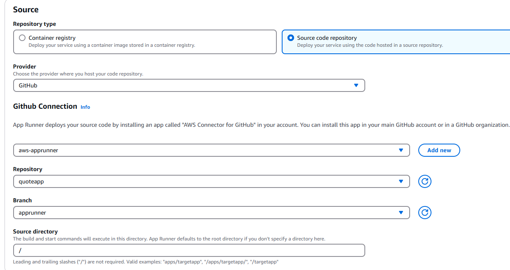

- Select Deployment Settings as automated, as we want our deployment to be triggered whenever we push new code to GitHub.

- On next page, we can provide build configuration. It can be configured in the console, or using a configuration file apprunner.yaml. I have provided the details in the console.
  
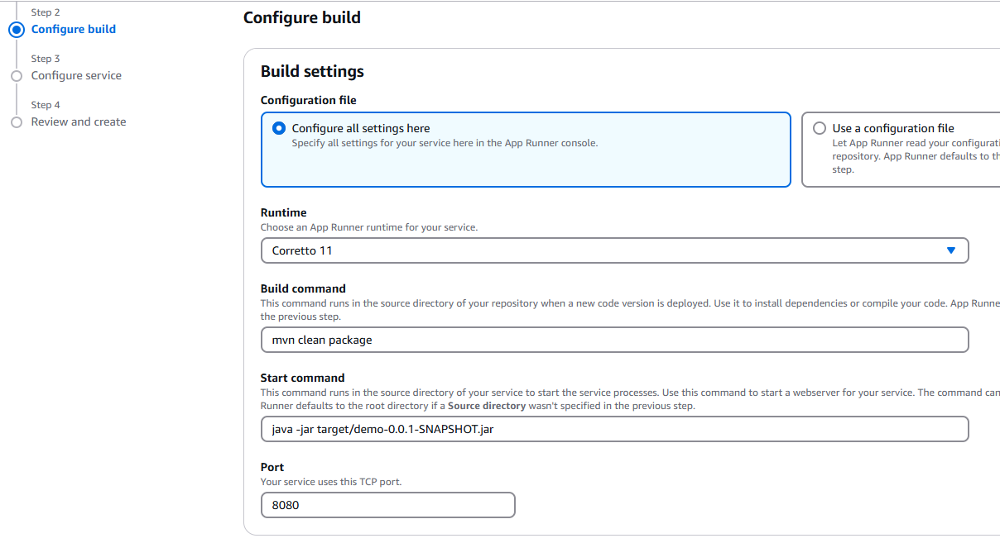

- Alternatively, we can also provide details in apprunner.yml file in root directory of our source code. If you are familiar with buildspec.yml file being used by AWS CodeBuild, it is similar. It can have CI steps like test, build, etc.

```yml
version: 1.0
runtime: corretto11
build:
  commands:    
    build:
      - mvn clean package
run:                              
  command: java -jar target/demo-0.0.1-SNAPSHOT.jar
```
- On next page, we need to provide service configuration details - CPU and RAM, autoscaling, Health Check, Security, Networking, Observability, etc. I have left everything as default, except Security.

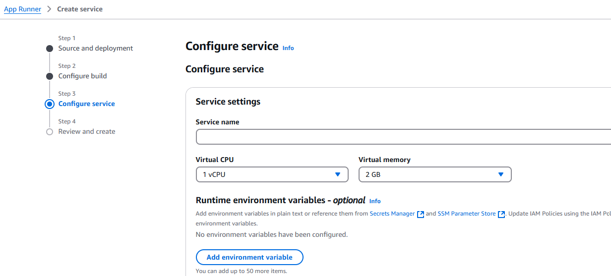

- As my application is accessing DynamoDB, it needs IAM permissions, under Security section, we can mention an instance profile which can be used by the application.

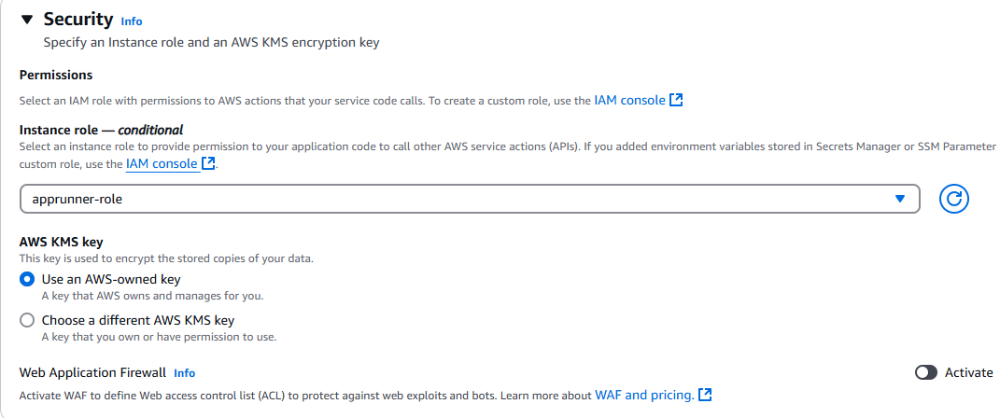

- While creating above role add trust policy like this. 

```json
{
    "Version": "2012-10-17",
    "Statement": [
        {
            "Effect": "Allow",
            "Principal": {
                "Service": "tasks.apprunner.amazonaws.com"
            },
            "Action": "sts:AssumeRole"
        }
    ]
}
```

- Under Networking section, default options are public, which is fine in our case, as we are creating a public service.

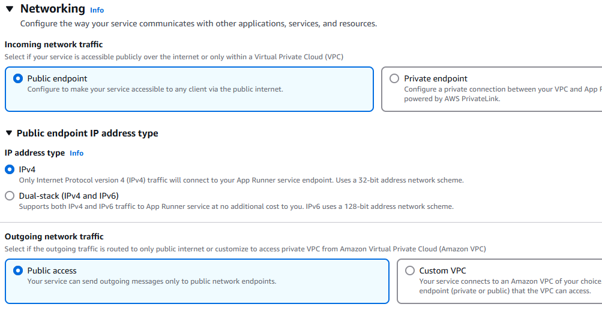

- Review everything on next page and click on Create & Deploy button. It will take few minutes to deploy the service. 

## Step 3: Verify the Application

- Now, I can see the status as running in the console. We can also see the logs in the console and troubleshoot in case of any issues.

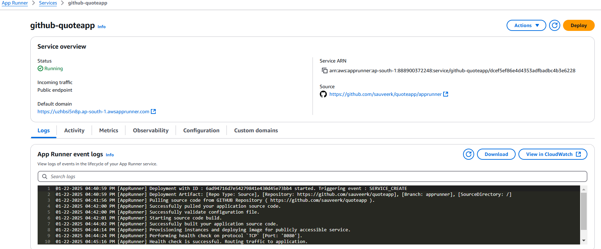

- Access the application using the URL provided in the console. 

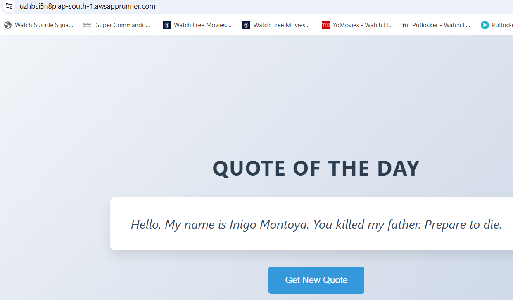

- We can configure a custom domain also, using Route 53 or external registrar.
  
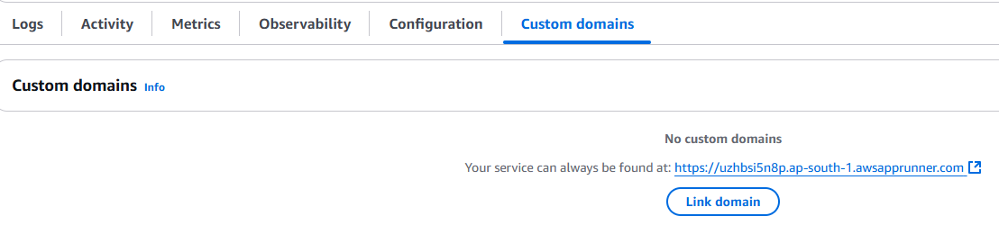

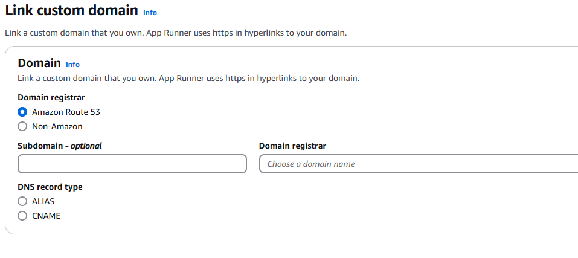

- I have a personal domain and Route 53 hosted zone. So, I will go with it. App Runner will create required Route 53 records in this case. It is quick and I can see active domain within a few minutes. 

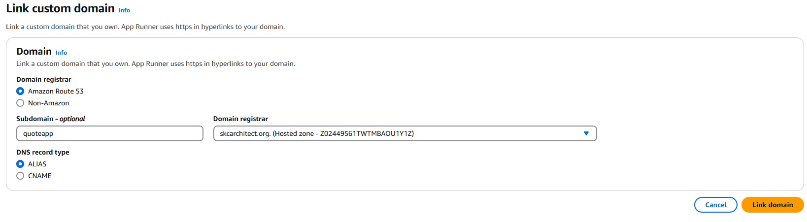

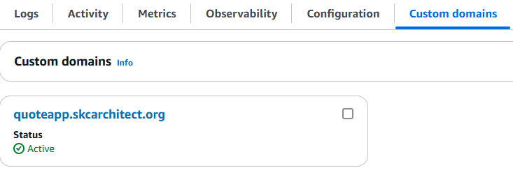

- I can access my application using this custom domain also.

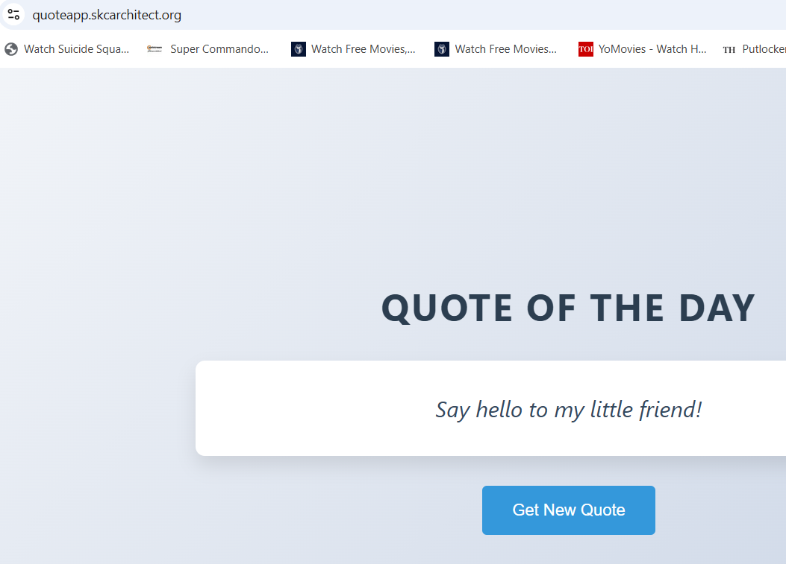

- If we wait for some time, we can see that instances have been scale down to zero under Metrics tab, if we request web page again, we can see that new instance has been brought up to serve the request.

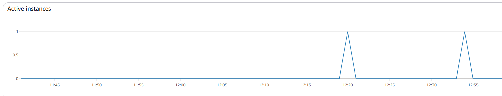

## Step 4: Modify the Application

- Let's modify the application and trigger a new deployment. I have changed the button name from "Get New Quote" to "Show Me Another One" in index.html file and pushed it to GitHub. A new deployment will be triggered, wait for it to complete.

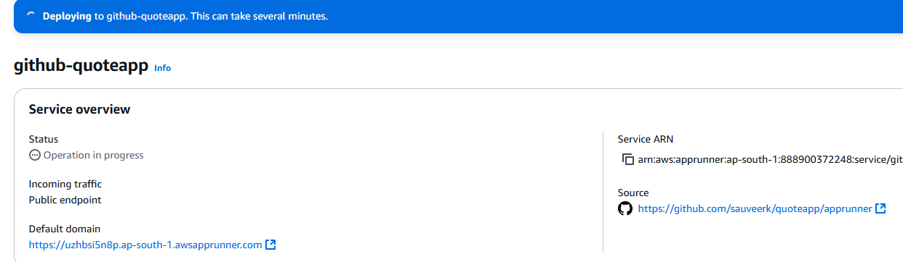 

- Access the page, after deployment completes. I can see the modified page now, with button name changed.

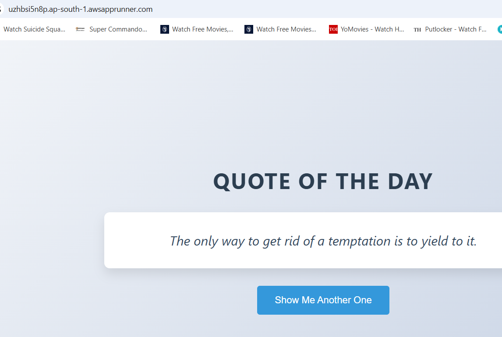


## Step 6: Additional Considerations

- Alternate approach will be to link App Runner to an ECR container repository, whenever image is updated, App Runner will trigger a new Deployment. Run a CI pipeline to test the application and build the docker image and push it to ECR repo. Subsequently, App Runner will trigger new deployment, thus completing CD part of the pipeline. 
  
- This is a GitOps kind of approach where deployment is based on pull either from source code repo or container registry. 

- App Runner deployment can be integrated with GitHub Actions, creating a full-fledged CI/CD pipeline. Though, App Runner itself has a configurable CI/CD pipeline.

- You only pay for resources that your App Runner service consumes. Your service scales down to fewer compute instances when request traffic is lower. You have control over scalability settings: the lowest and highest number of provisioned instances, and the highest load an instance handles.
  
- You can directly launch container images of compatible web applications that are hosted on the Amazon ECR Public Gallery as web services running on App Runner. When browsing the gallery, look for Launch with App Runner on the gallery page for an image. An image with this option is compatible with App Runner.

- Microservices based application can also be deployed on App Runner, with each service being deployed as an App Runner service and interacting with each other based on App Runner endpoints.

- Currently App Runner doesn't support a stateful app. Hence, App Runner doesn't guarantee state persistence beyond the duration of processing a single incoming web request.

- App Runner redirects all incoming HTTP requests to corresponding HTTPS endpoints. You don't need to configure any settings to enable redirecting the HTTP web requests. App Runner terminates the TLS before passing requests to your application container instance.

- AWS WAF is a web application firewall that you can use to secure your App Runner service. With AWS WAF web access control lists (web ACLs), you can guard your App Runner service endpoints against common web exploits and unwanted bots.


