# Provisioning an EC2 Instance in AWS using Terraform with GitHub Actions

- In this article, we will set up a GitHub Actions workflow that provisions an EC2 instance on AWS using Terraform. The workflow will trigger whenever code is pushed to the `main` branch.

- A GitHub workflow is a configurable automated process that will run one or more jobs. A job is a set of steps in a workflow that is executed on the same runner (server). Each step is either a shell script that will be executed, or an action that will be run. Steps are executed in order and are dependent on each other.

## Prerequisites
Following is needed to work on this:
- **AWS Account**: An AWS account with access to create EC2 instances.
- **Terraform**: Terraform configuration files to provision the EC2 instance.
- **GitHub Repository**: A GitHub repository where you plan to set up this workflow.
- **AWS IAM Credentials**: Create an IAM user with EC2, S3 and DynamoDB related permissions. S3 and DynamoDB permissions are   needed for configuring remote backend. State files are stored in S3 bucket. DynamoDB is, optionally, used for locking the state file and is useful when multiple people are working with same state file.

## Step 1: GitHub and Terraform Configuration

- Create a repository on GitHub. 
  
  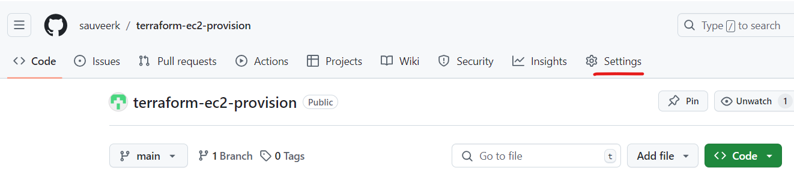

- Clone it locally. 

   git clone https://github.com/sauveerk/terraform-ec2-provision.git

- I created Terraform configuration files to provision ec2 instance in my local git repo first. An ec2 server with public IP is being created, after creation we will see instance ID and public IP values as output. Variable values are being passed using terraform.tfvars file. I have also added a remote backend which uses AWS S3 and DynamoDB table. Using a remote backend allows Terraform to store the state files remotely and securely.  
  
- I have shared the Terraform files at [Terraform-Config](https://github.com/sauveerk/projects/tree/main/Code/GitHub-Terraform) also.
  
  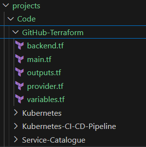

## Step 2: Store AWS Credentials in GitHub Secrets

- GitHub workflow needs AWS credentials to access AWS account and provision resources. We can provide it using GitHub secrets. Go to Settings > Secrets and Variables > Actions. 
  
   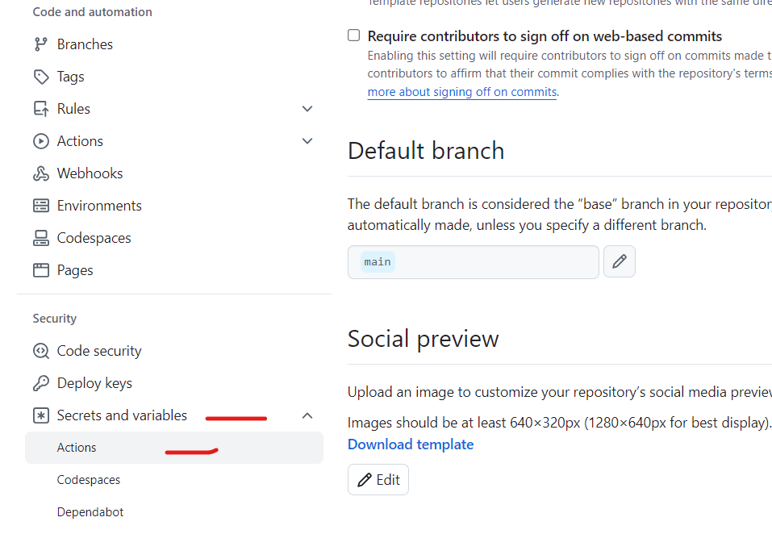

- Create New repository secrets and add the following secrets. I am using temporary STS credentials, so I need to provide session token also. If you are using IAM user, session token will not be needed.

```  
    AWS_ACCESS_KEY_ID: Your IAM user’s access key ID.
    AWS_SECRET_ACCESS_KEY: Your IAM user’s secret access key.
    AWS_SESSION_TOKEN: Session Token.
    AWS_REGION: The AWS region (e.g., us-east-1).

```
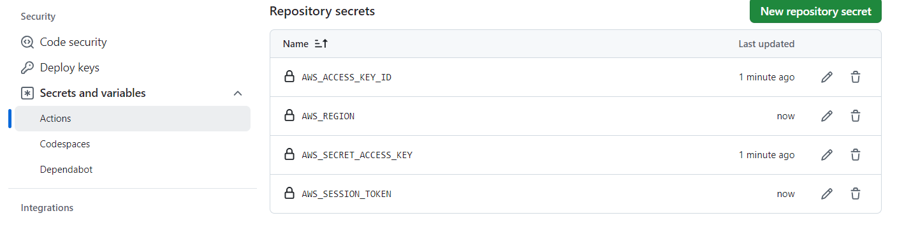

## Step 3: Create the GitHub Actions Workflow

- For creating workflows, we need to go to Actions tab of our repository. There are multiple workflow templates available including for Terraform. We can pick any workflow and then customize it. We can also skip and directly write the workflow.

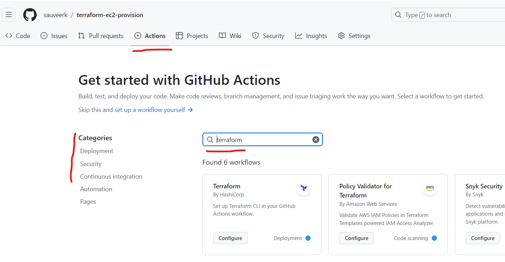

- There are multiple action templates that we can search and add. I have chosen Terraform workflow and added "Configure AWS Credentials" action from marketplace. Then I have customized it.

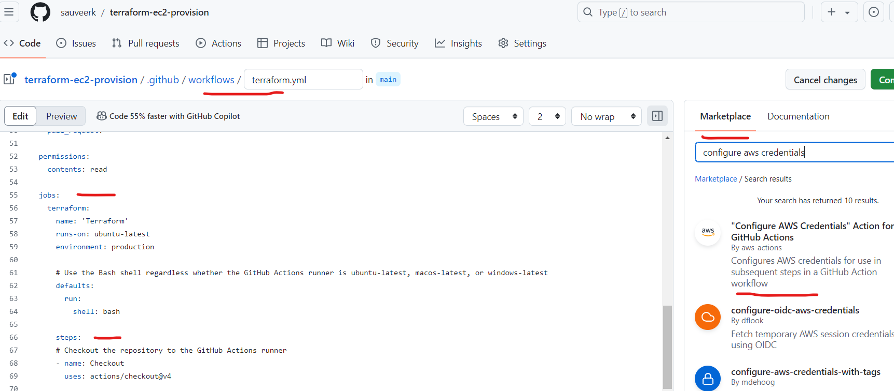

-  Rename the workflow file to ec2-provision.yml and commit. This creates this file under directory .github/workflows in our GitHub repo. In this case we need to pull from local repo and get it in sync with GitHub repo. Alternatively, We can also directly create this set up in our local repo and then push from there to GitHub. 
  
       git pull

- I have shared workflow file also at [Terraform-Config](https://github.com/sauveerk/projects/tree/main/Code/GitHub-Terraform).

- Breakdown of Workflow:
  
```
  On Push: The workflow is triggered when a push is made to the main branch. Paths-ignore is a filter, so that workflow is not    
            triggered when workflow file is pushed.

  Terraform Setup: We use the hashicorp/setup-terraform@v1 action to set up Terraform.

  AWS Credentials: The workflow uses the GitHub stored AWS secrets to authenticate with AWS. 

  Terraform Init: Initializes Terraform and configures the backend.

  Terraform Apply: Applies the Terraform configuration to provision the EC2 instance.
```

## Step 4: Push Changes to GitHub and Monitor Workflow Run

- Once we have created the workflow file and our Terraform configuration, let's push our code to the main branch. This will trigger the workflow.

```
git add .
git commit -m "Set up Terraform EC2 provisioning"
git push origin main
```

- Go to Actions tab of the GitHub repo. We can see a new workflow run.

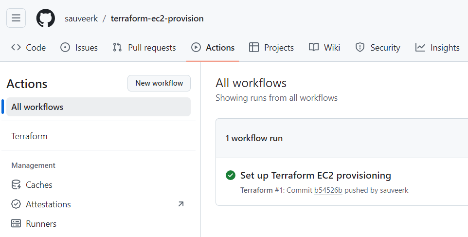

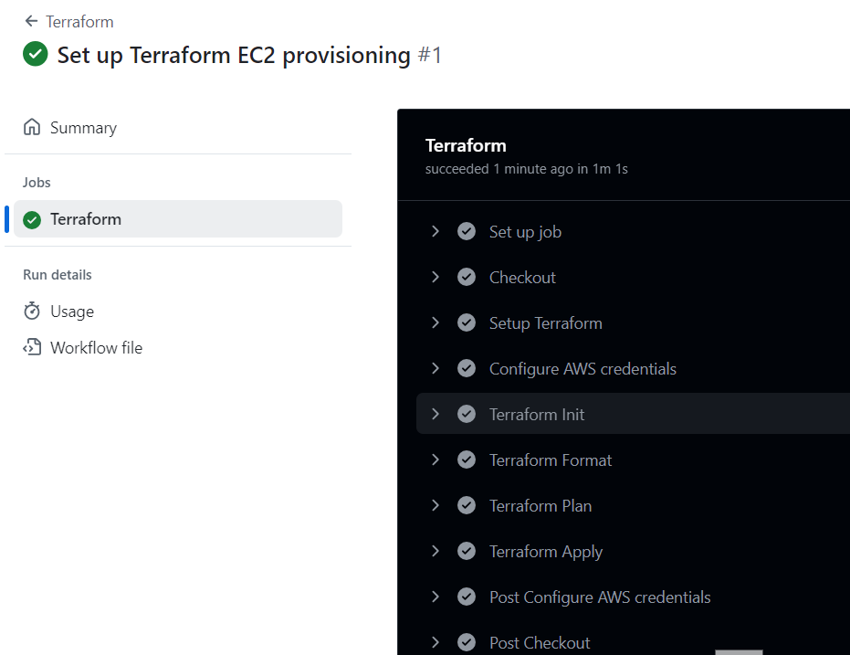
  
- You should see the Terraform EC2 Provisioning workflow running. You can monitor the logs to see the progress. Apply section also gives outputs instance ID and public IP address of the instance.

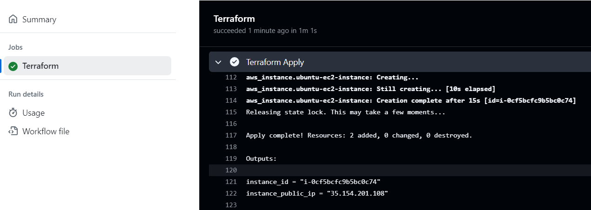

- Once the workflow completes, we can verify that EC2 instance has been provisioned. Navigate to EC2 > Instances and look for the instance created by Terraform. Instance ID and public IP address is same as shown in the logs.

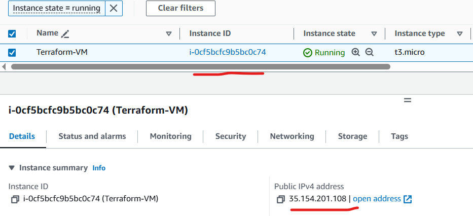

## Step 5: Additional Considerations

- GitHub Actions is a continuous integration and continuous delivery (CI/CD) platform that allows you to automate your build, test, and deployment pipeline. You can create workflows that build and test every pull request to your repository, or deploy merged pull requests to production.

- GitHub Actions goes beyond just DevOps and lets you run workflows when other events happen in your repository. For example, you can run a workflow to automatically add the appropriate labels whenever someone creates a new issue in your repository.

- GitHub provides Linux, Windows, and macOS virtual machines to run your workflows, or you can host your own self-hosted runners in your own data center or cloud infrastructure.

- You can configure a GitHub Actions workflow to be triggered when an event occurs in your repository, such as a pull request being opened or an issue being created. Your workflow contains one or more jobs which can run in sequential order or in parallel. Each job will run inside its own virtual machine runner, or inside a container, and has one or more steps that either run a script that you define or run an action, which is a reusable extension that can simplify your workflow.


- Taking it one step further, we can add security scanning using Checkov. Checkov is a Static Application Security Testing (SAST) tool. It scans cloud infrastructure configurations to find misconfigurations before they're deployed. 

- Append following to the workflow file. Commit and push the code. 

```
    #checkov section
    #- uses: actions/checkout@v2
    #- name: Set up Python 3.11
    #  uses: actions/setup-python@v1
    #  with:
    #    python-version: 3.11
        
    - name: Test with Checkov
      id: checkov
      uses: bridgecrewio/checkov-action@v12
      with:
        #directory: terraform-provision-ec2
        framework: terraform
        soft_fail: true
        output_format: cli,sarif
        output_file_path: console,results.sarif

    - name: Upload SARIF file
      uses: github/codeql-action/upload-sarif@v3
      
      # Results are generated only on a success or failure
      # this is required since GitHub by default won't run the next step
      # when the previous one has failed. Security checks that do not pass will 'fail'.
      # An alternative is to add `continue-on-error: true` to the previous step
      # Or 'soft_fail: true' to checkov.
      if: success() || failure()
      with:
        sarif_file: results.sarif
```

- Wait for the pipeline to complete. We are uploading the results to GitHub, so we can see the findings under Security section of the repository. Here we have set the pipeline to pass even if there are findings, but pipeline can be made to fail also, generally this is done for high and medium severity findings.

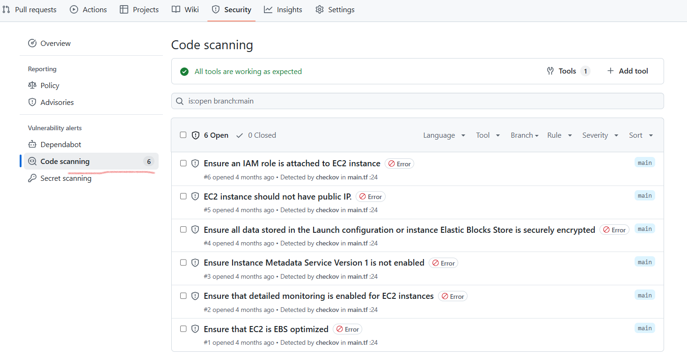

- Checkov also provides plugins for IDEs like VS Code, using which issues can be caught by developers and fixed before pushing the code. Using Checkov is an example of shift-left of security in DevSecOps.
  
- Terraform Cloud/Enterprise provide Sentinel, which is policy-as-a-code tool. It can be used to integrate best practices in the pipeline including avoiding misconfigurations. 