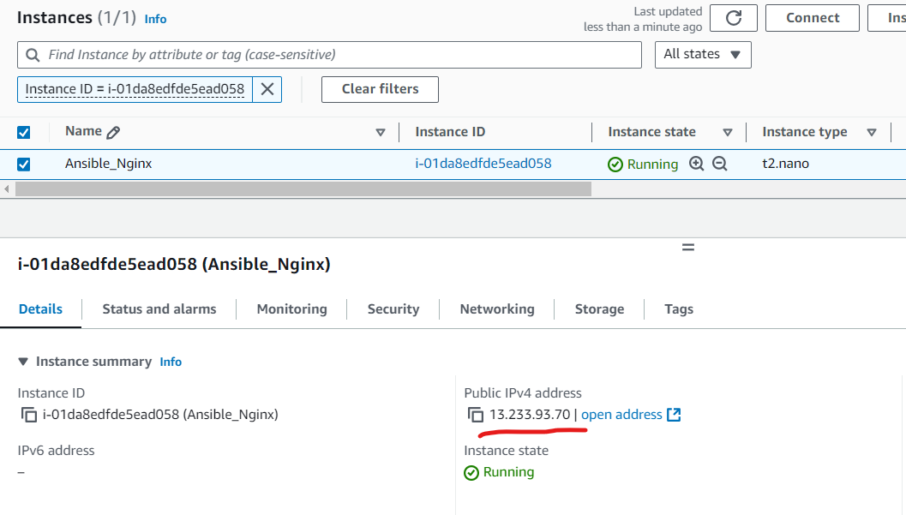

# Provisioning an EC2 Instance in AWS and installing Nginx on it using Ansible and GitLab 

- In this article, we will set up a GitLab pipeline that provisions an EC2 instance on AWS using Ansible and then it installs nginx on that server. The pipeline will be triggered whenever code is pushed to the `main` branch.

- A GitLab pipeline is a configurable automated CI/CD process that will run one or more jobs. To use GitLab CI/CD, you start with a .gitlab-ci.yml file at the root of your project. This file specifies the stages, jobs, and scripts to be executed during your CI/CD pipeline. It is a YAML file with its own custom syntax.

- Terraform and Ansible are powerful infrastructure as code (IaC) tools. Both can provision infrastructure, both can configure infrastructure, but each has its strength. Terraform is better at provisioning and managing your infrastructure, but Ansible is a better option if you want to install and configure software. In fact, Ansible can do much more, and is good for administration work. Many organizations, for ease of use and to reduce multiplicity of tools, use Ansible for both provisioning and configuring infrastructure.

- Ansible playbooks are expressed in YAML format with a minimum of syntax. A playbook is composed of one or more `plays` in an ordered list. The terms `playbook` and `play` are sports analogies. Each play executes part of the overall goal of the playbook, running one or more tasks. Each task calls an Ansible module.

## Prerequisites
Following is needed to work on this:
- **AWS Account**: An AWS account with access to create EC2 instances.
- **AWS IAM Credentials**: Create an IAM user with EC2 related permissions. Download credentials. 
- **SSH Key Pair**: A SSH key pair to access the EC2 instance. Create this in AWS account, download and save the    
        private key.
- **GitLab Repository**: A GitLab project where you plan to set up this pipeline. A GitLab project contains repository 
        and associated configurations like pipeline.

## Step 1: GitLab and AWS Configuration

- Create a project on GitLab. I have created a private project named ansible-aws.
  
      

- Clone it locally. 

   git clone https://gitlab.com/sauveer.ketan/ansible-aws.git

- I created Ansible playbook to provision ec2 instance in my local git repo first. An ec2 server with public IP is being created, after creation, Nginx will be installed on the server. 

- In AWS, we can create ssh key pairs to associate with ec2 servers. We need to download the private key to be able to log into the server later. I have already created a key pair and using the same in the Ansible playbook.
  

## Step 2:  Set Up AWS Credentials in GitLab

- GitLab pipeline needs AWS credentials to access AWS account and provision resources. We can provide it using GitLab CI/CD variables. Go to Settings > CI/CD > Variables. 

         

- Add the following variables. Select visibility option - Masked. I am using temporary AWS role credentials, so I need to provide session token also. If you are using IAM user, session token will not be needed. I have also added private ssh key in a variable EC2_Key, this will be used by Ansible to access the newly created server over SSH to install Nginx on it.

```  
    AWS_ACCESS_KEY_ID: Your IAM user’s access key ID.
    AWS_SECRET_ACCESS_KEY: Your IAM user’s secret access key.
    AWS_SESSION_TOKEN: Session Token (optional).
    AWS_REGION: The AWS region (e.g., us-east-1).

```
 

## Step 3: Ansible Playbook for EC2 Deployment and Nginx Setup

-  I have created Ansible playbook named ansible_ec2_nginx.yml. This has two plays. In first, ec2 server is being created and being added to a host group named "launched". In second play, Nginx is being installed on this server. Ansible is using private ssh key to access this server. 
  
- I am using default values for subnet and security group, hence I am not passing these values in the playbook.

- I have shared the files at [Ansible-Config](https://github.com/sauveerk/projects/tree/main/Code/GitLab-Ansible).  
   
    
## Step 4: GitLab CI/CD Pipeline Configuration

- GitLab pipelines are written in file name .gitlab-ci.yml. 

- As we are using Ansible AWS modules, on the GitLab runner server, pip and boto are needed. To make it easier to configure these, I am using docker python image. There are multiple ways of doing it, other images can also be used, steps will vary depending on what is installed on those images already.
  
-  SSH key is stored in an environment variable EC2_Key, this is being saved as a .pem file in the playbook, then this is being used to connect to the newly created server, this key needs to be passed in the ansible-playbook command for that.

```yml
stages:
  - deploy

image:
  name: python:3.9-slim

variables:
  ANSIBLE_HOST_KEY_CHECKING: "False"
  ANSIBLE_PYTHON_INTERPRRTER: /usr/bin/python3

before_script:
  - apt-get update && apt-get install -y openssh-client
  - pip install --upgrade pip
  - pip install ansible boto3 botocore
  - ansible --version
  - pwd
  - echo "$EC2_KEY" > private-key1.pem   #Create private key to connect to the ec2 server
  - chmod 600 private-key1.pem 
  - whoami
  - ls -ltr

# Deploy EC2 instance using Ansible and install Nginx on it
deploy_ec2:
  stage: deploy
  script:
    - ansible-playbook ansible_ec2_nginx.yml --private-key private-key1.pem
  only:
    - main
```

- Once we have created the gitlab CI file and Ansible playbook, let's push our code to the main branch. This will trigger the GitLab pipeline run.

```
git add .
git commit -m "Completed configuration files"
git push origin main
```

## Step 5: Pipeline Run and Monitoring

- We can see a new run under pipelines or jobs section.

 

 - Once we click on it, we can see more details of the entire run. We can see the IP address of the new server, and Job Succeeded message towards the end of the logs.
  
  

- We can see same server and IP address in ec2 console also.
  
  

- We can access this IP address on the browser over http and can see that Nginx is installed.
  
  
  
## Step 6: Additional Considerations

- Ansible can provide rich enterprise level capabilities in config management, automation and deployment. Many organizations use this for provisioning infra also. Ansible Tower used to provide web interface to work with Ansible at enterprise scale, now it has been replaced with Automation Controller, which is a central piece to the Ansible Automation Platform which now contains a lot more features and capabilities.

- Ansible is open source, AWX is open-source equivalent of Control Tower which also provides a web based interface.

- Ansible configuration capabilities can be combined with Terraform provisioning capabilities, e.g., using Terraform to provision servers but using Ansible for administration and configuration management.

- Ansible can be used for deploying applications as part of app deployment CI/CD pipeline.

- Ansible AWS/Azure/GCP modules make corresponding API calls, they provide an easy way to manage infrastructure, for example, starting/stopping or terminating a particular group of servers.
 


