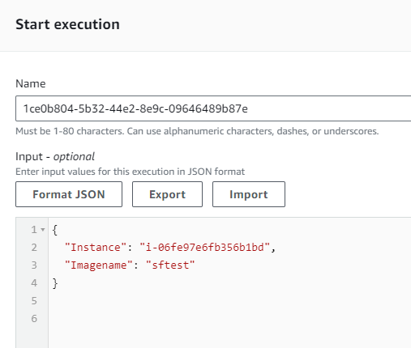
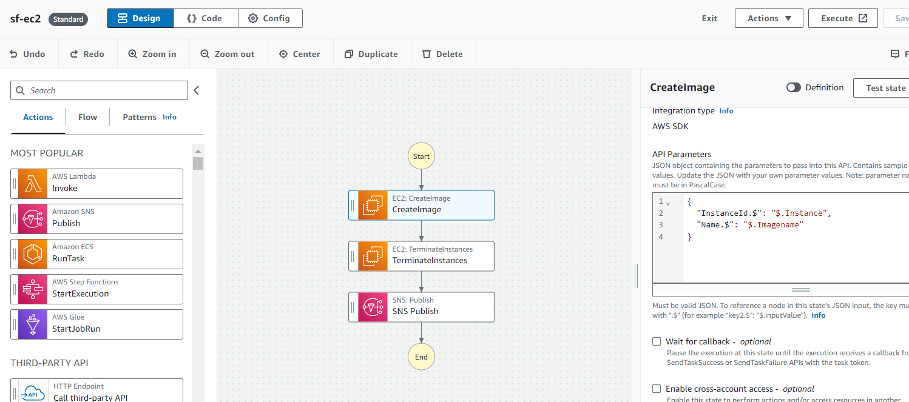
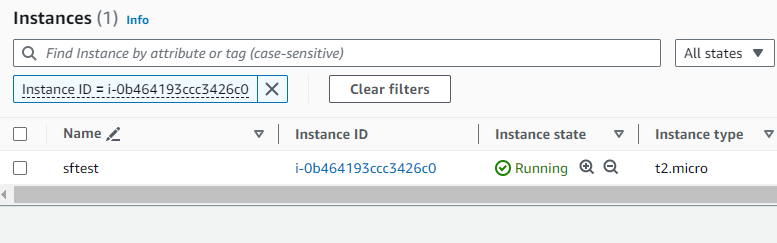

# Hybrid DNS

When on-prem environment is connected to cloud, generally different domains are used to differentiate between resources. This requires hybrid Domain Name System (DNS) architecture that enables end-to-end DNS resolution of on-premise resources and AWS resources.

 Below steps describe how to set up Amazon Route 53 Resolver  endpoints and rules that determine where a DNS query that originates from AWS should be sent, based on the domain name. DNS queries for on-premises resources are forwarded to on-premises DNS resolvers. DNS queries for AWS resources and internet DNS queries are resolved by Route 53 Resolver.

 We are setting up two VPCs, one of these VPCs will act as on-prem VPC. Route 53 Private Hosted Zones will act as DNS resolvers for these VPCs, these are configured for different domains. VPC peering is used to simulate on-prem to cloud connectivity.

 

## Step 1: Deploy 2 VPCs

- Navigate to the AWS Management Console and go to the VPC service.
- Click on "Create VPC" and specify the details for your first VPC (Name: on-prem-network, CIDR: 10.0.1.0/24). Create a subnet for it.
- Repeat the process to create the second VPC (Name: cloud-vpc, CIDR: 10.0.2.0/24). Create a subnet for it.
  

- Ensure that following VPC settings are set to true: enableDnsHostnames, enableDnsSupport.

- To simulate network connectivity, create peering connection between these VPCs.

- Give a name, select on-prem-network VPC.

- Select cloud-vpc as second VPC. Create peering connection.

- Accept peering connection. Add entries in route table of both VPCs.

## Step 2: Deploy 2 EC2 Instances in the VPCs

- Navigate to the EC2 service in the AWS Management Console.
- Launch an EC2 instance and select on-prem-networke VPC. Choose t2.micro or t3.micro instance types, select a key pair, keep other settings as default and create the instance.
- Repeat the process to launch another EC2 instance in the second VPC, cloud-vpc.

- Now that connectivity is established, we will be able to reach these 2 ec2 instances from each other. 

- Pinging cloud-instance from on-prem-instance

- Pinging on-prem-instance from cloud-instance

- We want these instances to have proper DNS names instead of default AWS provided names. This can be done via private hosted zones. Private hosted zones will be DNS servers for these VPCs.
  
  
  

## Step 3: Create Private Hosted Zones

- Navigate to Route 53 service in the console. Select create hosted zone. 

- Give domain name myvpc.cloud.com. Select Private Hosted Zone.

- Select cloud-vpc to associate with this zone.

- Repeat above steps to create second private hosted zone. Give domain name as onprem.mydc.com and select on-prem-network vpc to associate with it.
  

- Go to onprem.mydc.com and create record for on-prem-instance in it.

- Give name of the server, select A for type, give private IP address of the server.

- Create a PTR record also for reverse lookup with same values.

- Now, we have a standard DNS name for our on-prem-instance and it can be resolved. 

- But, cloud-vpc is not aware of this domain, and hence cloud-instance cannot resolve it.
  
  

- Simliarly, create a record for cloud-vpc in myvpc.cloud.com hosted zone.

- On similar lines, cloud-instance is able to resolve it, but on-prem-instance is not able to resolve it.

- To connect these 2 DNS systems, we will take help of Route 53 resolver endpoints and rules.

## Step 4: Create Inbound and Outbound Resolver Endpoints in Route 53

- Go to the Route 53 service in the AWS Management Console.
  
- Select Create Inbound Endpoint under Resolver.
  
  

- Give a name to endpoint. Select cloud-vpc. Select a security group that allows  inbound TCP and UDP access on port 53. Select IPV4 for endpoint type. 
  
  

- Select availability zones and subnets for assigning IP addresses to the endpoint. Resolver endpoints create ENIs, AWS recommends two subnets in two availability zones.

- Verify that inbound endpoint has been created.

- Next, create outbound resolver endpoints for on-prem-network VPC by selecting "Outbound Endpoint." Simliar to above, give a name, select VPC and subnets. Security group selected  must allow outbound TCP and UDP access on the port 53.
  
  

-- Vefify that outbound endpoint has been created.

- Create resolver rule to forward queries from on-prem-network VPC to cloud-vpc resolver inbound endpoint if domain being queried is cloud-vpc domain, i.e., myvpc.cloud.com. Target IP addresses will be inbound endpoint IP addresses.
  
  

- Test this rule, by querying cloud-instance using fqdn from on-prem-instance. Now, on-prem-instance can resolve DNS queries for cloud-instance, which is a different domain.

- Similarly, we can create inbound endpoint for on-prem domain (onprem.mydc.com) and outbound endpoint for cloud domain (
myvpc.cloud.com). For outbound endpoint, we also need to configure a rule to forward quries for onprem.mydc.com to on-prem inbound endpoint.

- Now, we have set up hybrid DNS between on-prem and cloud.

