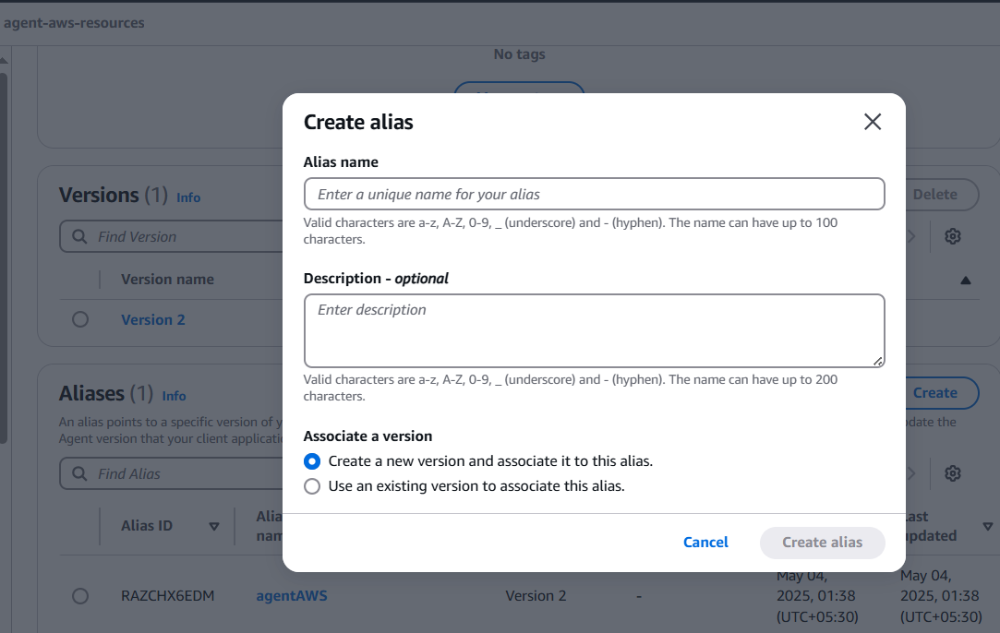
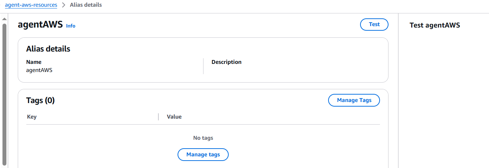
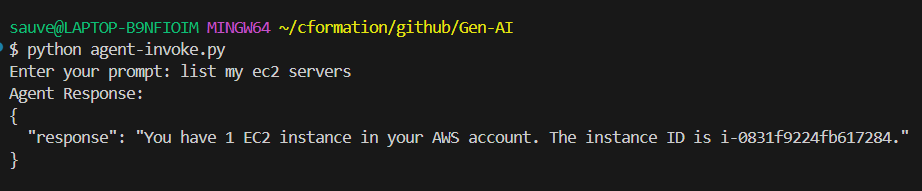
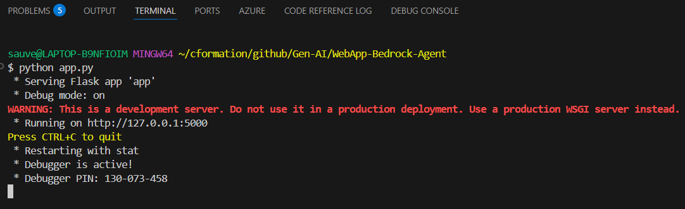
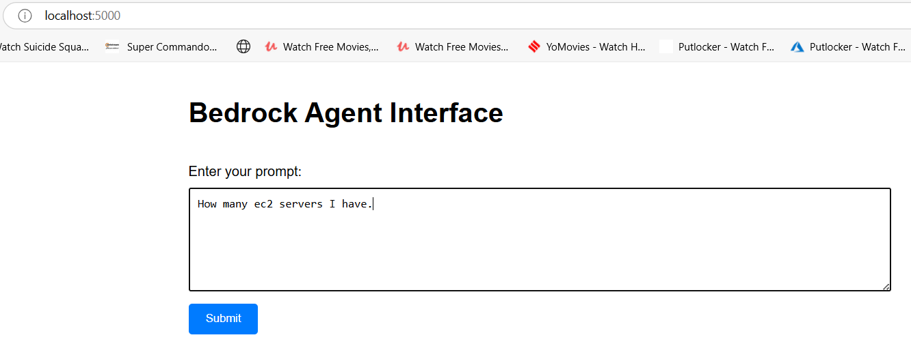
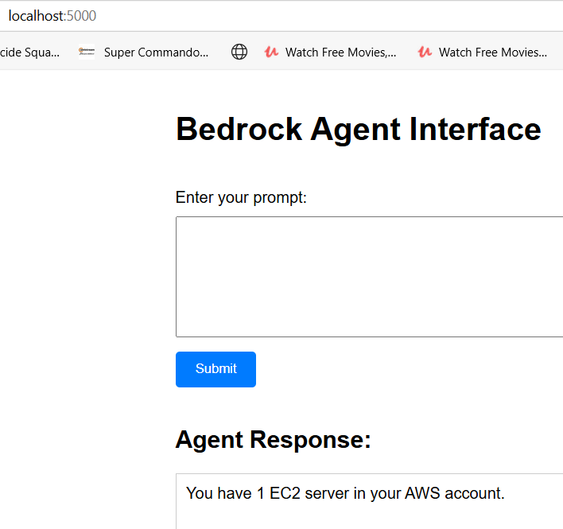
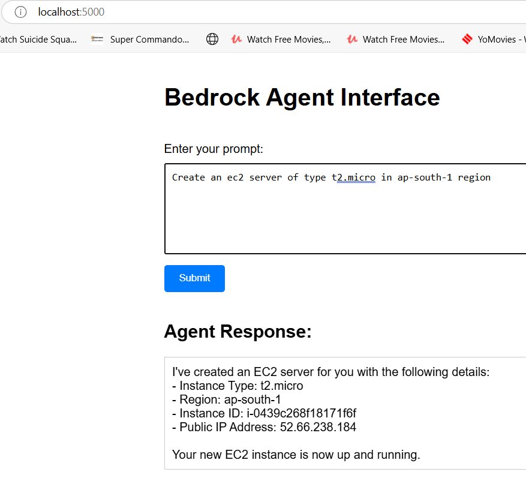
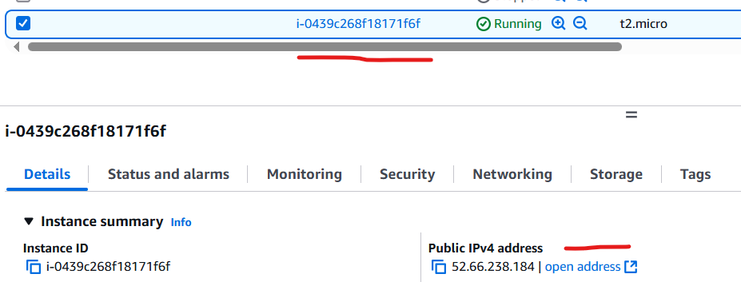
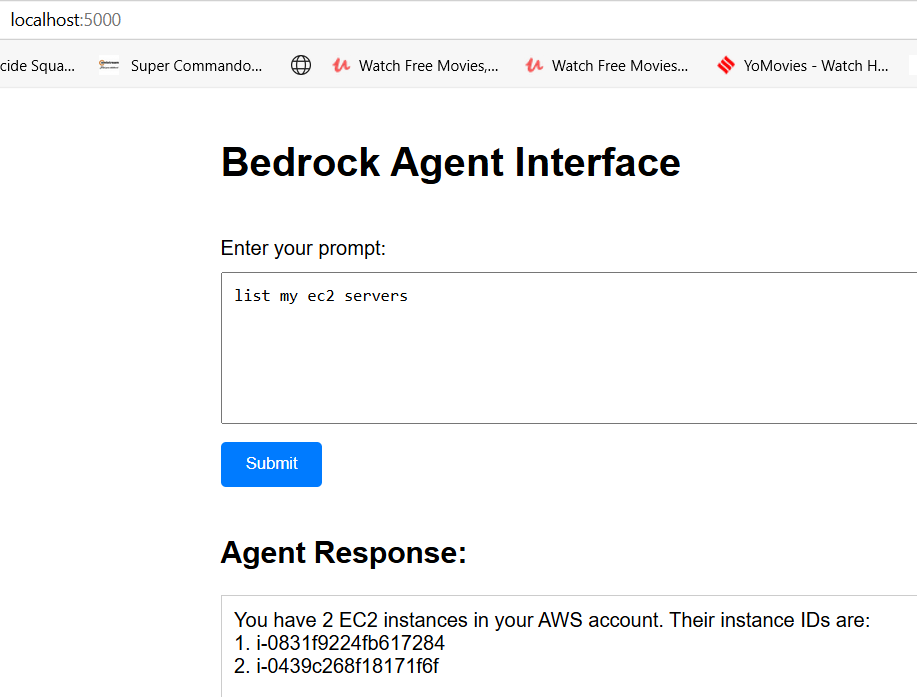

# Gen AI - Agentic AI Web App for End Users

- Please refer to below article. Earlier, we created an agent which can enquire about AWS resources and create ec2 instances. If we want to use this for regular use, for example by ops teams, we can create a web app around it with a nice web interface.
   
   https://github.com/sauveerk/projects/blob/main/Agentic-AI-Amazon-Bedrock-Agents.md

  
- In this article, we will create a web app around our agent. So that we don't need to go to Bedrock console to use our agent. Full app code is present here, it can be cloned - 
  
    https://github.com/sauveerk/projects/tree/main/Code/WebApp-Bedrock-Agent


## Step 1: Modify Action Group Behavior and Create Agent Alias

- We had enabled the confirmation to test the behavior of our agent by selecting "Enable confirmation of action group function" for actions groups that list s3 and ec2 servers. Let's disable this to simplify our code.
  
    

  
- Go to the action group that lists ec2 servers. Check disabled button. Click save to save the action group. Verify other action groups also to see that this is disabled.

- Save the agent. Prepare the agent.

- To use the agent programmatically. We need to create an alias. On the agent page, under alias section, click create.

    

- Give a name, keep the default choice - Create a new version and associate it to this alias. Click on create alias.  

- Click on the newly created alias, it will open alias page. Use Test button and test the functionality to verify that we are not being asked for confirmation. 

    

## Step 2: Python Program 

- This is the python code using which we can invoke our model programmatically.

    ```python
    import boto3
    import json
    from botocore.exceptions import ClientError
    from typing import Optional, Dict, Any
    import uuid

    def invoke_bedrock_agent(prompt: str) -> Optional[Dict[Any, Any]]:
        """
        Invoke a Bedrock agent with the given prompt.
        
        Args:
            prompt (str): The prompt to send to the agent
            
        Returns:
            Optional[Dict]: The agent's response or None if an error occurs
        """
        try:
            bedrock_agent_runtime = boto3.client('bedrock-agent-runtime')
        except Exception as e:
            print(f"Error creating Bedrock client: {str(e)}")
            return None
        
        if not prompt or not isinstance(prompt, str):
            print("Error: Prompt must be a non-empty string")
            return None
            
        try:
            session_id = str(uuid.uuid4())
            
            response = bedrock_agent_runtime.invoke_agent(
                agentId=<>,
                agentAliasId=<>,
                sessionId=session_id,
                inputText=prompt
            )
            
            # Handle the event stream response
            full_response = ""
            for event in response['completion']:
                if 'chunk' in event:
                    chunk_data = event['chunk']['bytes'].decode('utf-8')
                    full_response += chunk_data
            
            # Parse the complete response if needed
            if full_response:
                try:
                    return json.loads(full_response)
                except json.JSONDecodeError:
                    # If response is not JSON, return as plain text
                    return {"response": full_response}
            else:
                print("Error: Empty response from Bedrock Agent")
                return None
                
        except ClientError as e:
            print(f"AWS API Error: {str(e)}")
            return None
        except Exception as e:
            print(f"Unexpected error: {str(e)}")
            return None

    def main():
        prompt = input("Enter your prompt: ")
        response = invoke_bedrock_agent(prompt)

        if response:
            print("Agent Response:")
            if isinstance(response, dict):
                print(json.dumps(response, indent=2))
            else:
                print(response)
        else:
            print("Failed to get response from agent")

    if __name__ == "__main__":
        main()
    ```

- Let's test the program. We can see that it responds correctly.

  

## Step 3: Create Python Flask Web App

- Use this project structure.

 ```
   your_project_directory/
    ├── app.py
    ├── agent_invoke.py
    └── templates/
        └── index.html
 ```

- This is the code for app.py.

   ```python
        from flask import Flask, render_template, request
        from agent_invoke import invoke_bedrock_agent
        import json

        app = Flask(__name__)

        def extract_response_text(response):
            try:
                if isinstance(response, str):
                    response_dict = json.loads(response)
                else:
                    response_dict = response
                    
                # Check for 'response' field in the dictionary
                if 'response' in response_dict:
                    return response_dict['response']
                # Check for 'completion' field as fallback
                elif 'completion' in response_dict:
                    return response_dict['completion']
                # Return the full response if no known fields are found
                return str(response_dict)
            except Exception as e:
                return f"Error processing response: {str(e)}"

        @app.route('/', methods=['GET', 'POST'])
        def home():
            response = None
            if request.method == 'POST':
                user_prompt = request.form.get('prompt')
                if user_prompt:
                    raw_response = invoke_bedrock_agent(user_prompt)
                    response = extract_response_text(raw_response)
            return render_template('index.html', response=response)

        if __name__ == '__main__':
            app.run(debug=True)
   ```

- This is the code for index.html.

    ```html
        <!DOCTYPE html>
        <html lang="en">
        <head>
            <meta charset="UTF-8">
            <meta name="viewport" content="width=device-width, initial-scale=1.0">
            <title>Bedrock Agent Interface</title>
            <style>
                body {
                    font-family: Arial, sans-serif;
                    max-width: 800px;
                    margin: 0 auto;
                    padding: 20px;
                }
                .container {
                    display: flex;
                    flex-direction: column;
                    gap: 20px;
                }
                textarea {
                    width: 100%;
                    min-height: 100px;
                    padding: 10px;
                    margin: 10px 0;
                }
                button {
                    padding: 10px 20px;
                    background-color: #007bff;
                    color: white;
                    border: none;
                    border-radius: 4px;
                    cursor: pointer;
                }
                button:hover {
                    background-color: #0056b3;
                }
                .response-box {
                    border: 1px solid #ccc;
                    padding: 10px;
                    min-height: 100px;
                    white-space: pre-wrap;
                }
            </style>
        </head>
        <body>
            <div class="container">
                <h1>Bedrock Agent Interface</h1>
                <form method="POST">
                    <label for="prompt">Enter your prompt:</label>
                    <textarea name="prompt" id="prompt" required>{{ request.form.get('prompt', '') }}</textarea>
                    <button type="submit">Submit</button>
                </form>
                
                
                <div>
                    <h2>Agent Response:</h2>
                    <div class="response-box">{{ response }}</div>
                </div>
                
            </div>
        </body>
        </html>
    ```
  
## Step 4: Test the Web App

  
- Go to the project directory, run the program using: python app.py. It will start running local server. 

    

- We can access the app on localhost:5000. Let try the prompt "How many ec2 servers I have". Press submit.
  
      

- We can see the response on the web page.

   


- Let's try another prompt: Create an ec2 server of type t2.micro in ap-south-1 region. We can see that server has been created.

  
  
- Let's verify it in AWS console.

   

- Let's again check how many servers I have. Now I have two servers.
  
    
 

## Step 5: Clean Up

- Remember to clean up the resources you created to avoid incurring unnecessary costs:

  - Terminate any EC2 instances created during testing.
  - Delete the Bedrock Agent.
  
## Step 6: Additional Considerations

- Prompt Quality: The quality of your prompt significantly impact the agent's ability to correctly understand user intent and use the right tools. Be clear and specific.
  
- Throttling: As there are service quotas applicable on the LLMs, you might face throttling errors. Check the service quota. Wait and retry.
 
- Using Bedrock Agents for AWS operations essentially boils down to interacting with and managing your AWS resources using natural language commands. It simplifies resource creation, information retrieval, task execution and troubleshooting. It increases operational efficiency.
  
- Creating custom web applications that leverage Bedrock Agents for AWS operations is a very compelling use case for many organizations. It enhances accessibility by enabling the users who are not experts in the AWS console, CLI, or SDKs to perform pre-defined operational tasks. These can also assist technical teams and increase operational efficiency. 

- Please note that Amazon Q already has some functionalities like information retrieval and troubleshooting assistance. But, you define Action Groups and Knowledge Bases for your agent that are unique to your organization, you can provide tailored User Experience and Workflow Integration. Amazon Q in the console is a great starting point and provides general AWS assistance. A custom web application built on Bedrock Agents allows you to create a highly specialized, integrated, and controlled operational tool tailored precisely to your organization's unique environment, processes, and user needs, going beyond the generic capabilities of a console-level assistant. It's about building your organization's intelligent assistant for its specific operational challenges.   


 


