# Gen AI - Automating AWS Tasks with Amazon Bedrock Agents

- Amazon Bedrock Agents are conversational AI applications that extend the capabilities of Large Language Models (LLMs) by enabling them to understand multi-step user requests and orchestrate actions across different systems. They act as intelligent intermediaries, breaking down complex tasks, reasoning about the required steps, maintaining conversation context, and using defined tools to interact with external services to fulfill user goals.

- You can leverage Bedrock Agents extensively for AWS operations by integrating them with AWS services via Action Groups linked to tools like Lambda functions or APIs. This allows agents to perform automated resource management tasks, such as listing EC2 instances, enumerating S3 buckets, or creating new servers based on natural language commands. They can also retrieve operational information for troubleshooting or provide a simplified, conversational interface for users to interact with and manage AWS resources without needing deep technical expertise or direct console access.

- An action group defines actions that the agent can help the user perform. For example, listing ec2 servers. Define the parameters and information that the agent must elicit from the user for each action in the action group to be carried out. Decide how the agent handles the parameters and information that it receives from the user and where it sends the information it elicits from the user. Knowledge bases can also be configured optionally.
  
 
  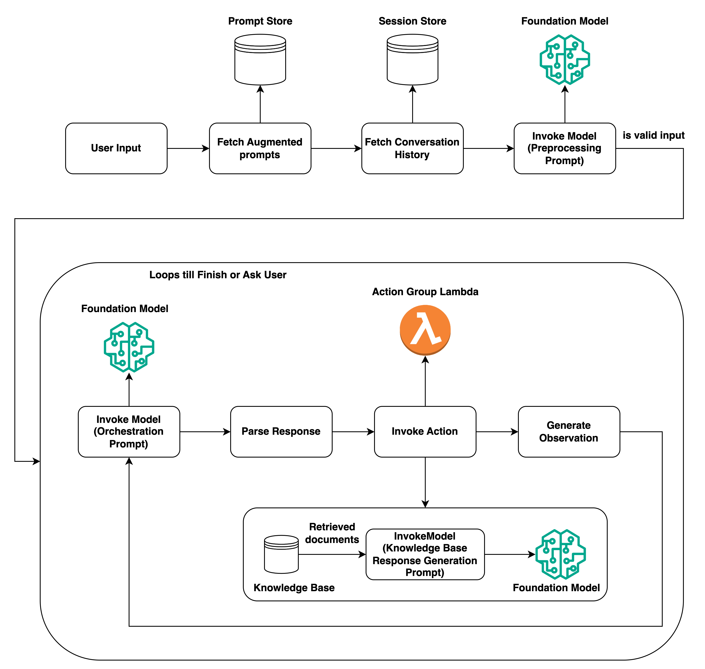
    

- This article will guide you through setting up a Bedrock Agent with Action Groups. We will create and integrate AWS Lambda functions that allow the agent to:
    - List existing EC2 instances.
    - List existing S3 buckets.
    - Create a new EC2 instance with specified parameters.

- This demonstrates how you can leverage large language models (LLMs) orchestrated by Bedrock Agents to perform actions in your AWS account based on natural language commands.


## Prerequisites

To follow along with this tutorial, you will need:

-   **AWS Account**: An active AWS account with necessary permissions to create and manage Bedrock Agents, IAM roles, Lambda functions, EC2 instances, and view S3 buckets.
-   **Amazon Bedrock Access**: Ensure Amazon Bedrock is enabled in your account and the AWS region you plan to use.
-   **Bedrock Model Access**: You need access to a supported model for Bedrock Agents, such as Anthropic Claude. Follow the steps in the Bedrock console under "Model access" to enable this.


## Step 1: Enable Bedrock Model Access

- Under Amazon Bedrock console. Go to model access (bottom left). Modify access, select Claude Sonnet 3.5 models and submit. Please note that your payment mode should be invoice based and not card based, if you are in India, otherwise you will get errors about invalid payment mode.
  
   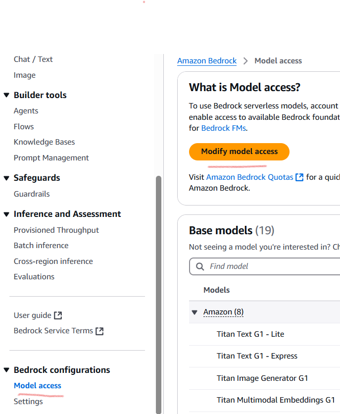

  
- After few minutes, you will get the access and these models will become active in your console.

   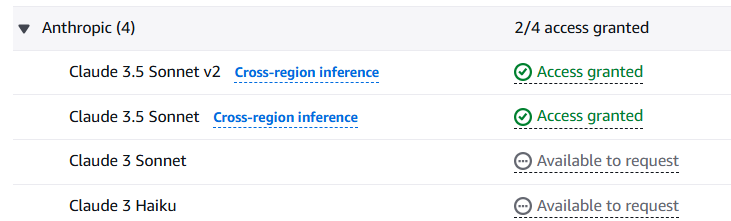


## Step 2: Create AWS Lambda Functions

- We will create three Lambda functions. Each function performs a specific AWS task and returns the result in a format Bedrock Agents expect. Deploy these functions in the same AWS region where you configure your Bedrock Agent.

- You can find the complete Python code for these functions in the following GitHub repository:

    https://github.com/sauveerk/projects/tree/main/Code/Gen-AI-Bedrock-Agents

   ### Lambda Function 1: List EC2 Instances

   This function, action_group_ec2,
   lists the IDs of all EC2 instances in current region.

   **IAM Permissions Needed:** `ec2:DescribeInstances`


   ### Lambda Function 2: List S3 Buckets

   This function, action_grop_s3, 
   lists the s3 buckets.

   **IAM Permissions Needed:** `ec2:DescribeInstances`


   ### Lambda Function 3: Create EC2 Instance

   This function, action_group_create_ec2, 
   creates an ec2 server. It takes instance type and region as parameters.

   **IAM Permissions Needed:**
   `ec2:RunInstances`
   `ec2:DescribeInstances`                     


## Step 3: Create Bedrock Agent and Action Groups

- In the Bedrock console, navigate to "Agents" under "Builder Tools". Click "Create agent". Give your agent a name and a description (e.g., "AWS Resource Manager Agent").

   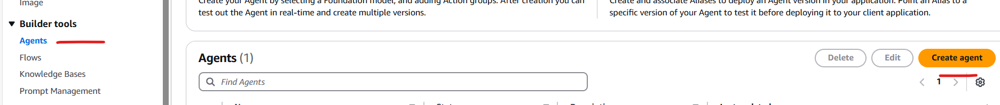

- After agent is created, click on it. Click Edit in Agent Builder. We can configure the agent using this console.
  
  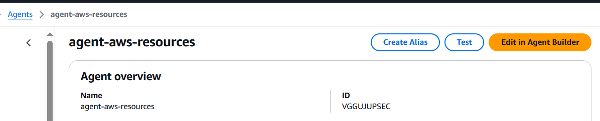

- Select "Create and use a new service role"

- Define instructions for the agent. This prompt guides the agent's behavior. Something like:

        You are an AI assistant that can help users manage their AWS resources.
        You can list EC2 instances, list S3 buckets, and create new EC2 instances.
        
  
- Under Action Groups section click Add.
  
- Give the action group a name (e.g., Ec2ManagementActions). Provide a description (e.g., "Actions for managing EC2 resources").  Under "Action group invocation", select "Define with Function details".

   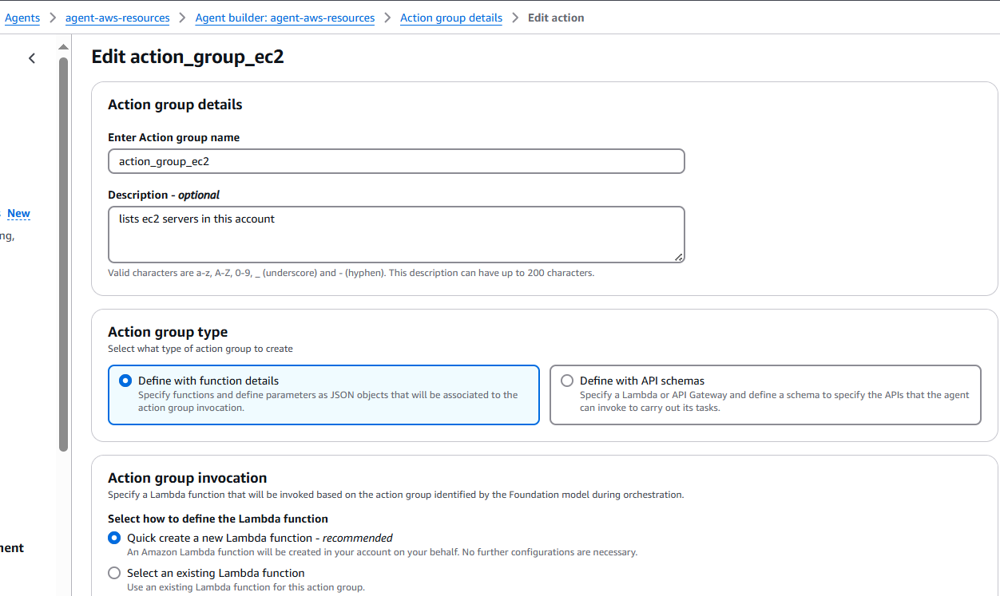

- Select "Quick create a new Lambda function". This will create a lambda function, and add a  resource based policy to it so that it can be invoked by bedrock agent. 
  
- Provide the function name and description. No parameters are required for this function as it only lists ec2 instances.

   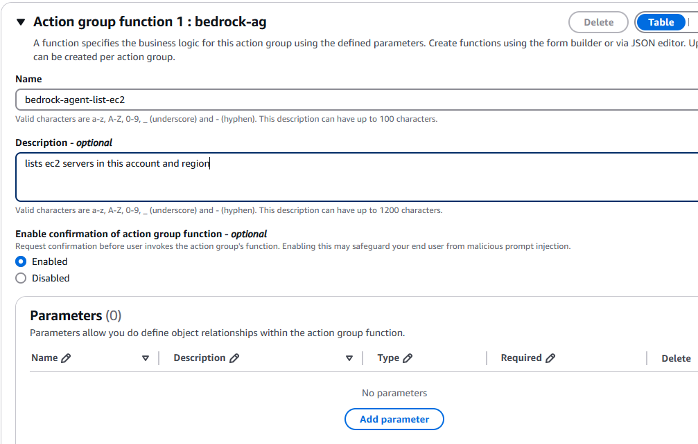

- Here "Enable confirmation of action group function" is selected. Agent will ask for confirmation before moving ahead with invocation. It is disabled by default. 

- Click save to create the action group. 

- Click on action group again. We can see the newly created lambda function. Click on view, it will take to lambda console. Copy the code from GitHub repo given above and paste the code in the function and deploy. 

  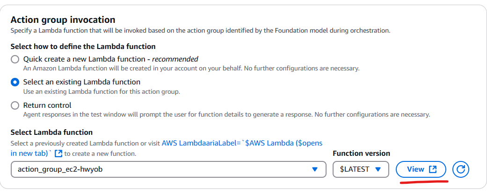
  
- Go to lambda function configuration, increase the timeout duration. Then go to permissions section and add additional permissions to the role being used by lambda function. In this case it is ec2:DescribeInstances.

   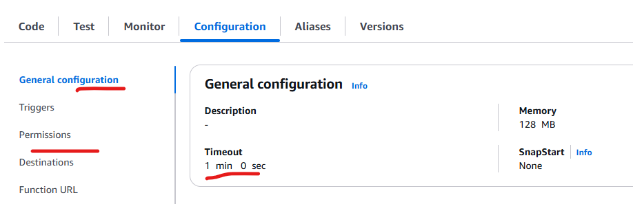

- Now lambda function is ready. We can test it by giving a test event in appropriate format.

   ```json
      {
   "messageVersion": "1.0",
   "function": "bedrock-agent-list-ec2",
   "inputText": "",
   "sessionId": "888900372248953",
   "agent": {
      "name": "agent-aws-resources",
      "version": "DRAFT",
      "id": "VGGUJUPSEC",
      "alias": "TSTALIASID"
   },
   "actionGroup": "action_group_ec2",
   "sessionAttributes": {},
   "promptSessionAttributes": {}
   }

   ```

- Follow similar steps to add other 2 action groups. For ec2 create functions, add parameters also.

  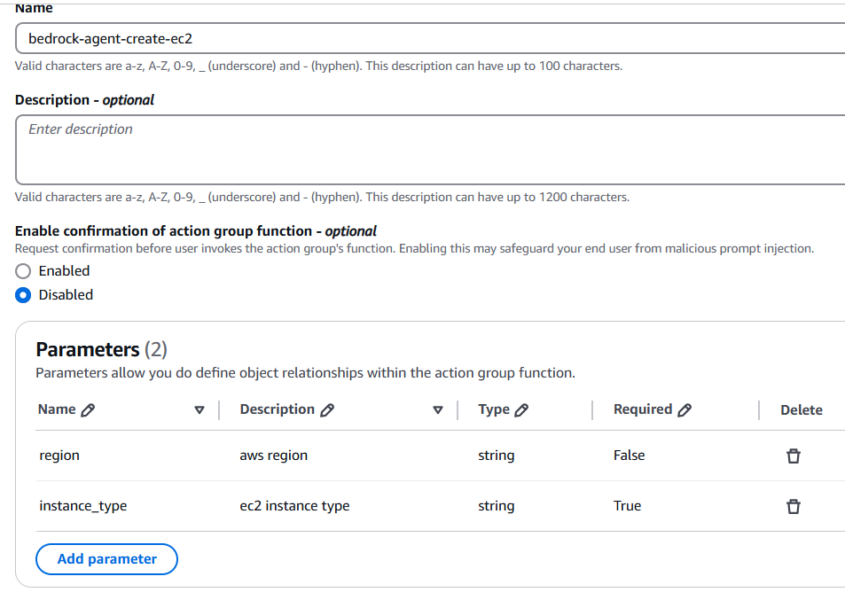

- Save the agent in agent builder.

  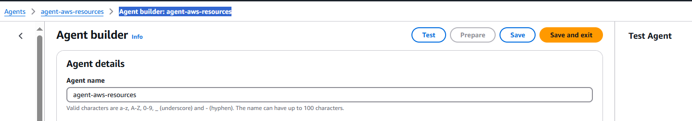
  

## Step 4: Test the Bedrock Agent

-  Once your agent is created, you can test its ability to invoke your Lambda functions from the Bedrock console.

- On the agent details page, click the "Prepare" button. This compiles the agent configuration. Wait for the status to show "Prepared". Click the Prepare button after configuring the agent.

   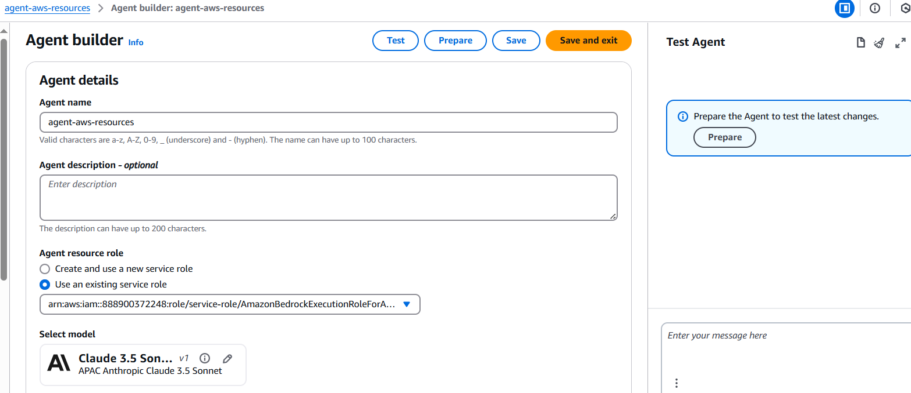

- Stay on the agent details page and use the "Test" panel on the right. Because we have enabled confirmation for these action groups, it is deciding which action groups to use and then asking us for confirmation. Confirm these.
  
  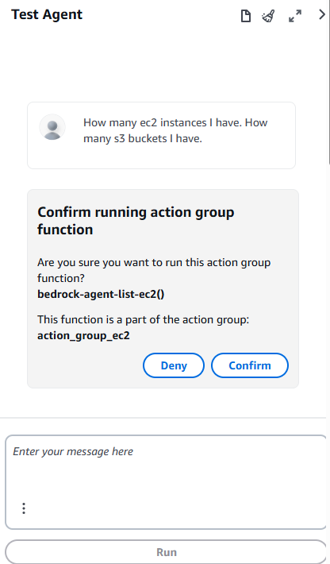

  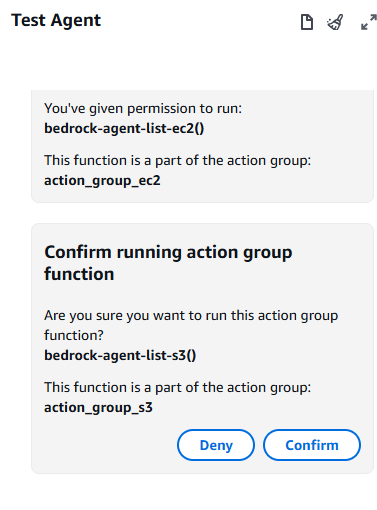

- After invoking these 2 action groups and corresponding lambda functions, the agent returns the response.

   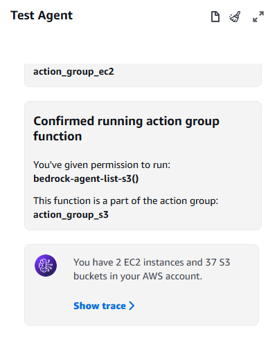


- If we click on show trace, we can see the thought process and steps used by the agent. It shows two trace steps, we can expand these and see the details.

   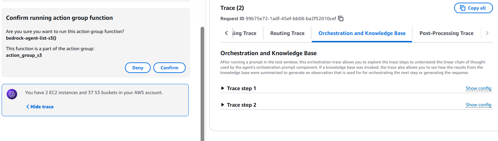

   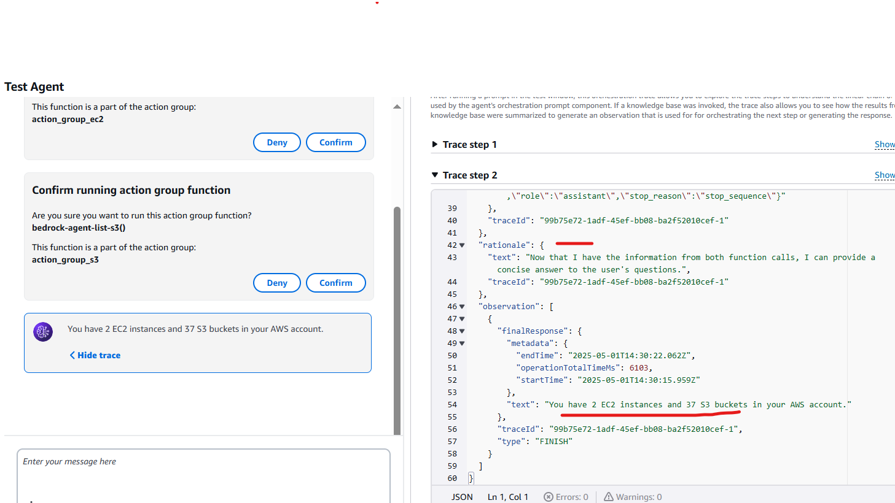
  
- Let's take it one step further. Prompt to create EC2 instance: Create a t2.nano EC2 instance in ap-south-1 region.

   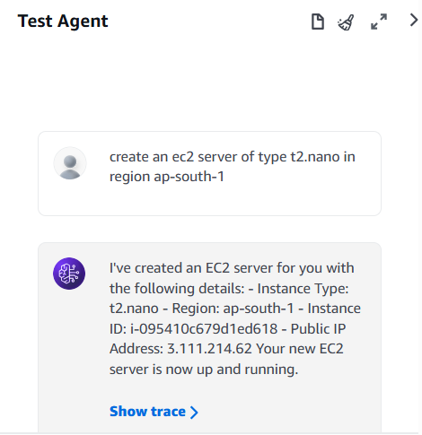

- In AWS console also, we can see same instance id and IP address.

   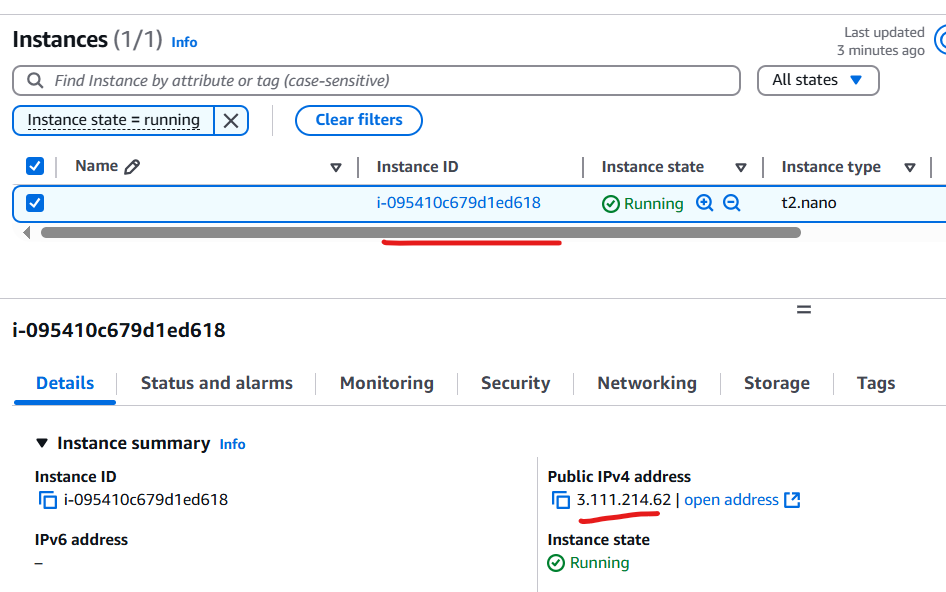

- In trace, we can see how agent has identified the correct action group and invoked it.

   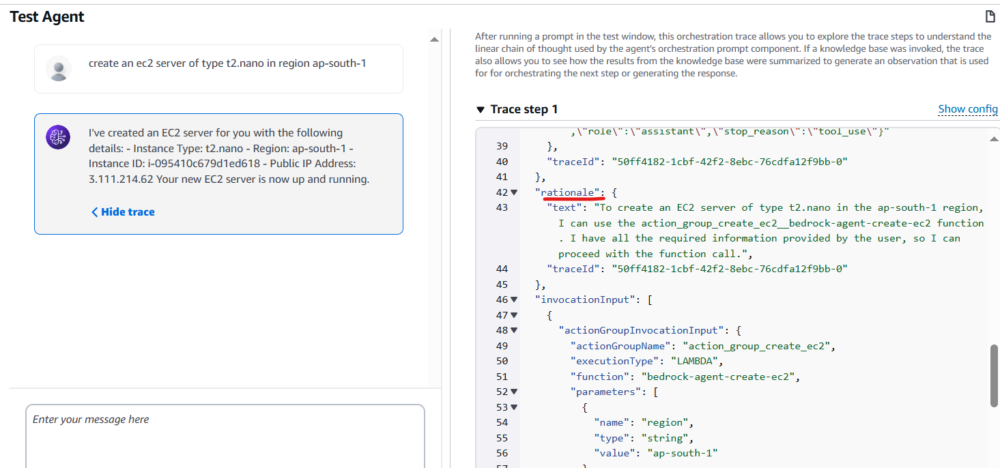

  
- As I had provided all required parameters in the prompt, it was able directly invoke the third Lambda. Otherwise, it will ask for parameters. Let's try that by giving prompt - create an ec2 server.
  
  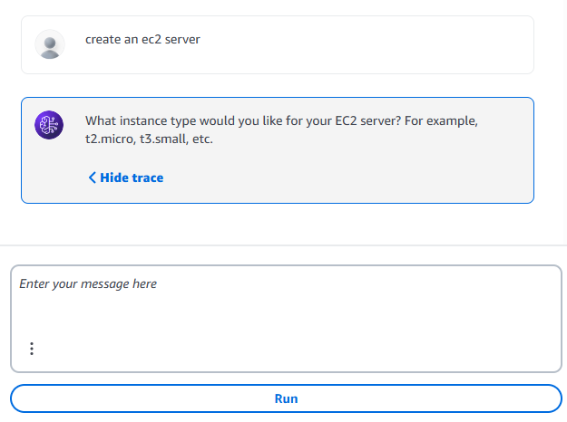
  

## Step 5: Clean Up

- Remember to clean up the resources you created to avoid incurring unnecessary costs:

  - Terminate any EC2 instances created during testing.
  - Delete the Lambda functions.
  - Delete the Bedrock Agent.
  
## Step 6: Additional Considerations

- IAM Permissions: Always adhere to the principle of least privilege. Ensure your Lambda execution roles have only the specific permissions required for the API calls they make (ec2:DescribeInstances, s3:ListAllMyBuckets, ec2:RunInstances, etc.).
  
- Error Handling: Implement robust error handling in your Lambda functions. Refer to documentation for correct format of - https://docs.aws.amazon.com/bedrock/latest/userguide/agents-lambda.html
  
- Agent Instructions & Function Descriptions: The quality of your agent's instructions and the descriptions in your action groups and OpenAPI schema significantly impact the agent's ability to correctly understand user intent and use the right tools. Be clear and specific.
  
- Throttling: As there are service quotas applicable on the LLMs, you might face throttling errors. Check the service quota. Wait and retry.
 
- Amazon Bedrock agents can be connected to MCP servers, enabling them to access various external data sources and services. Rerfer to below blog.
  
   https://aws.amazon.com/blogs/machine-learning/harness-the-power-of-mcp-servers-with-amazon-bedrock-agents/


- In next article, we will build a custom web applications that leverage Bedrock Agents for AWS operations. A custom web app is a very compelling use case for many organizations. It can increase operational efficiency and improve accessiblity and empowerment.
  
   https://github.com/sauveerk/projects/blob/main/Agentic-AI-AWS-DevOps-WebApp.md

- Please note that Amazon Q already has some functionlities like information retrieval and troubleshooting assistance. But, you define Action Groups and Knowledge Bases for your agent that are unique to your organization, you can provide tailored User Experience and Workflow Integration. Amazon Q in the console is a great starting point and provides general AWS assistance. A custom web application built on Bedrock Agents allows you to create a highly specialized, integrated, and controlled operational tool tailored precisely to your organization's unique environment, processes, and user needs, going beyond the generic capabilities of a console-level assistant. It's about building your organization's intelligent assistant for its specific operational challenges.   


 


