# Access AWS Accounts with Azure Active Directory Federation

AWS IAM is a web service that helps you securely control access to AWS resources. With IAM, you can manage permissions that control which AWS resources users can access. Creating and managing the lifecycle of IAM identities in AWS can be time-consuming and error prone. Each time an employee joins a company, moves departments, or leaves a company, IAM identities have to be created, permissions have to be changed to grant or remove access on AWS services, and finally, IAM identities have to be removed to revoke access.

Most organizations follow have a central identity management in place; for example, an on-premises Active Directory (AD) or the cloud service Microsoft Azure Active Directory (Azure AD). Instead of implementing user lifecycle processes in each environment, it’s easier, more reliable, and more secure to implement them in a central user identity store such as Azure AD.

---

## **Architecture Overview**

There are two popular ways to achieve this.

- AWS IAM Identity Center

AWS IAM IDC makes it easy to manage access centrally to multiple AWS accounts and AWS applications, with sign-in through Microsoft Entra ID. Federate Microsoft Entra ID with AWS SSO once, and use AWS SSO to manage permissions across all of your AWS accounts from one place. AWS SSO provisions permissions automatically and keeps them current as you update policies and access assignments. End users can authenticate with their Microsoft Entra credentials to access the AWS Console, Command Line Interface, and AWS IAM IDC integrated applications.

- AWS Single-Account Access

AWS Single-Account Access enables you to federate Microsoft Entra ID to a single AWS account and use Microsoft Entra ID to manage access to AWS IAM roles. AWS IAM administrators define roles and policies in each AWS account. For each AWS account, Microsoft Entra administrators federate to AWS IAM, assign users or groups to the account, and configure Microsoft Entra ID to send assertions that authorize role access.

**In this article we will focus on second approach, i.e., single account access approach.**

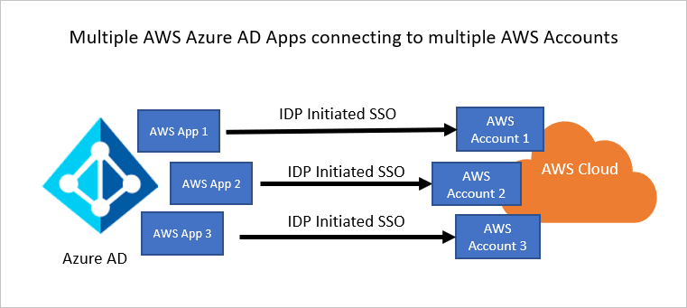

---

## **Step 1: Adding AWS Single-Account Access from the gallery**

- Log into Azure Entra console. Browse to Identity > Applications > Enterprise applications > New application.

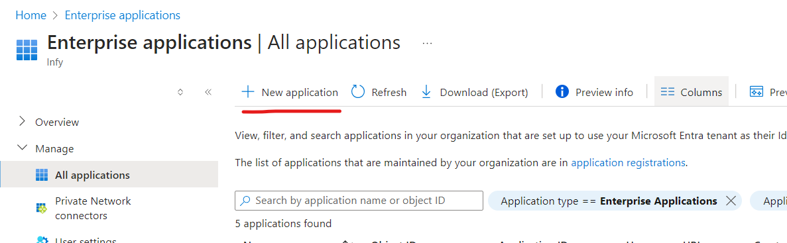
   
- In the Add from the gallery section, type AWS Single-Account Access in the search box. Select AWS Single-Account Access from results panel and then click on Create button. Wait a few seconds while the app is added to your tenant.
  
  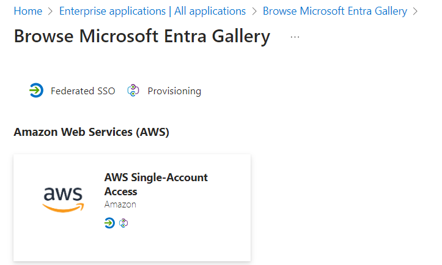
    
---

## **Step 2: Configure Microsoft Entra SSO**

- Go to your application created above in Entra. On the Select a single sign-on method page, select SAML.

   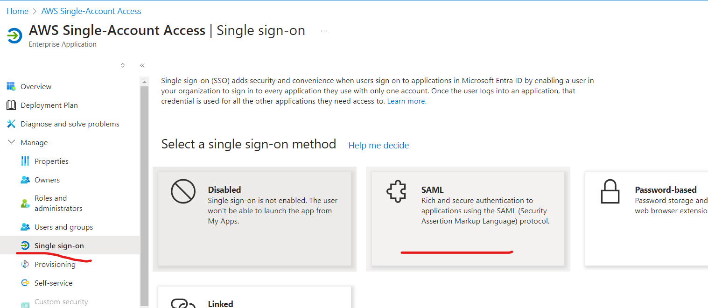

- If you get a prompt, click yes.
  
  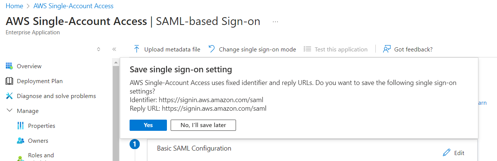

- On the Set up single sign-on with SAML page, click the pencil icon for Basic SAML Configuration to edit the settings. 
  
   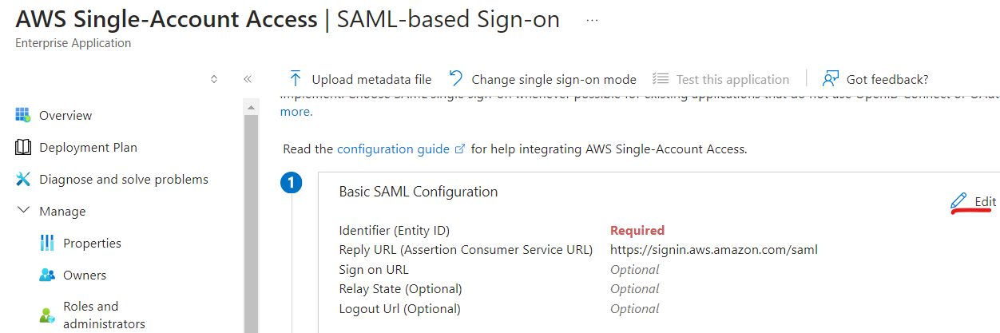

- In the Basic SAML Configuration section, update both Identifier (Entity ID) and Reply URL with the same default value: https://signin.aws.amazon.com/saml. You must select Save to save the configuration changes.

- AWS application expects the SAML assertions in a specific format, which requires you to add custom attribute mappings to your SAML token attributes configuration. The following screenshot shows the list of default attributes. 

  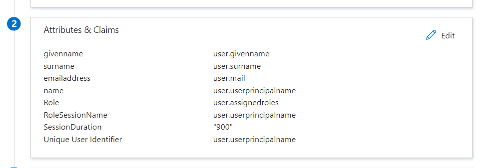

- On the Set up single sign-on with SAML page, in the SAML Signing Certificate (Step 3), a default certificate is automatically added. Click on edit (pencil) icon. 
 
- In the SAML Signing Certificate section, find Federation Metadata XML and select Download to download the certificate and save it on your computer.

   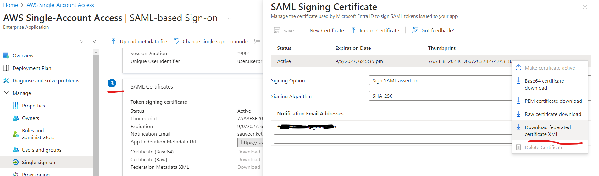  

- In the Set up AWS Single-Account Access section, copy the appropriate URL(s) based on your requirement.
  
  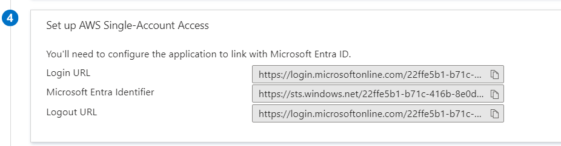

---

## **Step 3: Assign the Microsoft Entra test user**

- Browse to Identity > Users > All users. Select New user > Create new user, at the top of the screen. Give the details. I will use an existing user.

- In the app's overview page, select Users and groups.  Select Add user/group, then select Users and groups in the Add Assignment dialog.
  
  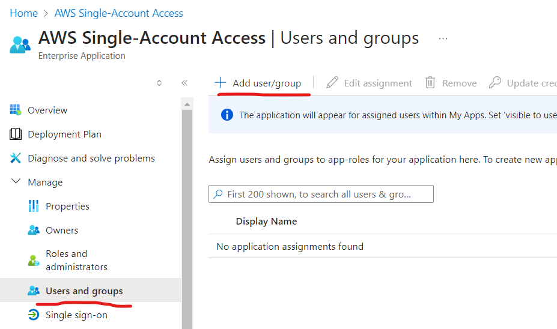

---

## **Step 4: Configure AWS Single-Account Access**

- Log into AWS console, got to IAM.

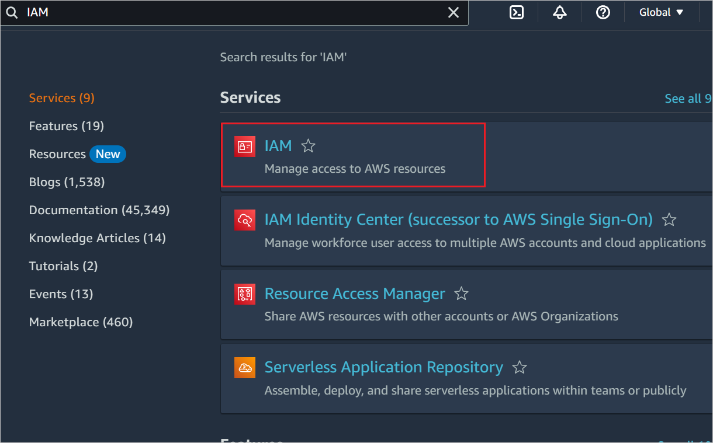
  
- Go to Access management -> Identity Providers and click Add provider button.

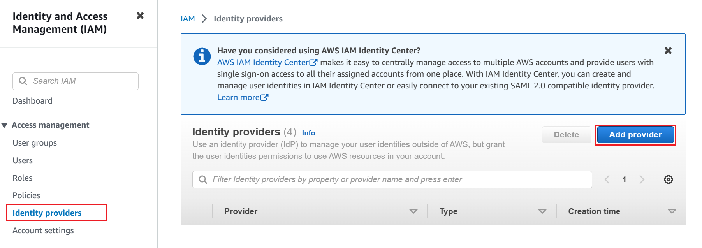

- In the Add an Identity provider page, select SAML, provide a name, upload the meteadata file downloaded above.
  
  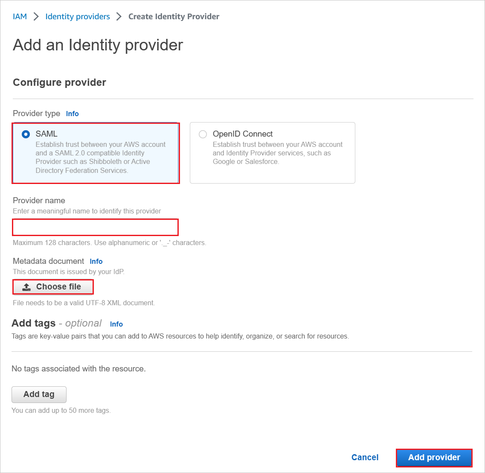

- Select Roles > Create role. On the Create role page, Choose Trusted entity type, select SAML 2.0 federation. Under SAML 2.0 based provider, select the SAML provider you created previously (for example: WAAD). Select Allow programmatic and AWS Management Console access. 

  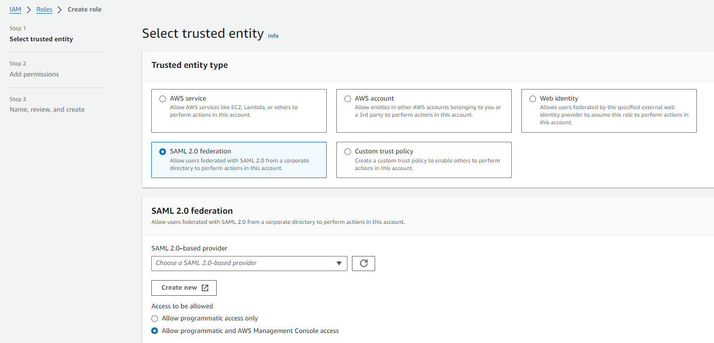

- Select Next. Add appropriate permissions.

  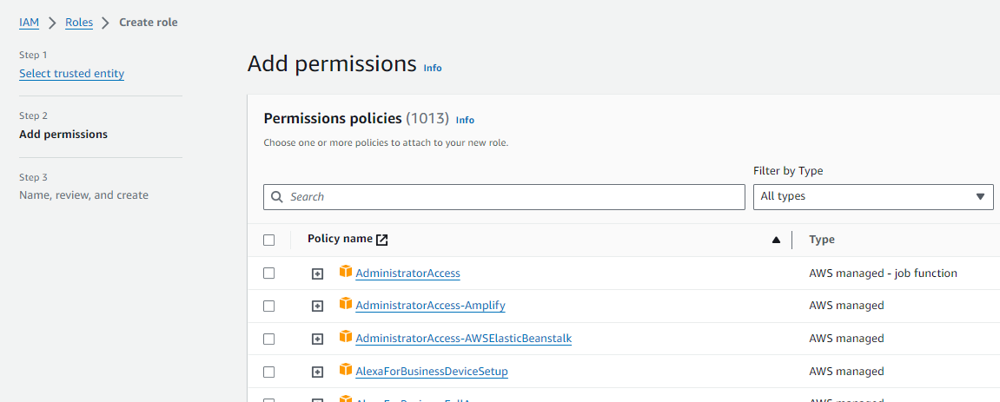

- On the Review dialog box, give a name and choose Create Role.
- We can create multiple roles and map them to identity provider.

---
## **Step 5: Create AWS Service Account**

- Use AWS service account credentials for fetching the roles from the AWS account in Microsoft Entra user provisioning. For this, open the AWS console home. Create an IAM policy using following JSON.  For Name, enter AzureAD_SSOUserRole_Policy.

```
{
    "Version": "2012-10-17",
    "Statement": [
        {
            "Effect": "Allow",
            "Action": [
            "iam:ListRoles"
            ],
            "Resource": "*"
        }
    ]
}

```
- Create an IAM user with name AzureADRoleManager and attach AzureAD_SSOUserRole_Policy to the user. Download the access keys and use this in Entra. Go to user provisioning section of the application. Select automatic from drop down, provide AWS credentials nad select Test Connection. You will get a success message pop up. CLick on save button to save the settings.  


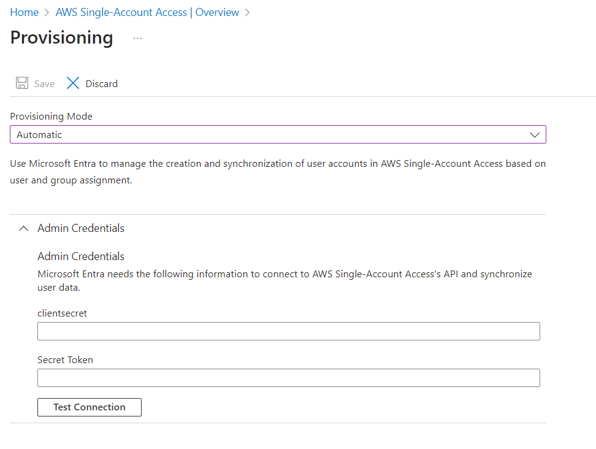

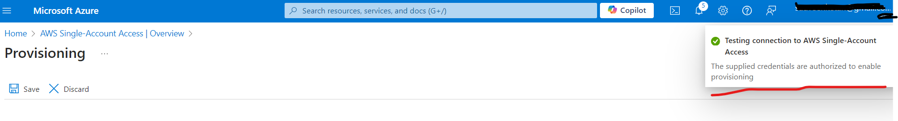

-  Switch Provisioning Status to on and save again.
  
  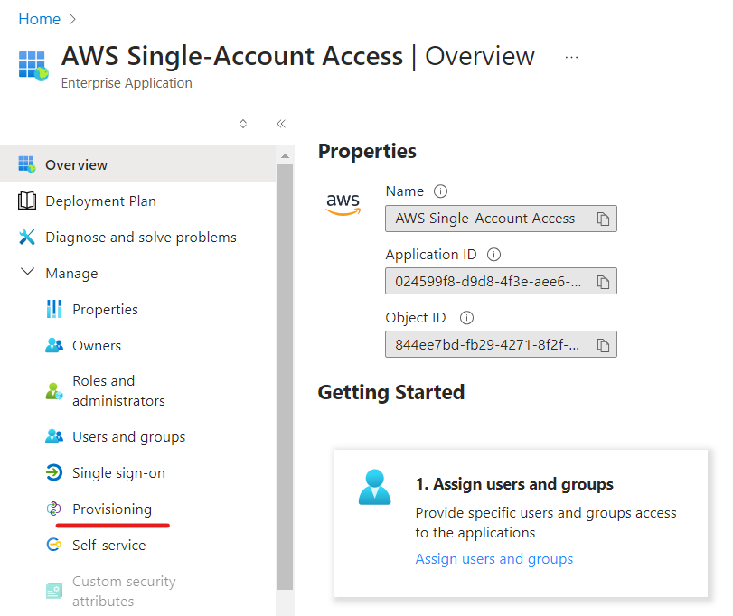

  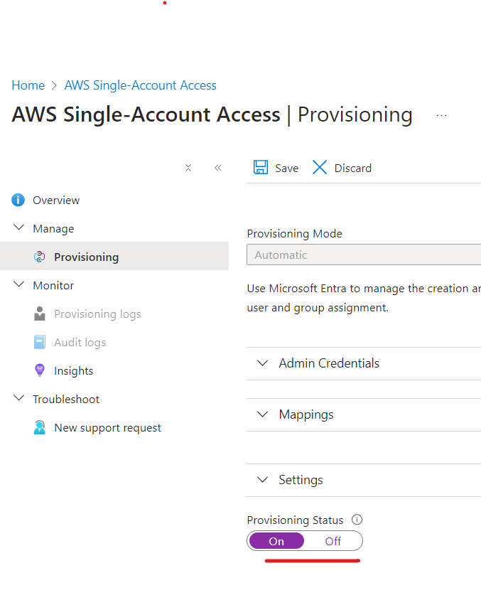 

- The provisioning service imports roles only from AWS to Microsoft Entra ID.  After you save the provisioning credentials, you must wait for the initial sync cycle to run. Sync finishes quickly, but sometimes it can take longer, up to 40 minutes to finish. You can see the status at the bottom of the Provisioning page, under Current Status.

---

## **Step 6: Test Access**

- Go to single sign on section of the application. Click Test. 

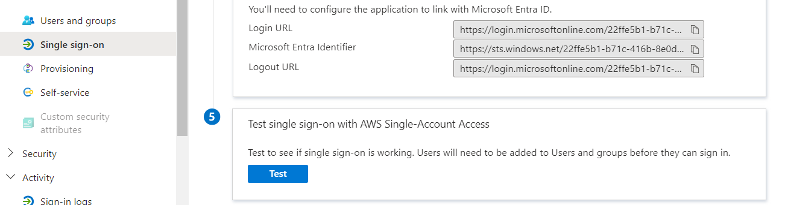

- Applications will also show up in myapps (https://myapps.microsoft.com/). This is how users access it in organizations.

   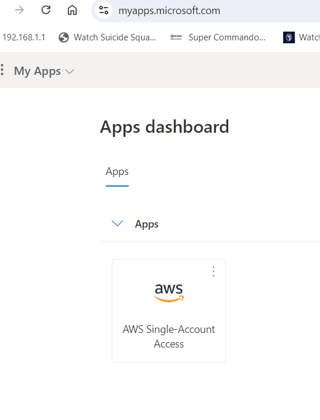

 ## **Step 7: Additional Considerations**

 - Alternative to this approach is federating AWS IAM Identity Center with Azure Entra. But, in this approach permissions has to be managed. AWS IAM Identity Center is somewhat similar to Azure Entra, it is a cental identity mangement system which can be used for accessing AWS accounts and AWS applications like Q, AppStream, Quicksight, etc. 
  
- You can connect IAM Identity Center with your existing identity provider and synchronize users and groups from your directory (Active Directory, Azure Entra, etc.), or create and manage your users directly in IAM Identity Center.