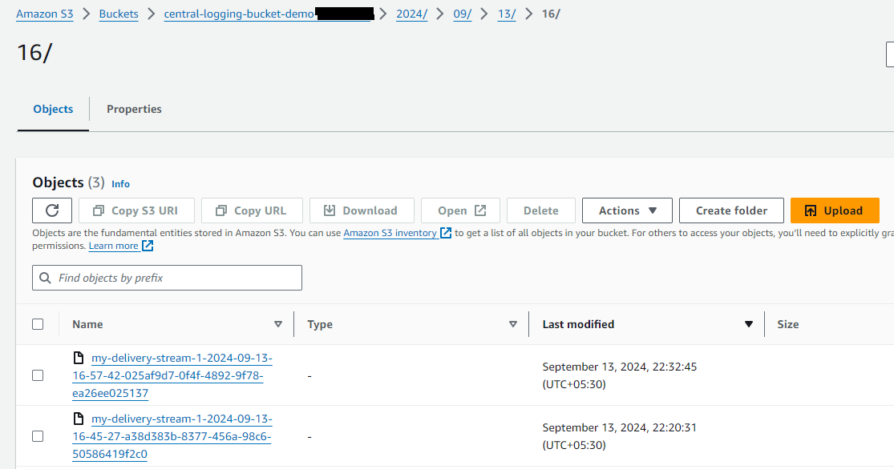

# Centralized Logging Setup in AWS Using CloudWatch Logs, Log Destination, and Kinesis Data Firehose

## Introduction

In a multi-account AWS environment, centralizing logs from various accounts into a single location simplifies monitoring, auditing, and troubleshooting. This article describes how to set up a centralized logging solution where CloudWatch Logs from multiple AWS accounts are delivered to a single S3 bucket in a central account. This setup uses CloudWatch Log Destination, Amazon Data Firehose, and S3.

Generally, organizations use a centralized logging account where all the virtual private cloud (VPC) flows logs, AWS CloudTrail logs, the AWS Config log, and all the logs of Amazon CloudWatch Logs (using subscriptions) from all the other accounts are stored. It is a hub and spoke model. 

Many services like Cloudtrail and Config are integrated with AWS organizations and for them centralization can be easily enabled. For CloudWatch, it needs to be configured.

You can use subscriptions to get access to a real-time feed of log events from CloudWatch Logs and have it delivered to other services such as an Amazon Kinesis Stream, an Amazon Data Firehose, or AWS Lambda for custom processing, analysis, or loading to other systems including third party systems like Splunk. 

To begin subscribing to log events, create the receiving resource, such as an Amazon Data Firehose, where the events will be delivered. A subscription filter defines the filter pattern to use for filtering which log events get delivered to your AWS resource, as well as information about where to send matching log events to.

You can create subscriptions at the account level and at the log group level. Each account can have one account-level subscription filter. Each log group can have up to two subscription filters associated with it.

You can also use a CloudWatch Logs subscription to stream log data in near real time to an Amazon OpenSearch Service cluster. 

In this example, we will create a CloudWatch Logs subscription that sends any incoming log events that match our defined filters to our Amazon Data Firehose delivery stream which sends it to a central S3 bucket. 

## Architecture Overview

1. **Source Account**: CloudWatch Logs are generated in the source account.
2. **Central Account**: Hub or recipient account that will host the centralized S3 bucket and Kinesis Data Firehose.
3. **Log Destination**: A CloudWatch Log Destination in the central account receives logs from the source account.
4. **Kinesis Data Firehose**: The log destination forwards logs to Kinesis Data Firehose in central account, which delivers them to an S3 bucket in the central account.

     
     
        

### Step 1: Create a S3 Bucket in the Central Account

- Navigate to the S3 Console in the central account. Create a new bucket, give it a unique name.
  
   

 ### Step 2: Set Up Amazon Data Firehose in the Central Account

- Create an IAM role that allows Data Firehose to write to the S3 bucket. Trust policy should allow firehose.amazonaws.com, give the role following permissions. Replace the bucket name.
  
  ```
    {
    "Statement": [
      {
        "Effect": "Allow",
        "Action": [ 
            "s3:AbortMultipartUpload", 
            "s3:GetBucketLocation", 
            "s3:GetObject", 
            "s3:ListBucket", 
            "s3:ListBucketMultipartUploads", 
            "s3:PutObject" ],
        "Resource": [ 
            "arn:aws:s3:::my-bucket", 
            "arn:aws:s3:::my-bucket/*" ]
      }
    ]
  }
  ```
- Create a destination Firehose delivery stream by running below command, replacing the placeholder values for RoleARN and BucketARN with the role and bucket ARNs that you created:

  ```
  aws firehose create-delivery-stream \
    --delivery-stream-name 'my-delivery-stream' \
    --s3-destination-configuration \
    '{"RoleARN": "arn:aws:iam::recipientAccountId:role/FirehosetoS3Role", "BucketARN": "arn:aws:s3:::my-bucket"}'
  ```                 

- Wait until the stream becomes active (this might take a few minutes). You can use the Firehose describe-delivery-stream command to check the DeliveryStreamDescription.DeliveryStreamStatus property. 

   aws firehose describe-delivery-stream --delivery-stream-name "my-delivery-stream"

- We can also verify it in Data Firehose console.

   


### Step 3: Create a CloudWatch Log Destination in the Central Account

- When the delivery stream is active, create the IAM role that will grant CloudWatch Logs the permission to put data into your Firehose stream. Use this trust policy for the role. This role will be used in put-destination command below in 3rd step.

```
{
    "Statement": {
        "Effect": "Allow",
        "Principal": {
            "Service": "logs.region.amazonaws.com"
        },
        "Action": "sts:AssumeRole",
        "Condition": {
            "StringLike": {
                "aws:SourceArn": [
                    "arn:aws:logs:region:sourceAccountId:*",
                    "arn:aws:logs:region:recipientAccountId:*"
                ]
            }
        }
     }
}
```
- Attach these permissions to the role.

```
{
    "Statement":[
      {
        "Effect":"Allow",
        "Action":["firehose:*"],
        "Resource":["arn:aws:firehose:region:recipientAccountId:*"]
      }
    ]
}
```

- Create logs destination in hub account, replace target-arn and role-arn with correct values.

```
aws logs put-destination \                                                       
    --destination-name "testFirehoseDestination" \
    --target-arn "arn:aws:firehose:us-east-1:recipientAccountId:deliverystream/my-delivery-stream" \
    --role-arn "arn:aws:iam::recipientAccountId:role/CWLtoKinesisFirehoseRole"
```

- Attach destination access policy 

```
{
  "Version" : "2012-10-17",
  "Statement" : [
    {
      "Sid" : "",
      "Effect" : "Allow",
      "Principal" : {
        "AWS" : "SourceAccountId"
      },
      "Action" : "logs:PutSubscriptionFilter",
      "Resource" : "arn:aws:logs:us-east-1:recipientAccountId:destination:testFirehoseDestination"
    }
  ]
}

```
aws logs put-destination-policy \
    --destination-name "testFirehoseDestination" \
    --access-policy file://~/AccessPolicy.json


### Step 4: Set Up CloudWatch Log Subscriptions in the Source Account

- Go to CloudWatch log groups, select relevant group, under actions, under Subscription Filters, select Data Firehose option. 


- Select cross-account and provide destination ARN (central account Data Firehose ARN created above). Give a name and choose Start Streaming.
  
  


### Step 5: Test the Setup

1. **Generate Logs**: In the source account, generate some CloudWatch logs, I am generating these by running a lambda function. First screenshot shows time in UTC, but next one shows local time zone time, which will match with s3 timestamp approximately.


2. **Check Data Firehose**: In the central account, monitor the Kinesis Data Firehose stream to see if it receives data.
3. **Verify S3 Bucket**: Check the S3 bucket in the central account to ensure that logs are being stored as expected.



### Step 6: Additional Considerations

- You can set an account-level subscription policy that includes a subset of log groups in the account. The account subscription policy can work with Amazon Kinesis Data Streams, AWS Lambda, or Amazon Data Firehose. This document provides examples you can follow to create an account-level subscription for Kinesis Data Streams, Lambda, and Firehose.
  
   https://docs.aws.amazon.com/AmazonCloudWatch/latest/logs/SubscriptionFilters-AccountLevel.html
   
- AWS released a feature to support decompression of CloudWatch Logs in Firehose. With this new feature, you can specify an option in Firehose to decompress CloudWatch Logs. You no longer have to perform additional processing using AWS Lambda or post-processing to get decompressed logs, and can deliver decompressed data to Splunk, S3, etc. Additionally, you can use optional Firehose features such as record format conversion to convert CloudWatch Logs to Parquet or ORC, and dynamic partitioning to automatically group streaming records based on keys in the data (for example, by month) and deliver the grouped records to corresponding Amazon S3 prefixes.

- AWS provides a ready-to-use solution for centralized logging which stores logs in OpenSearch.

   https://aws.amazon.com/solutions/implementations/centralized-logging-with-opensearch/

    


