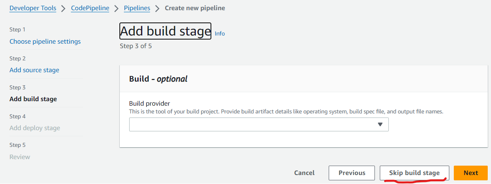

# Setting Up CI/CD Pipeline with AWS CodePipeline for Cloudformation Template Deployment

- We will store cloudformation template and related artifcats in CodeCommit. This will provide version control functionality also. 

- We will create a CI/CD pipeline using CodePipeline. When we commit our code, pipeline will be triggered and deploy the template.

- AWS Services Used - CodeCommit, CodePipeline, Cloudformation, S3

## Step 1: Set up AWS CodeCommit Repository

- Navigate to the AWS Management Console and go to the CodeCommit service.
- Create a new repository or use an existing one to store your CloudFormation template.
  
  

- Clone the repository locally and add your CloudFormation template file to it. Files can also be added directly from console, but it is only suitable for small testing.


## Step 2: Set Up IAM Roles

- Create IAM roles with appropriate permissions for CodePipeline and CloudFormation.
- Ensure that these roles have the necessary permissions to access and modify relevant AWS resources.

## Step 3: Create CloudFormation Stack

- Write your CloudFormation template specifying the resources you want to deploy. Store in CodeCommit repository.
- I have used two simple files - bucketcft.yml creates a S3 bucket.

```
Parameters:
  BucketName:
    Type: String
    Default: cfttest-sauv-pipe
Resources:
  TestBucket:
    Type: 'AWS::S3::Bucket'
    Properties:
      BucketName: !Sub '${BucketName}-${AWS::Region}-${AWS::AccountId}'
      Tags:
        - Key: Purpose
          Value: Testing CFT Pipelne
```
- Parameters.json passes bucket name as a parameter.
  
 ``` 
  {
  "Parameters" : {
    "BucketNameP" : "cfttest-sauv-pipe-1122"
  }
}

```

## Step 4: Set Up AWS CodePipeline

- Go to the AWS Management Console and navigate to the CodePipeline service.
- Click on "Create pipeline" and specify a name for your pipeline.
  
  

- Keep your pipeline settings as default on settings page, you can choose an existing role created above (recommended) or let CodePipeline create a new role. 
  
- Select source provider as CodeCommit, select your repository name and branch. Leave other settings as default.
  
  

- Choose skip on build stage page, as cloudformation deployment does not need a build stage.
  
  

- On deploy stage page, choose AWS CloudFormation as the deploy provider. Under Action mode, select Create or Update Stack. . 
  
  

- Select an existing stack or give a new name. Give artifact names present in codecommit - cloudformation template and paramters file (optional).
  
  
  
- Give a role name from your account that is configured for cloudformation execution. Leave other settings as default.
  
  

- Review the settings and create pipeline.

## Step 5: Configure CodePipeline Execution

- Now, when we commit files to codecommit. It will trigger the CI/CD process.
  
- Monitor the pipeline execution status and review any logs or errors encountered during the process.
  
  

- After pipeline execution completes, check if cloudformation stack has been created.
  
  
  
- Check if resources (bucket in this case) have been created.
  
  

## Step 6: Test Deployment

- Modify BucketName in parameters file and commit it. I have given 1133 in the name instead of 1122. It will trigger the pipeline execution again.

```
{
  "Parameters" : {
    "BucketName" : "cfttest-sauv-pipe-1133"
  }
}
```
- Monitor pipeline execution. After it succeeds, check if stack has been modified existing S3 bucket (with 1122 in name) has been deleted and new bucket (with 1133 in name) has been created.
  
  

  

- We have succesfully created a pipeline for cloudformation template deployment using source control. We tested initial deployment of the template. Then, we tested modifiying the template and verified deployment of the changes.
