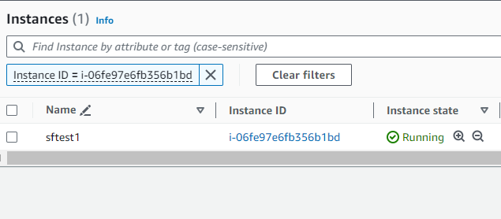
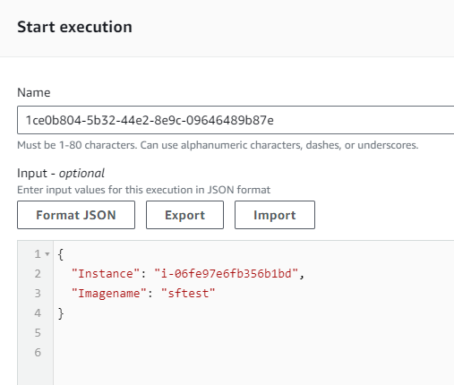

# Deploying an AWS S3 Static Website and Putting it Behind CloudFront

## Step 1: Create an S3 Bucket

- Go to the AWS Management Console and navigate to the S3 service.
- Click on "Create bucket" and follow the prompts to create a new bucket.
- Bucket name can be anything unique. But, if you want to use custom domain, ensure that the bucket name matches your domain name (e.g., sauveer-resume.skcarchitect.org in my case).

## Step 2: Upload Your Website Files to the S3 Bucket

- Select your newly created bucket and click on the "Upload" button.
- Upload all your static website files (HTML, CSS, JavaScript, images, etc.) to the bucket.

## Step 3: Enable Static Website Hosting

- In the bucket properties, navigate to the "Static website hosting" section.
- Select "Use this bucket to host a website" and specify the index document (e.g., index.html).
- Note down the endpoint URL provided (e.g., http://your-bucket-name.s3-website-your-region.amazonaws.com).

## Step 4: Create a CloudFront Distribution

- Go to the CloudFront service in the AWS Management Console.
- Click on "Create Distribution" and choose "Web" distribution type.
- Enter the S3 bucket endpoint URL as the "Origin Domain Name."
- Configure additional settings such as default cache behavior, viewer protocol policy, and distribution settings.
- Click "Create Distribution" to create your CloudFront distribution.

## Step 5: Update DNS Records

- Go to your DNS management console (e.g., Route 53) and update your DNS records.
- Create a new CNAME record pointing to your CloudFront distribution domain name.
- Wait for DNS changes to propagate.

## Step 6: Test Your Website

- After DNS propagation is complete, access your website using the domain name.
- Ensure that your website loads properly and all assets are being served through CloudFront.

## Step 7: Additional Considerations

- Set up SSL/TLS certificate for your CloudFront distribution to enable HTTPS.
- Configure caching behavior and distribution settings for optimal performance.
- Monitor CloudFront metrics and logs to ensure your website is performing as expected.

Congratulations! Your AWS S3 static website is now deployed and served through CloudFront.

