# Deploying an AWS S3 Static Website and Putting it Behind CloudFront

- I have created an html file for my resume. Through below steps, I have configured my resume as a S3 static website. 

- S3 static website does not support https, website endpont that you see under S3 properties is http only. So,to make my website secure, I have put it behind a cloudfront distribution. 

- Instead of default domain name provided by AWS, I have configured a custom domain in Route 53. 

- AWS services used - S3, Cloudfront, ACM, Route 53.

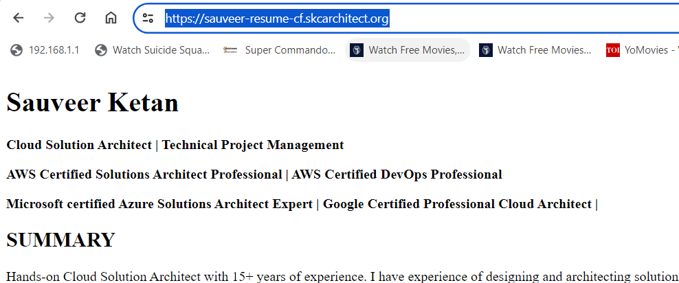

## Step 1: Create an S3 Bucket

- Go to the AWS Management Console and navigate to the S3 service.
- Click on "Create bucket" and follow the prompts to create a new bucket.
- Bucket name can be anything unique. But, if you want to use custom domain, ensure that the bucket name matches your domain name (e.g., sauveer-resume.skcarchitect.org in my case).
  
## Step 2: Upload Your Website Files to the S3 Bucket

- Select your newly created bucket and click on the "Upload" button.
- Upload all your static website files (HTML, CSS, JavaScript, images, etc.) to the bucket.

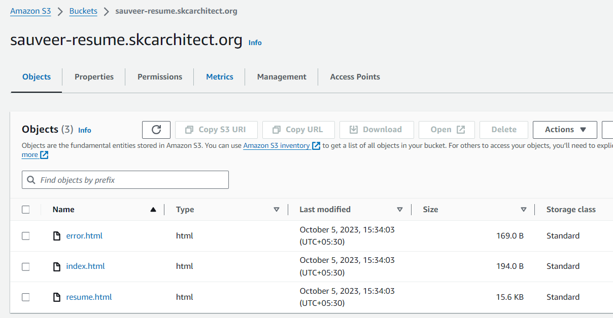

## Step 3: Enable Static Website Hosting

- In the bucket properties, navigate to the "Static website hosting" section.
- Select "Use this bucket to host a website" and specify the index document (e.g., index.html).
- Note down the endpoint URL provided (e.g., http://your-bucket-name.s3-website-your-region.amazonaws.com).

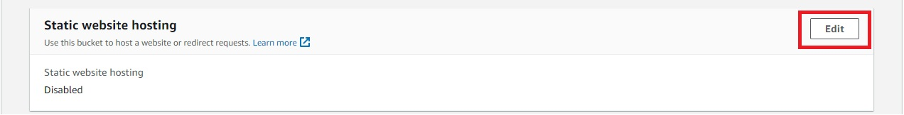

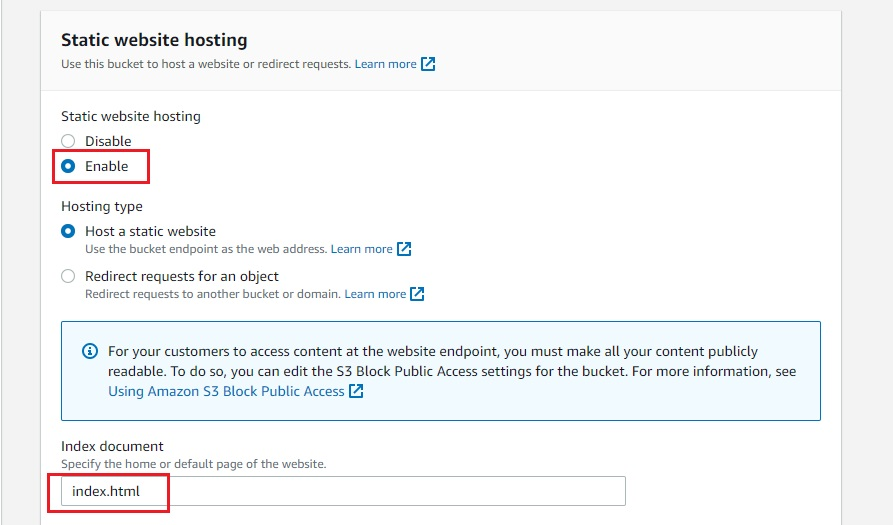

## Step 4: Making bucket public

- By default, Amazon S3 blocks public access to your account and buckets. If you want to use a bucket to host a static website, you can use these steps to edit your block public access settings.
- Choose the name of the bucket that you have configured as a static website. Choose Permissions.
- Under Block public access (bucket settings), choose Edit. Clear Block all public access, and choose Save changes.
  
  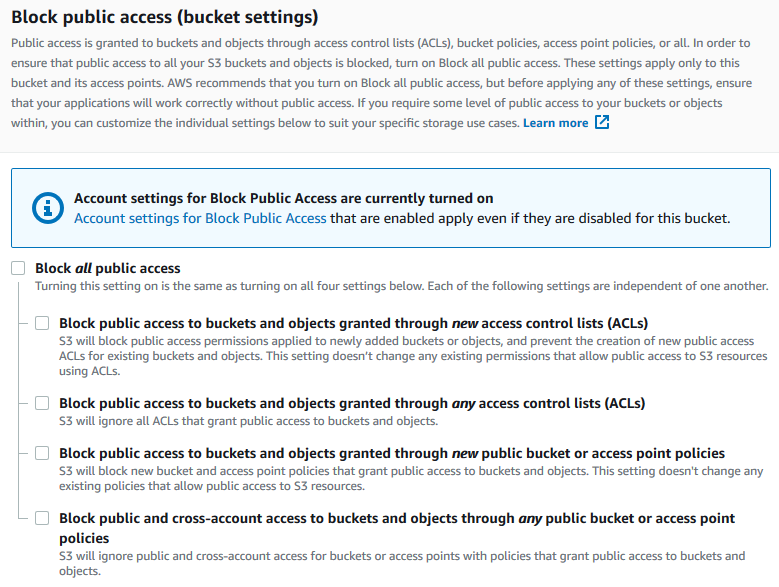

- Amazon S3 turns off Block Public Access settings for your bucket. To create a public, static website, you might also have to edit the Block Public Access settings for your account before adding a bucket policy. If account settings for Block Public Access are currently turned on, you see a note under Block public access (bucket settings).
- Finally, add a bucket policy that makes it public. Choose Permissions. Under Bucket Policy, choose Edit. To grant public read access for your website, copy the following bucket policy, and paste it in the Bucket policy editor.
  
 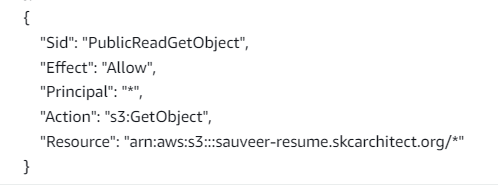

- My website is ready now, it can be accessed using bucket website endpoint given under properties. 

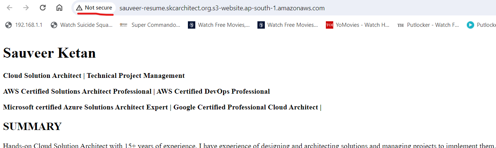

- For using a custom url, I need to create DNS record. I own a domain and I have a public hosted zone in Route 53. I have created an alias to point to s3 static website.

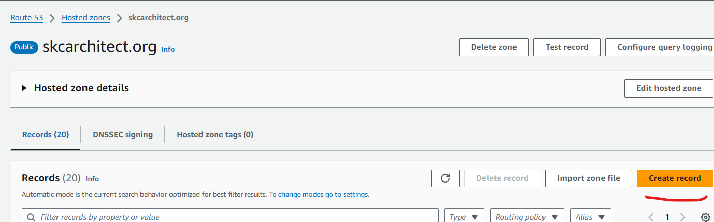

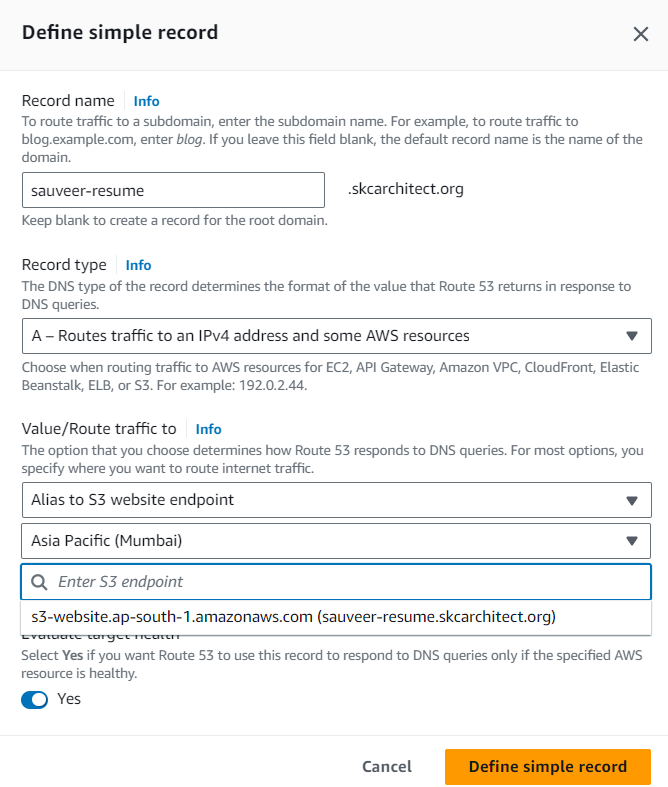

- Now, I can access my website using custom domain. But, this is http website and hence not secure. To make a S3 static website accessible via https, we need to put it behind a cloudfront distribution. 

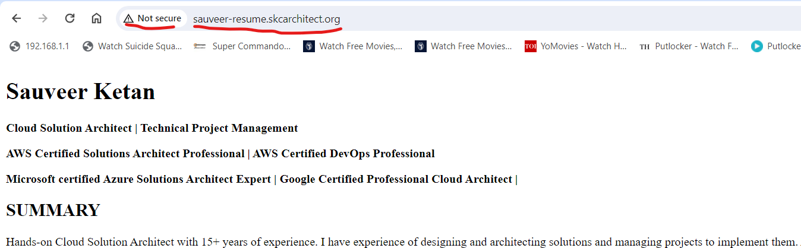

## Step 5: Create a TLS Certificate in ACM

- Go to ACM. You have to select the AWS North Virginia region(US-East-1). As CloudFront recognizes only this region as it's ACM certificates. 
- Reques a certificate. Choose public certificate.

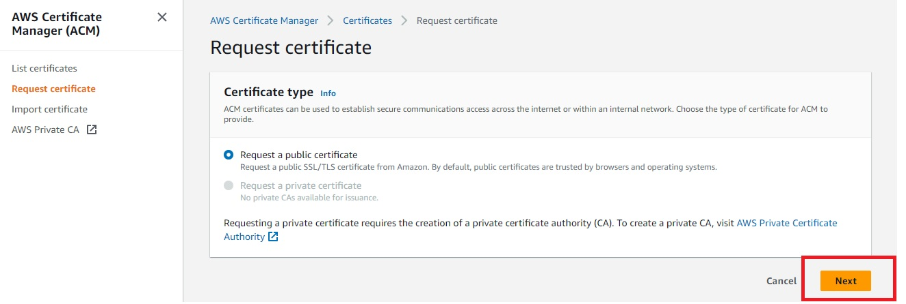

- Provide your Domain names, select a Validation method rest all are fine click on request.
  
  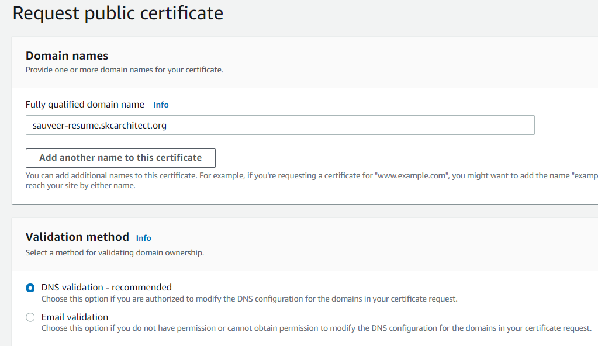

- Once you click request, you need to add the given record in Route 53 by clicking on Create records in Route 53.

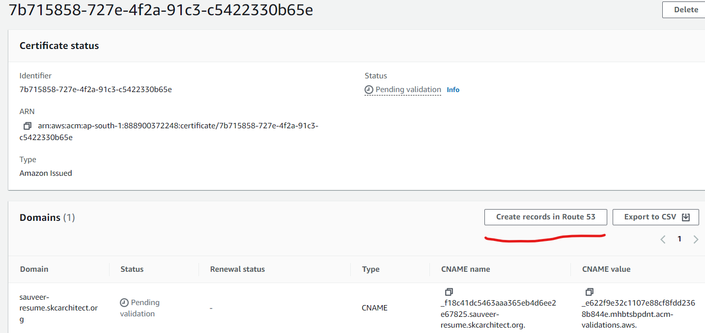

- After some time, certificate will become available.

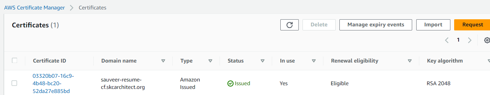

## Step 6: Create a CloudFront Distribution

- Go to the CloudFront service in the AWS Management Console.
- Click on "Create Distribution". Select your s3 bucket website endpoint as origin domain.

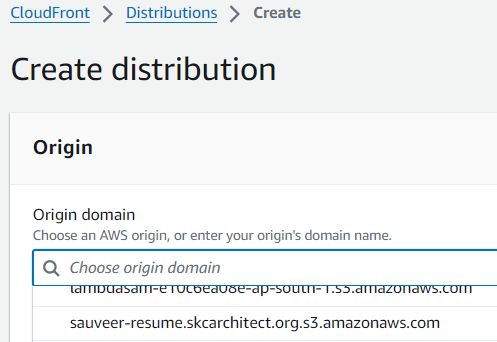

- In Viewer protocol policy select to Redirect HTTP to HTTPS.

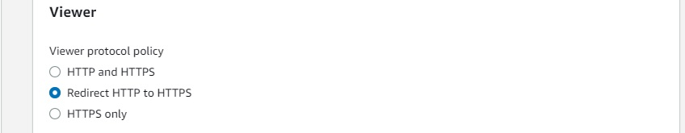

- Add custom SSL certificate.

- Select Web Application Firewall (WAF). You can select as per your requirment.

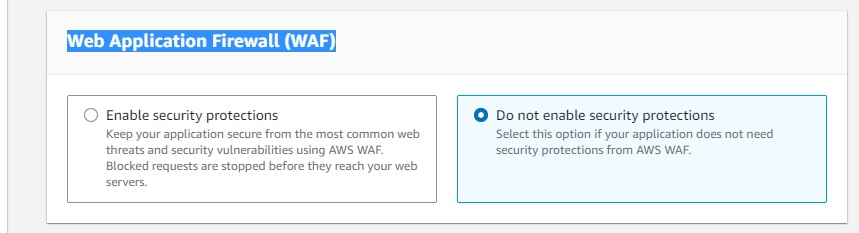

- Mention Default root object and Click on Create distribution.

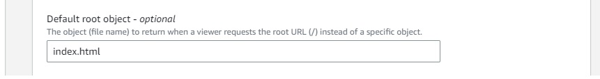

- After distribution is created, you can access the website using distribution domain name.

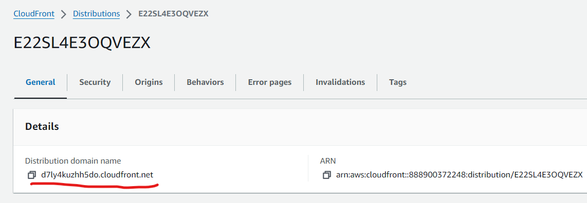

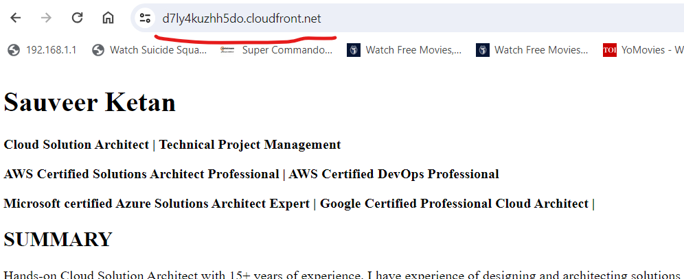

## Step 7: Update DNS Records

- Go to your DNS management console (e.g., Route 53) and update your DNS records.
- Create a new alias record pointing to your CloudFront distribution domain name.

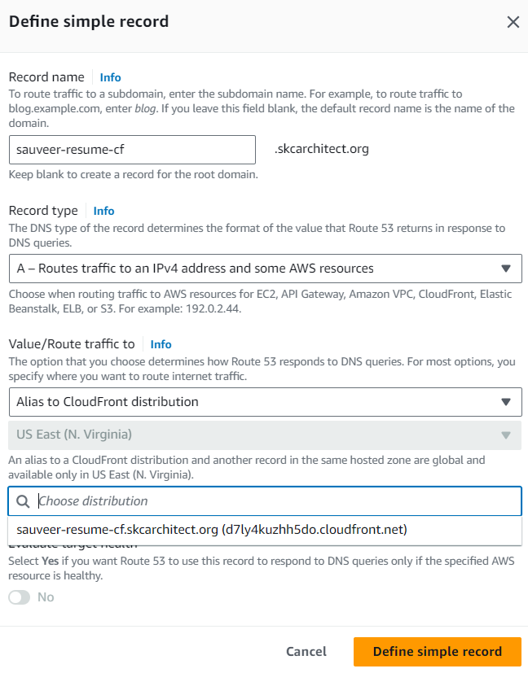

- Wait for DNS changes to propagate.
- Website is available now using https.

- Congratulations! Your AWS S3 static website is now deployed and served through CloudFront.

## Step 8: Additional Security (optional)

- In above configuration, S3 bucket is open for public (anonymous) access and s3 endpoint can be directly accessed. To restrict access from cloudfront only, restrict access with a Referer header.

- Under Add custom header, choose Add header. For Header name, enter Referer. For Value, enter a customer header value that you want to forward to the origin (S3 bucket). To restrict access to the origin, enter a random or secret value that only you know.

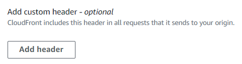

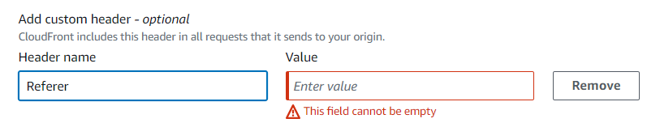

- Open your website's bucket from the Amazon S3 console. Then, add a bucket policy that allows s3:GetObject on the condition that the request includes the custom Referer header that you specified in above step. To block access for any request that doesn't include the custom Referer header, use an explicit deny statement in the bucket policy.

- For this configuration, you must turn off the S3 bucket's block public access settings. Amazon S3 considers a bucket policy that grants anonymous access restricted by a Referer to be public.

## Step 9: Additional Security (optional)

- In above configuration, S3 bucket block public access setting is off. Also, cloudfront to S3 connection is http only, not https. 

- To fix these, use the REST API endpoint as the origin. Then, restrict access with an origin access control (OAC). **(Note - Not recommended, for hosting websites, it is recommended to use S3 static website).**
   
- You don't need to turn on static website hosting on your bucket for this configuration. This configuration uses the REST API endpoint of the bucket instead of the website endpoint from the static website hosting feature. 
  
- When you create your distribution, enter your Amazon S3 bucket name in Origin Domain field. You can choose bucket endpoint, even if static website is enabled. **(Note - this is not recommended by AWS, in cloudfront console when you select this option, it gives warning to choose website endpoint instead).**
  
  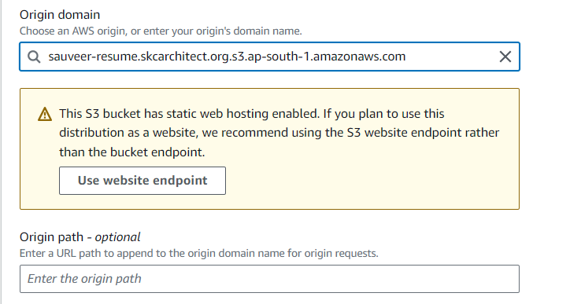

- Under Origin access, select Origin access control settings (recommended).

- In the Origin access control dropdown list, select the OAC name, or create new, and choose Create control setting.

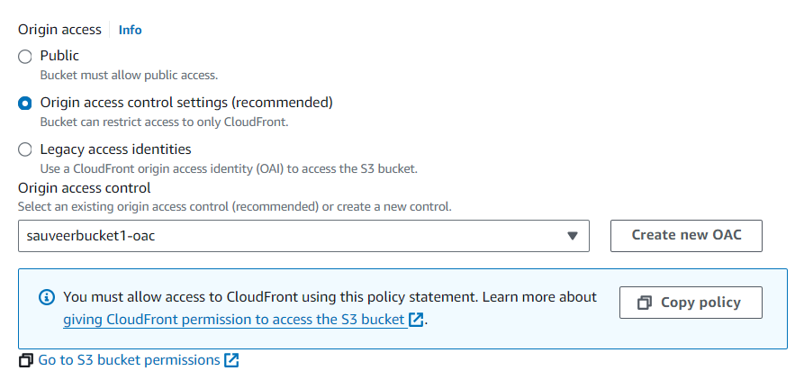

- CloudFront provides you with the policy statement to give OAC permission to access your Amazon S3 bucket after you create the distribution. Select Copy Policy and paste the policy in your S3 bucket policy configuration.

