# Connecting AWS VPCs Using Transit Gateway

- Organizations need a way to connect multiple VPCs spread across multiple AWS accounts. Transit Gateway provides one of the popular ways to do this through hub and spoke model. Transit Gateway is created in shared central networking AWS account (i.e., hub), and it is shared using RAM (resource access manager) with other accounts (i.e., spokes). All the accounts create Transit Gateway attachments for their VPCs and complete other required steps and VPCs are able to connect with each other through Transit Gateway.

- I am using two different accounts here, one primary central account, other secondary account. We have one ec2 instance in each of them. These VPCs have one private subnet in each for TGW attachment. 
  
Primary instance private IP address - 10.0.2.8

Secondary instance private IP address - 172.32.2.139

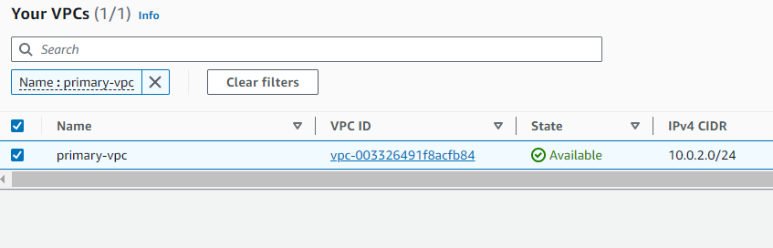

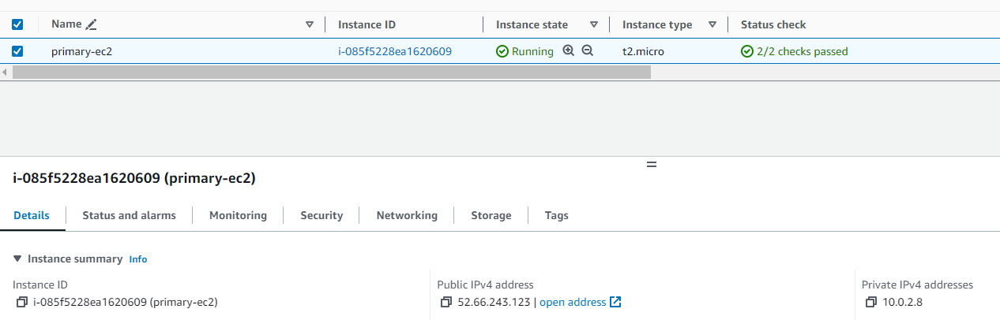

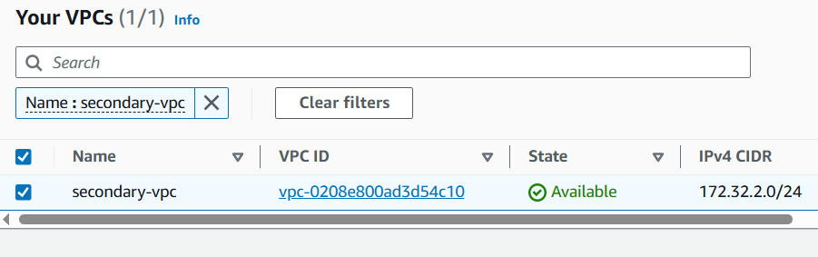

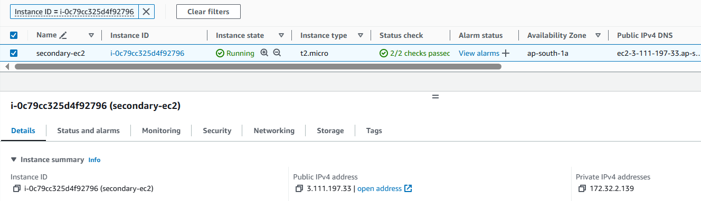

- There is no connectivity between these VPCs, so these servers cannot access each other using private IP address. We will use ping to test connectivity, so also add inbound ICMP rule in the security group of both servers.

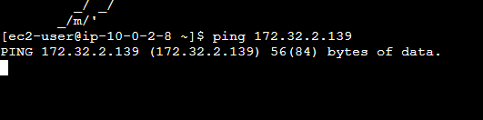

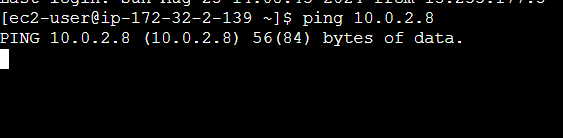

## Step 1: Create a Transit Gateway in Primary Account

- Navigate to the AWS Management Console and go to the VPC service.
- Click on "Transit Gateway" and then "Create Transit Gateway."
- Select "Auto accept shared attachments", keep other options as default.
- Create the transit gateway.
  
  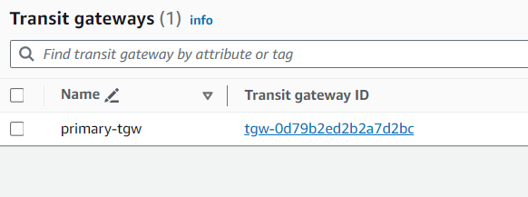

- Share this TGW with secondary account. Go to RAM, Share Resources, select Transit Gateway created above and select secondary account number. Create resource share.

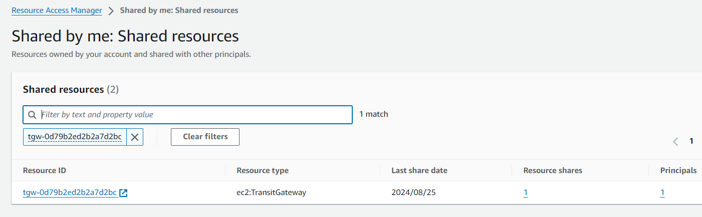

- Go to RAM in secondary account under "shared with me" section. Accept the shared transit gateway. Now, transit gateway will be visible in Transit Gateway console also.

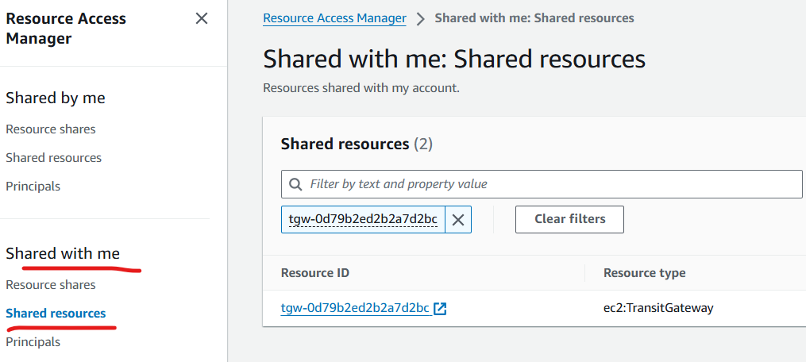

## Step 2: Attach VPCs to the Transit Gateway

- Go to the Transit Gateway dashboard in primary account and select the transit gateway created in Step 1.
- Click on "Attachments" and then "Attach VPC."
- Choose the primary VPC and tgw related private subnet within and create attachment. These subnets are  used by the transit gateway to route traffic.   
- Transit Gateway places a network interface in the connectivity subnet using one IP address from the subnet. Specifying one subnet for an Availability Zone enables traffic to reach resources in other subnets in that Availability Zone.

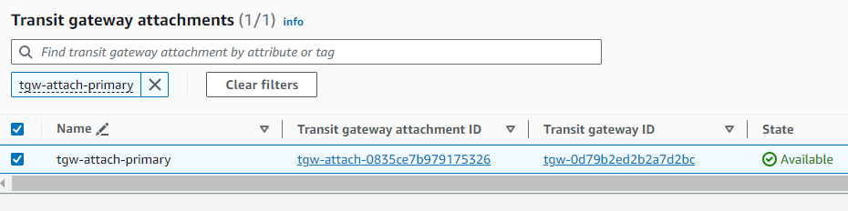

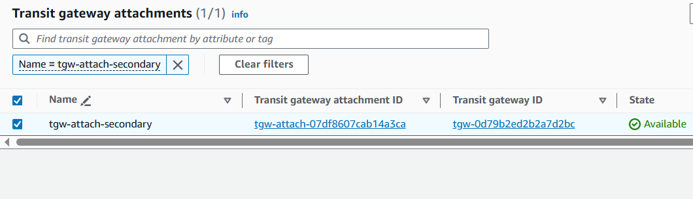

## Step 3: Update Route Tables

- Navigate to the Route Tables section in the VPC dashboard for each attached VPC.
- Update the route tables to include a route to the CIDR block of the other VPC via the transit gateway. Select TGW in target, you will be able to select the attachment we created earlier.

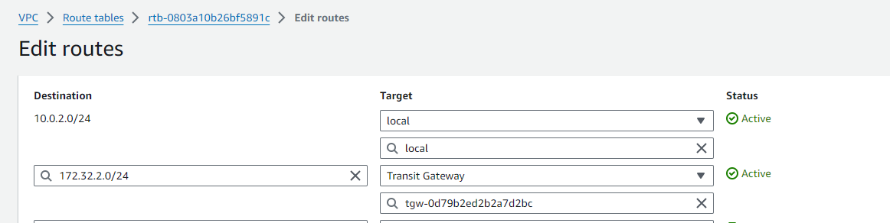

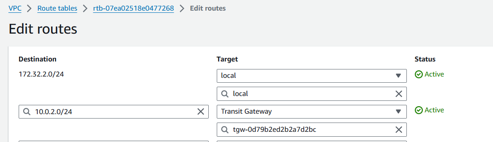

## Step 4: Configure Security Groups and Network ACLs

- Review and adjust the security group and network ACL settings for the attached VPCs as needed.
- Ensure that the necessary inbound and outbound rules are configured to allow traffic to flow between the VPCs via the transit gateway.
- In our case, we already have added inbound ICMP rules to our ec2 security group and default NACL attached to  the subnets allows all traffic.

## Step 5: Test Connectivity

- Verify that the instances in one VPC can communicate with instances in the other VPC over the transit gateway.
- Now servers are able to reach each other using private IP addresses. 

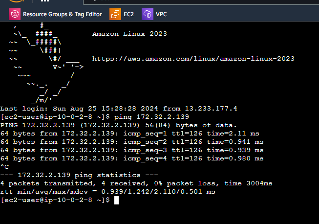

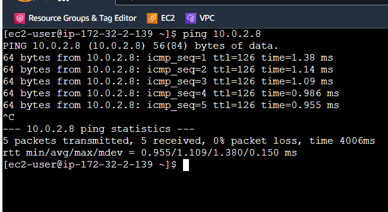

## Step 6: Monitor and Troubleshoot

- We can monitor the transit gateway and VPC metrics using AWS CloudWatch.
- We can set up CloudWatch alarms, e.g., for throughput.
- We can set up  Flow Logs capture for TGW. VPC flow logs also capture all the trffic going in and out of a VPC.
- We can use Network Manager to visualize and monitor entire networking topology. It also generates events which can be used to generate alerts.
- VPC reachability Analyzer can be used to troubleshoot connectivity. Search for it in the AWS console.

## Step 7: Additional Considerations

- TGW route tables are used to configure routing for TGW attachments. A default tgw route table is also created in primary account. We can see that it has propagated routes for both VPC CIDR ranges. These get created as we create the attachments. These are dynamic routes.

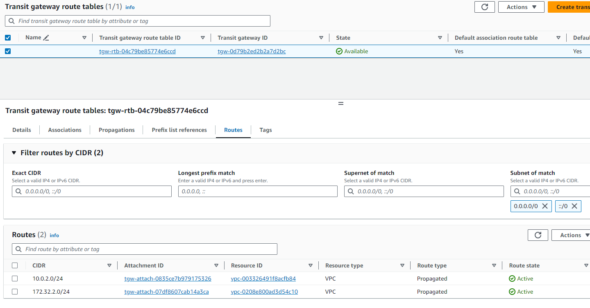

-  This route table is there and these routes are there because of default settings of the TGW. We can disable dynamic propagation for attachments.
  
  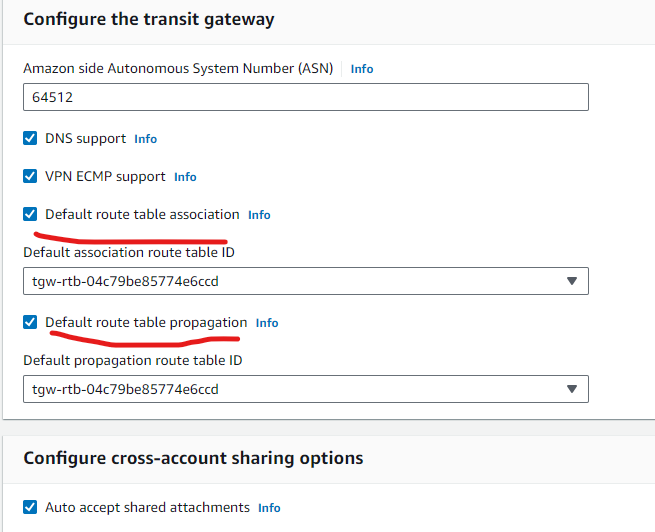

- An AWS Transit Gateway Route Table includes dynamic routes (i.e., propagated), static routes and blackhole routes. This routing operates at layer 3, where the IP packets are sent to a specific next-hop attachment, based on the destination IP addresses. You can create multiple route tables to separate network access. AWS Transit Gateway controls how traffic is routed to all the connected networks using route tables. They can have prefixes (set of one or more CIDR blocks) also for easier management.

- Static route is when we manually add some entry, it will remain there as long as we don't remove it. Whereas, dynamic routes get modified based on VPC attachments.

- We can also route particular IPs/CIDR ranges to blackhole. This traffic is dropped. It prevents the attachment from reaching a specific route. If the static route matches the CIDR of a propagated route, the static route will be preferred than the propagated route.

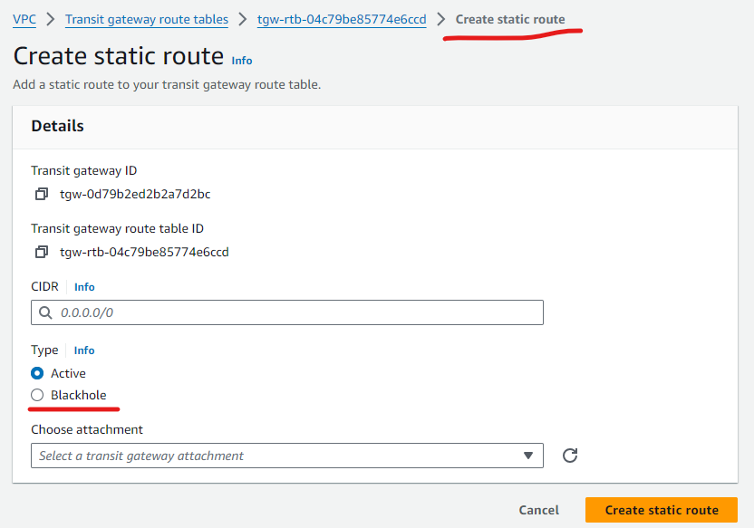

- Let's create one more server in secondary VPC, we can see that primary server is able to ping this ec2 server.

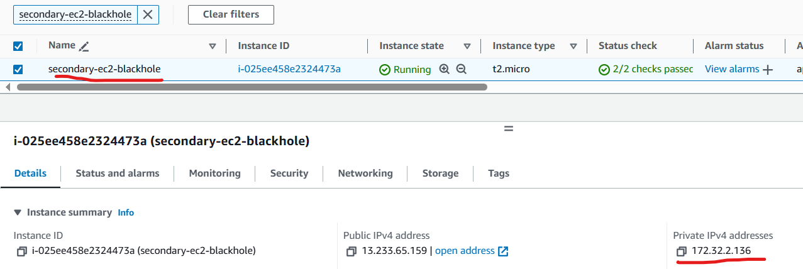

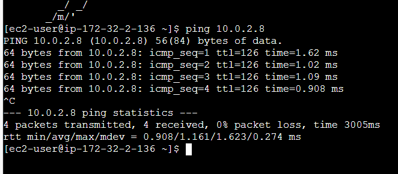

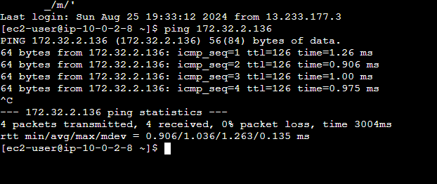

- Let's create a static blackhole entry for this server's IP address in TGW route table.

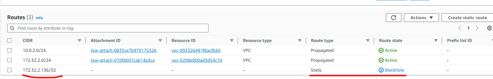

- Now primray server cannot reach this new server, even though it is able to reach first server in secondary VPC.

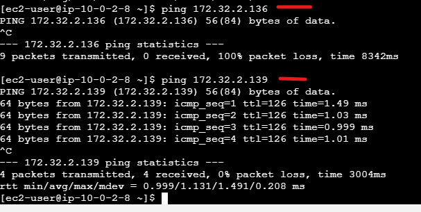

- TGW is a regional resource. For inter-region connectivity, tgw in those regions can be peered.

- TGW is not only for connecting VPCs, but it can also help in connecting with on-prem environment through VPN attachment, third party appliances or a Direct Connect gateway using a transit virtual interface. For a VPN/Direct Connect connection attachment, routes in the Transit Gateway route table propagate to your on-premises router/firewall using Border Gateway Protocol (BGP). The prefixes advertised over BGP session from on-premises router/firewall are propagated to the TGW route table.