# Implementing a Fanout Pattern using SNS and SQS in AWS

The fanout messaging pattern is a common application integration design pattern used to decouple frontend from backend systems. Here, a single message is sent to multiple endpoints. In AWS, this can be efficiently achieved by integrating **Amazon SNS (Simple Notification Service)** and **Amazon SQS (Simple Queue Service)**. This article provides a step-by-step guide to implement the fanout pattern using SNS and SQS.

---

## **Architecture Overview**

- **Amazon SNS**: SNS is a pub/sub messaging service that allows messages to be published to multiple subscribers.
- **Amazon SQS**: SQS is a message queuing service that allows reliable delivery of messages to multiple recipients.

- In the fanout pattern, a message is published to an SNS topic. Multiple SQS queues subscribe to the SNS topic. The message is delivered to all SQS queues.

    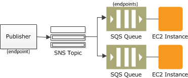

- For example, you can develop an application that publishes a message to an SNS topic whenever an order is placed for a product. Then, SQS queues that are subscribed to the SNS topic receive identical notifications for the new order. An Amazon EC2 server instance  attached to one of the SQS queues can handle the processing or fulfillment of the order. And you can attach another EC2 server instance to a data warehouse for analysis of all orders received. There can be any other compute service instead of ec2, e.g., lambda functions or ECS tasks.

- You can also use fanout to replicate data sent to your production environment with your test environment. Expanding upon the previous example, you can subscribe another SQS queue to the same SNS topic for new incoming orders. Then, by attaching this new SQS queue to your test environment, you can continue to improve and test your application using data received from your production environment.

- In a more useful pattern for microservices based architecture, different queues receive different messages based on different backends they serve. SNS filter policies are used for this, they can be applied on message attributes or message body.
It enables subscribers to an SNS topic to receive only the subset of topic messages they are interested in. E.g., For a insurance application, when a user requests an insurance quote, the request is forwarded to a series of backend systems: a sales system handles vehicle insurance for cars, another sales system handles life insurance, and an analytics system processes all quote requests. New backend systems can be integrated easily in this system.

---

## **Step 1: Create an SNS Topic**

- In the AWS Management Console, search for **SNS** and navigate to the SNS Dashboard.
   
- Click on **Topics** on the left-hand side and then click **Create topic**. Choose **Standard** as the type of topic. Keep others as default. Give your topic a name, e.g., `insurancetopic`. Click **Create topic**.
 
    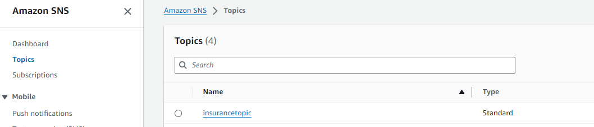

---

## **Step 2: Create SQS Queues**

- In the AWS Management Console, search for **SQS** and navigate to the SQS Dashboard.

- Click **Create queue**. Choose **Standard Queue**. Provide a name, e.g., `carinsurance`. Use the default settings and click **Create queue**.

- Repeat the process and create another queue, e.g., `healthinsurnce`.

   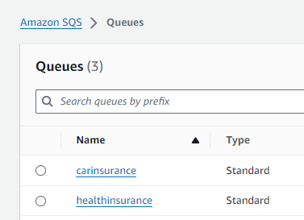

---

## **Step 3: Subscribe SQS Queues to the SNS Topic**

- Go to the **carinsurance** queue you created earlier. Select Subscribe to Amazon SNS Topic under Actions. Choose SNS topic created earlier.

    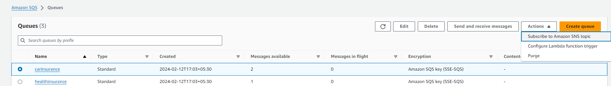

- Go to the **healthinsurance** queue you created earlier. Select Subscribe to Amazon SNS Topic under Actions. Choose SNS topic created earlier.   
   
- Add a new email subscription to get email notification whenever new insurance is submitted. There are total 3 subscriptions.

   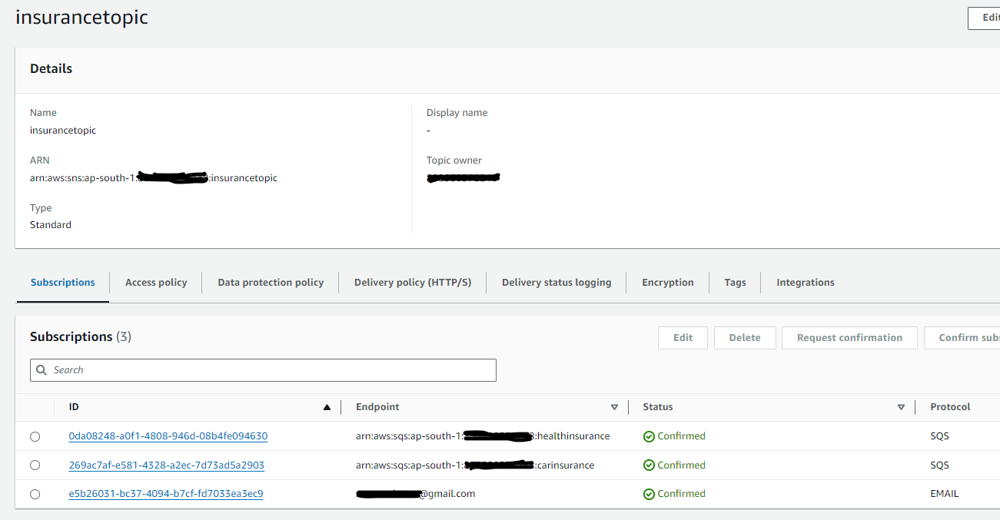

- Go to SNS console, select insurancetopic. We can see our subsriptions listed there. Click on carinsurance. Add a subscription filter policy for message attribute and click create subscription.

```
{
  "insurance_type": [
    "car"
  ]
}
```
   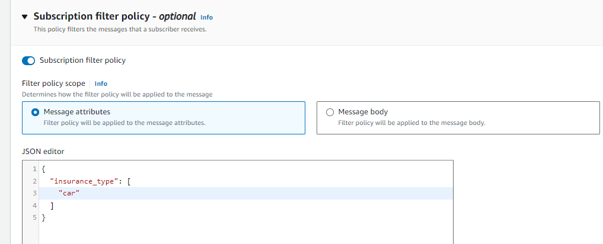


- Similarly, add a subscription filter policy for healthinsurance subscription.
  
```
  {
  "insurance_type": [
    "health"
  ]
}
```

---

## **Step 4: Publish Messages to SNS Queue**

- Go to SNS topic insurancetopic and select Publish Message. Put something in subject and message body, leave message structure at default selection. Add message attribute insurance_type = car. Choose Publish Message. I have published with message body "Thar, Mumbai".

   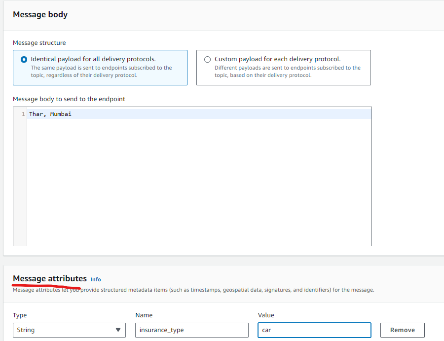

- Publish another message for car insurance. Put "Ertiga, Noida" in body and add attribute insurance_type = car. Choose Publish Message.

- Publish another message for healht insurance. Put "Male, 35 years old, New Delhi" in message body and add attribute insurance_type = health. Choose Publish Message.

- Go to SQS console. We can see that there are 2 messages available in car insurance topic and one in health insruace.

   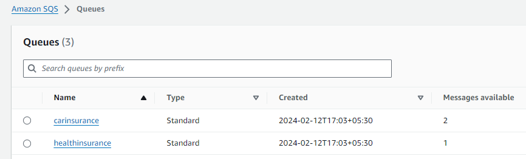

- Go to carinsurance queue. Click on "send and receive message".

   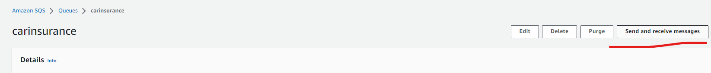

- We can see there are two messages. Choose Poll for Messge.

   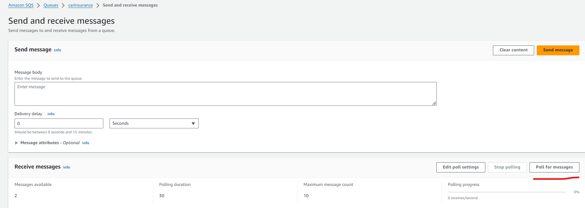

- We can see two messages after polling completes. We can choose and inspect their content.

   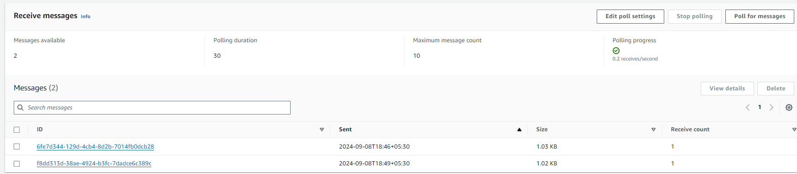

- Similarly, we can poll and view single car insurance message received on carinsurance SQS queue.

   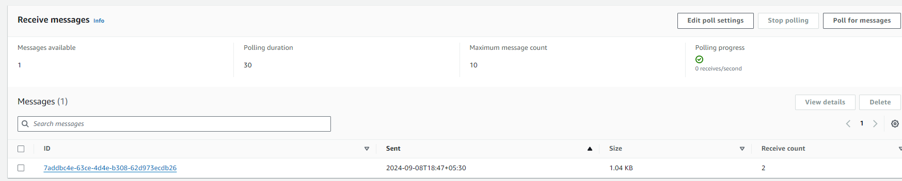

- We can also verify all 3 messge notifications received in our mailbox because of email subscription on our SNS topic.
  
---


