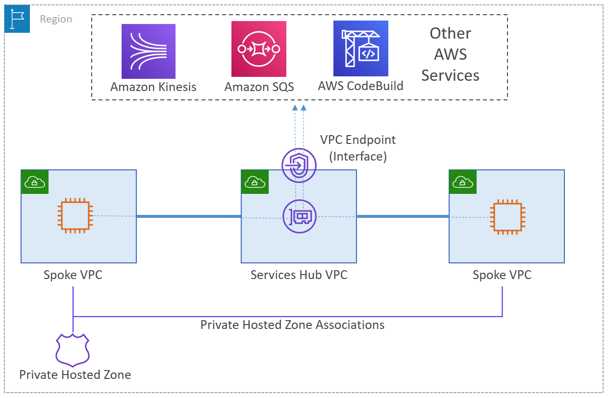
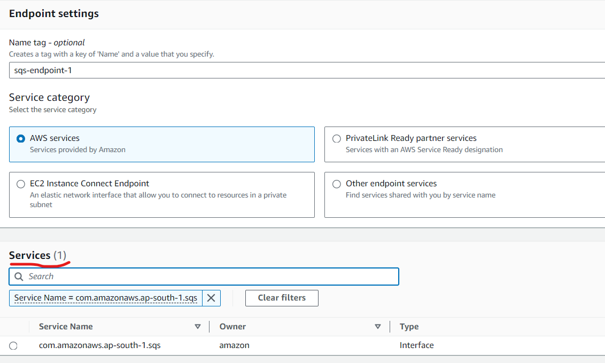
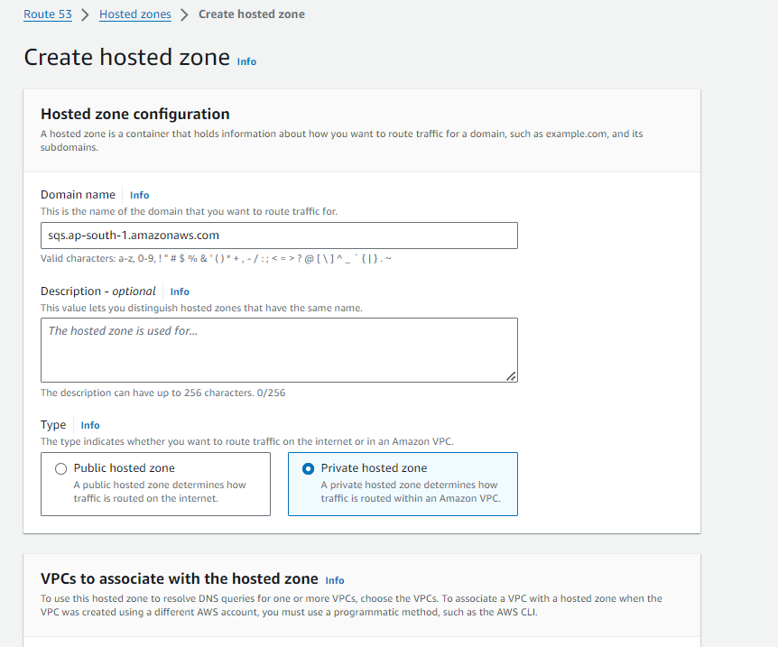

# Hub-and-Spoke Based VPC Interface Endpoint Setup in a Multi-Account AWS Environment

## Introduction

VPC endpoints are private connections between your VPC and another AWS service without sending traffic over the internet, through a NAT instance, a VPN connection, or AWS Direct Connect. They allow communication between instances in your VPC and services without imposing availability risks. With VPC endpoints, your VPCs don’t need to have Internet Gateway or NAT Gateway for EC2 instances to access AWS services and endpoints. There are two types of VPC endpoints – Gateway endpoints and interface endpoints. Gateway endpoints can be used to access regional S3 bucket and DynamoDB tables and interface endpoints can be used to access AWS service endpoints or VPC endpoint services. Gateway endpoints are free, but interface endpoints are charged at hourly basis.

In a multi-account AWS environment, setting up VPC interface endpoints centrally in a networking account (hub) and sharing them with other accounts (spokes) can provide a streamlined, secure, and cost-effective architecture. This setup allows for better management of network traffic, centralized monitoring, and compliance with organizational policies.

This article details the steps to implement a hub-and-spoke architecture for VPC interface endpoints in a multi-account AWS environment. We'll focus on a scenario where the interface endpoint is set up in a central networking account, and other accounts in the organization route their traffic through it.

## Architecture Overview

The architecture involves:

1. **Central Networking Account**: Hub account, it hosts the VPC interface endpoints and routes traffic to the respective AWS services.
2. **Spoke Accounts**: Each has its own VPC, and traffic from these VPCs is routed to the central interface endpoints in the networking account. We will use a single spoke VPC in this demo.

## Steps to Set Up Hub-and-Spoke VPC Interface Endpoints

### Step 1: Hub Account Set Up

- I have a VPC with public and private subnets in my hub account. I have launched a private ec2 server in my hub account.   

- I have a bastion host in same VPC from which I can connect to my private ec2 server.

- An IAM role is already attached to the server, but because there is no internet access, we cannot access AWS service endpoints. I am trying to list SQS queues and SNS topics, but it is timing out. I have also given a timeout value of 5 seconds to avoid waiting for default timeout value of 60 seconds.
  
  

- To access these services privately, we need to create interface vpc endpoints. Go to VPC console, Endpoints section, choose Create Endpoint.
  
  

- Give the endpoint a name, search for SQS under services, we will get endpoint for the region we are in. Select VPC and private subnet in which our private server is present. Select default security group or any one which allows inbound https access.  Keep other options as default and create endpoint.

- Now, we can access SQS service from our private server.

### Step 2: Connect Hub and Spoke VPCs

- Create a VPC in spoke account, ensure that CIDR is not overlapping with hub VPC CIDR.

- We need to connect hub VPC with spoke vpc which is present in other AWS account. In real world, mostly Transit Gateway (TGW) is used for connecting VPCs. Here, we will imitate this using VPC peering.

- From the hub account, create a VPC peering connection request to spoke account's VPC.
 

- Provide details of both VPCs and create peering connection.

- Accept peering request from spoke account.

  
- Configure the route tables in the hub VPC, and add a rule to route the traffic for corresponding VPC CIDRs by way of a VPC peering connection. I have added it to both private and public subnet route tables.
  
  

  

- In the spoke VPC, update route tables to direct traffic and add a rule to route the traffic for corresponding VPC CIDRs by way of a VPC peering connection.

 

### Step 3: Spoke Account Set Up

- Creat a private ec2 sever in spoke VPC in spoke account.
  
  
  
- We can connect to this server using bastion host in hub account. This server has an IAM role attached but because it does not have internet access, so it cannot access AWS services. 
  
  

- Though, becasuse of peering connection, it will be able to access the interface endpoint present in hub VPC and can use it. But, for that --endpoint-url argument should be passed as it cannot resolve the DNS for the interface endpoint. DNS resolution is happening by default in hub vpc. Now, using interface endpoint, it can list queues present in spoke account.
   
   
 
- But, we want the DNS resolution to happen by default. So that spoke accounts can access SQS privately without any additional effort.
  
  ### Step 4: DNS Configuration and Testing
   
- Disable the Private DNS name for the interface VPC endpoint in the hub VPC.

  

- Verify it.

  

- Create a Private Hosted Zone (PHZ) in Route53 with same name as AWS service endpoint (e.g., sqs.ap-south-1.amazonaws.com in this case) and attach it to the hub VPC.

- Create an alias record to point to an interface VPC endpoint DNS.

- Now, hub VPC has attained previous state, and it can resolve the default sqs endpoint, but spoke VPC still cannot do it.

- If we want any other VPC to be able to resolve the sqs endpoint and connect via hub interface endpoint, we need to associate that VPC with above created hosted zone. In this case, our spoke vpc is in another account, so attachment can be done using cli commands only.

- If you want to associate a VPC that was created by using one account with a private hosted zone that was created by using a different account, the account that created the private hosted zone must first submit a CreateVPCAssociationAuthorization request. Then the account that created the VPC must submit an AssociateVPCWithHostedZone request.
  
- Create authorization request in hub account.
  
  aws route53 create-vpc-association-authorization --hosted-zone-id <<id>> --vpc VPCRegion=ap-south-1,VPCId=<<vpc id>>
  
  

- Approve from spoke account. It will come as pending in the beginning, after few minutes, will become available.
  
  aws route53 associate-vpc-with-hosted-zone --hosted-zone-id <<id>> --vpc VPCRegion=ap-south-1,VPCId=<<vpc id>>
  
  

- Verify the association in Route53 console under PHZ.
  
  

- Now our spoke vpc server will also be able to resolve default sqs endpoint.
  
  

### Step 5: Additional Considerations

- Setting up a hub-and-spoke architecture for VPC interface endpoints in a multi-account AWS environment centralizes control, reduces management overhead, and enhances security.

- This setup allows for the efficient management of network traffic and resources, and can easily be expanded as your organization grows.

- To improve resiliency of this design, our interface VPC endpoints should use two or more Availability Zones (AZs).
  
- There are limits on everything, few soft (can be increased on request by AWS), few hard (can't be increased), take them into considerations while designing. Check AWS documentation for this.
  