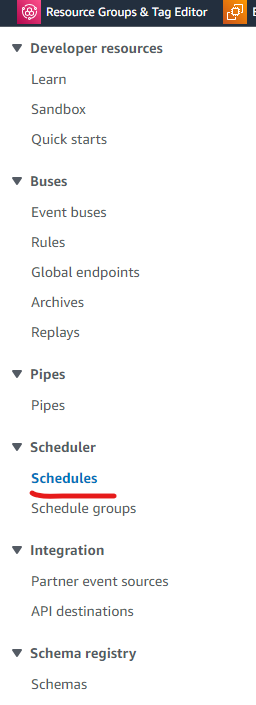

# A lambda function that runs daily and stops any running instances to save cost. A good FinOps practice.

- This lambda function runs on a designated schedule daily and stops all running instnaces in my account. This is a good FinOps practice. Even if I forget to stop my instances, this saves money by stopping them for me.

- AWS services used - Lambda, EventBridge, Cloudwatch


## Step 1: Creating a lambda function

- Go to lambda console, create a lambda function by selecting "author from scratch" and latest python version. 
  
- Paste following code under code section and save. Lambda function is created.
  
```
import boto3
import json
import logging
from botocore.exceptions import ClientError

def lambda_handler(event, context):
    client = boto3.client("ec2")

    status = client.describe_instances()

    # loop through the reservations in the response
    for reservation in status['Reservations']:

        # loop through the instances in the reservation
        for instance in reservation['Instances']:
        
                ID = instance['InstanceId']
                state = instance['State']['Name']
                # print the instance ID and state
                #print(f"Instance ID: {instance['InstanceId']}, State: {instance['State']['Name']}")
                print(f"Instance ID: {ID}, State: {state}")
                
                # check if the instance is running and stop it if it is
                if state == 'running':
                        try:
                            #print("inside if block")
                            print(f"stopping running instance: {ID}")
                            response = client.stop_instances(
                                InstanceIds=[ID,]
                                # Hibernate=True|False,
                                # DryRun=True|False,
                                # Force=True|False
                                
                            )
                            print(response)
                        except ClientError as e:
                            logging.error("Botocore generated an error {}".format(e))

```

## Step 2: Add permissions

- Lambda function will be making ec2 API calls, so it should have ec2 related IAM permssions. Create a role for lambda which has basic lambda permissions along with ec2 permissions.
  
- Modify lambda role under Configuration -> Permissions. 

## Step 3: Scheduling it using Event Bridge

- Go to EventBridge, Scheuduler, click on Create Schedule button.



- Add the schedule as per your convenience. My schedule is to run the function daily at a designated time. Select above lambda function as target.


## Step 4: Monitor and Test

- Test the function by running it manually from lambda console. Click on Test button, leave all default, as this function does not take any input. Leave a running instance, and see if it is stopped by the function.
  
- Function will generate Cloudwatch logs, we can go to it from monitor tab.


- It has one log stream for each day, where we can see the details of that day's run.


## Step 5: Additional Considerations

- For failed invocations, where function could not stop a server, we can add a SNS notication within the exception block of the function. Or, we can create a cloudwatch log metric filter for "error" and then create an alert and corresponding notification. 
  
- Many organisations deploy AWS provided solution which stops instances at larger scale. Please check - https://aws.amazon.com/solutions/implementations/instance-scheduler-on-aws/

