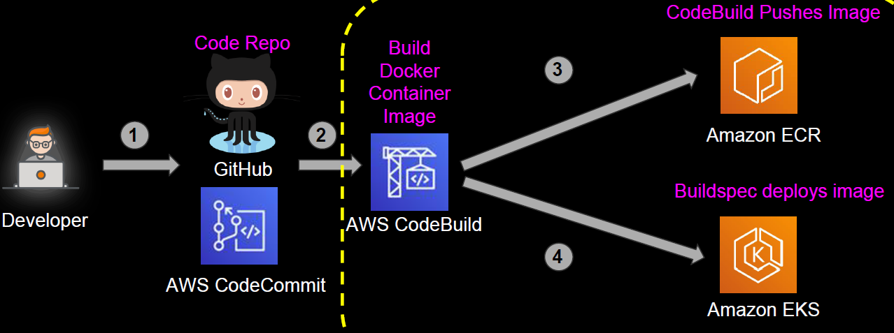
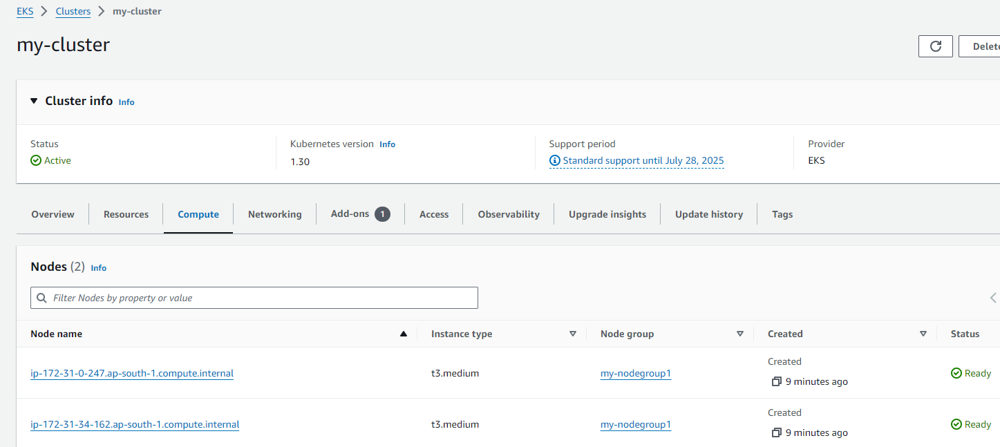
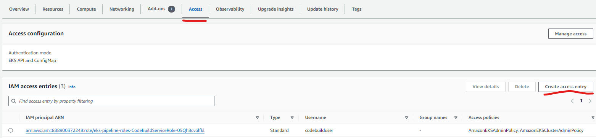
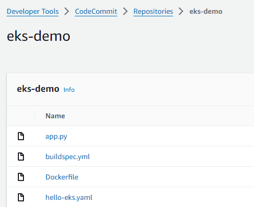
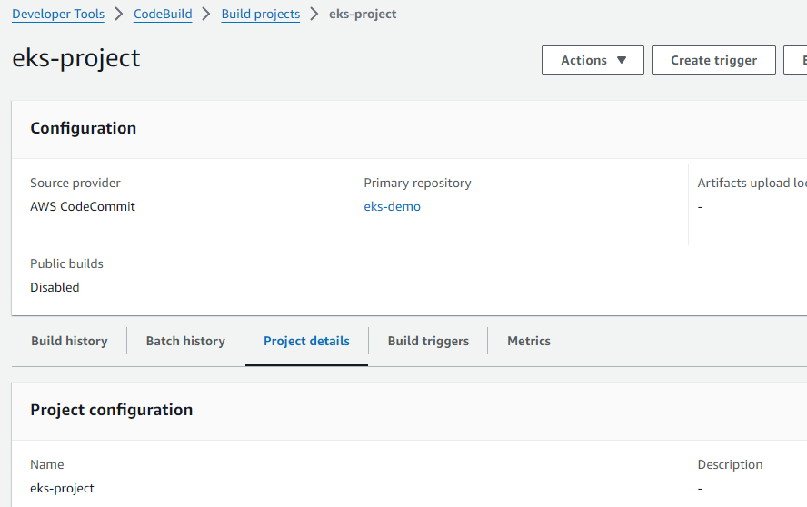
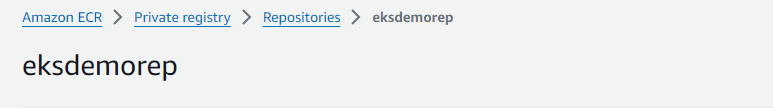
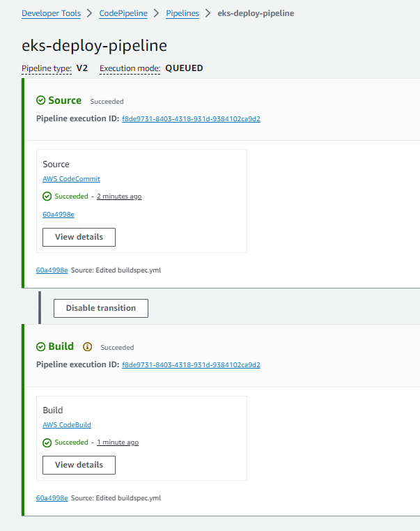
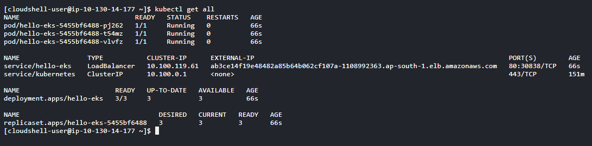
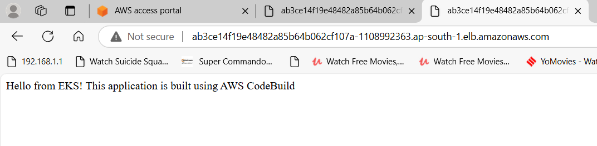
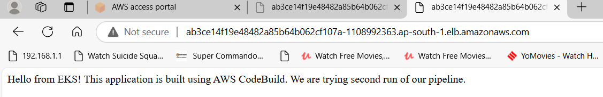

# Deploying an application on Kubernetes cluster using CICD Pipeline

- I have created a CICD pipeline using AWS services - CodeCommit, CodeBuild, CodePipeline. This pipeline will deploy an application on EKS cluster. 
  
- We will put source files in CodeCommit, CodeBuild will use these and apply manifest file to our k8s cluster. A service of type LoadBalancer will also be deployed, using which we can access our application.



- AWS services used - EKS, ECR, CodeCommit, CodeBuild, CodePipeline

## Step 1: Create EKS Cluster

- Install eksctl and kubectl on the system from where you want to deploy this project. I have used AWS Cloudshell.
  
- Crete an EKS cluster and nodegroup in AWS from console or using eksctl command. I have selected managed spot option. Spot nodes will incur lower cost. 

eksctl create cluster --name=my-cluster --region=ap-south-1 --vpc-private-subnets subnet-221f306e,subnet-2a1ee041

eksctl create nodegroup \
  --cluster my-cluster \
  --region ap-south-1 \
  --node-private-networking \
  --subnet-ids subnet-221f306e,subnet-2a1ee041 \
  --name my-nodegroup1 \
  --node-type t3.medium \
  --nodes 2 \
  --nodes-min 2 \
  --nodes-max 2 \
  --managed \
  --spot 

- Verify that cluster and nodegroups have been created in console



- Run this command to work on your cluster using kubectl.

aws eks update-kubeconfig --region ap-south-1 --name my-cluster

## Step 2: Create IAM Roles for CodeBuild and CodePipeline

- Create a service role for CodeBuild, give it the required permissions, in this case to ECR, EC2 and S3. 
  
- This CodeBuild role will require access to EKS cluster to deploy application on that. Now, EKS allows creating access entries. Create access entries for CodeBuild role using console or cli.
  
  
 

- Create a service IAM role for CodePipeline. Provide is standard permissions. Check documentation.

## Step 3: Create CodeCommit repo, CodeBuild project and ECR repo

- Create CodeCommit repository and add buildspec.yaml, app.py, Dockerfile and hello-k8s.yaml file to this repo. These files are present in projects/Code/Kubernetes-CI-CD-Pipeline directory.
  
  

- Create CodeBuild project, select above created CodepiCommit repo and IAM role, select buildspec file option, keep rest as default.
  
  

- Create a private ECR repo for storing the image. CodeBuild will build a container image using Dockerfile present in source and push it to this ECR repo.
  
  

## Step 4: Create CodePipeline

- Create a pipeline from the console. Source will be above CodeCommit repo. Select above CodeBuild project in build stage. Skip deploy stage, as deployment is being done by CodeBuild.
  
- Provide environment variables being referred to in the buildspec file in the pipeline.

```  
EKS_CLUSTER_NAME - eks cluster name
REPOSITORY_URI  - ecr repo URI
REPOSITORY_NAME - CodeCommit repo name
REPOSITORY_BRANCH - main
```  
- Pipeline will start running after creation. Monitor the execution. 



## Step 5: Kubernetes Deployment

- Get the deployment details



- This deployment creates a load balancer as service type being used is LoadBalancer. We can access our app using the LB URL.



## Step 6: Modify Source Code

- We will modify the message in our app in app.py, change it to - 'Hello from EKS! This application is built using AWS CodeBuild. We are trying second run of our pipeline.'
  
- Monitor the pipeline execution, wait for it to succeed. 

- Refresh the page where we are accessing using LB url. We can see modified message.




## Step 7: Additional Considerations

- Similarly, we can modify kubernetes properties, e.g., number of pods, etc.
  
- If pipeline fails at build stage, check CodeBuild logs.
  
- To make the deployment more generic, in buildspec.yml file modify the apply command to - "kubectl apply -f .". This way we can have multiple manifest files in our source repo and they all will be applied by kubectl, e.g., for deployments, services, autoscalers, etc.
  
- Even if we use pipeline for deployment, someone with direct access to cluster can modify things, e.g., reducing number of pods, or deleting the load balancer service, etc. Gitops is becoming popular to tackle this.
  
- GitOps - Here Git repository becomes single source of truth. A tool like Flux or Argocd keeps checking the source and if there is any deviation at k8s level, they will fix it. Refer to Kubernetes-GiOps article for an implementation example.

