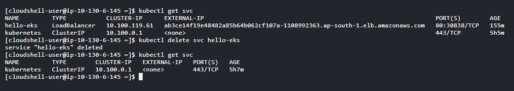
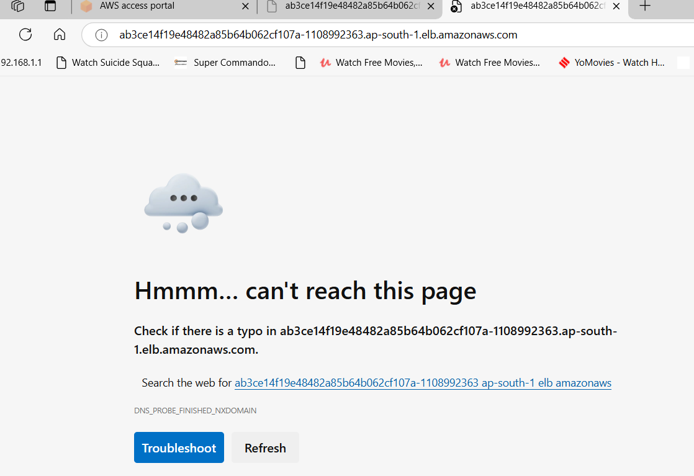
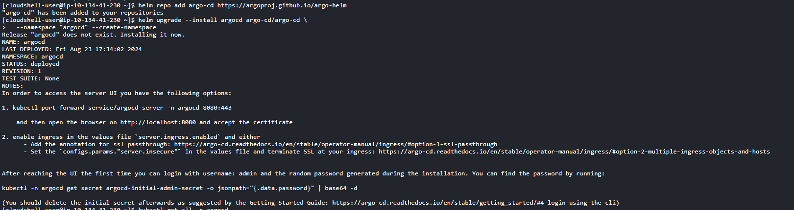
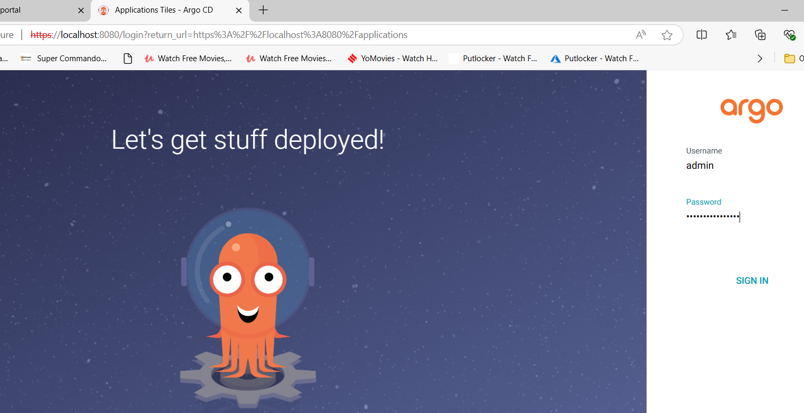
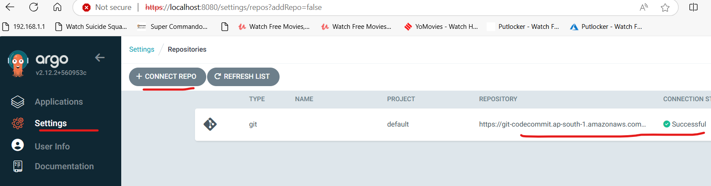
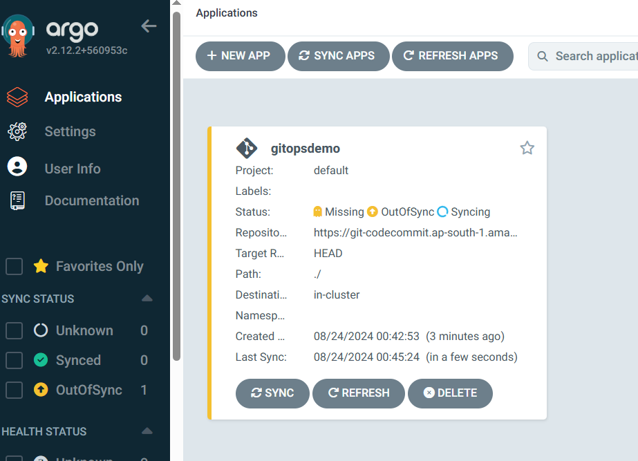
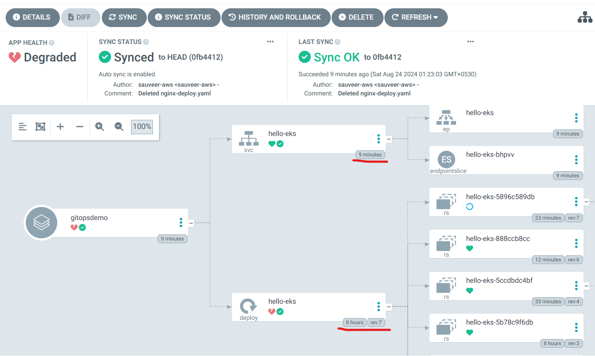
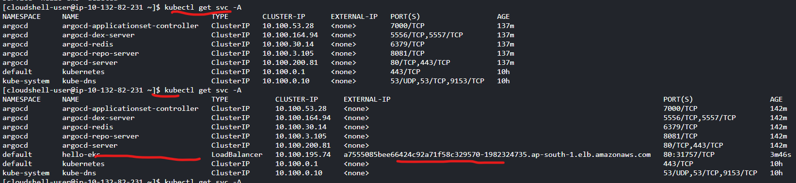
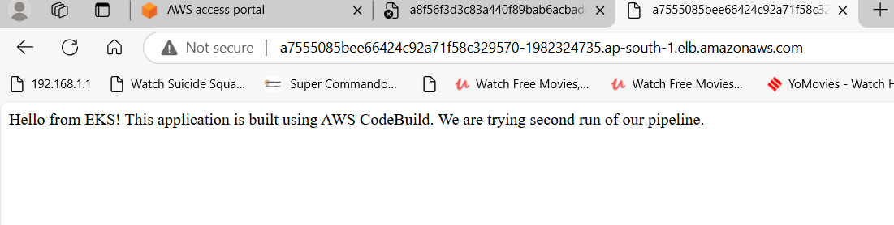
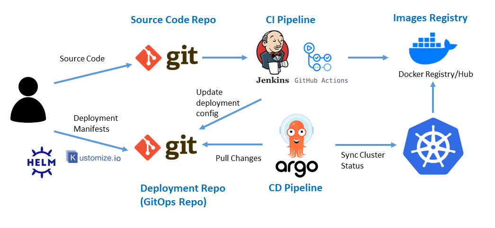

# Applying GitOps on a Kubernetes cluster  

- Please refer to other article "Kubernetes-CI-CD-Pipeline" first. 
  
- Even if we use pipeline for deployment, someone with direct access to cluster can modify things, e.g., reducing number of pods, or deleting the load balancer service, etc. Gitops is becoming popular to tackle this.
  
- GitOps - Here Git repository becomes single source of truth. A tool like Flux or ArgoCD keeps checking the source and if there is any deviation at k8s level from manifests, they will fix it. It is pull based, while Devops is push based.

- AWS services used - EKS, ECR, CodeCommit, CodeBuild, CodePipeline. We are also using ArgoCD, a GitOps tool.

## Step 1: DevOps Shortcoming Demo

- I have deleted the LoadBalancer service. 


  
- Now, we cannot access the application using the load balancer. Unless someone notices and fixes it, it will remain like this.




## Step 2: Install and Configure ArgoCD on the Cluster

- Install ArgoCD using helm, on the screen you will see instructions on how to access it.

```
    helm upgrade --install argocd argo-cd/argo-cd \
  --namespace "argocd" --create-namespace
```



- Access from your localhost using port forwarding option. I have used my windows machine for this. Access using localhost:8080 and log in.



- Configure connection to your repository (CodeCommit in this case). Follow AWS documention to generate https credentials for CodeCommit.
  
  https://docs.aws.amazon.com/codecommit/latest/userguide/setting-up-gc.html


  
- Create application in ArgoCD. Give any name to application. Sync policy - automatic. Give repository url under source, give path as ./, as all manifest files are in same directory. Select destination as kubernetes.default.svc, this will deploy on same cluster. ArgoCD is capable of deploying on other clusters also, but we do not need it here. After creation of application, it will start syncing.



- I have connected ArgoCD to same repository which is being used to deploy the application. ArgoCD will compare the K8s manifest in source repo with actual k8s objects and configuration. It will find that LoadBalancer is not matching and it will deploy the LoadBalancer again.





- We can see that it is a new LB, URL has changed. Using this, we can again access our application.



## Step 3: Additional Considerations

- Here we have used existing application. If we do not deploy anything to EKS cluster, and configure ArgoCD, it will deploy the application from scratch also, using the manifest files in source repo.

- In this set up, we only have a single repo and ArgoCD is polling it. There is no other tool needed. Real life projects are more complicated. Generally, traditional DevOps pipeline is used for CI (continuous integration) part and Gitops is used for CD (continuous delivery) part.
  
- For example, one popular set up is that there will be two repos - app source-code and deployment k8s-manifests. 
  **a)** Code will be pushed to app repo, it will trigger a Devops pipeline, which will build and test the application, package it into a container image and push to some container repository. 
  **b)** Another pipeline will be triggered (or same pipeline can do it), which will modify the manifest file with reference of latest image in k8s-manifests repo, also any other changes if needed. This change will be noticed by GitOps tools like ArgoCD and it will apply the changes to the EKS cluster.

  