# Deploying a Lambda Function to Write S3 Object Metadata to DynamoDB

## Step 1: Create a DynamoDB Table

- Go to the AWS Management Console and navigate to the DynamoDB service.
- Click on "Create table" and provide a table name (e.g., s3table).
- Set "name" as the partition key (String type). Leave other settings as default.
- Click "Create table" to create your DynamoDB table.

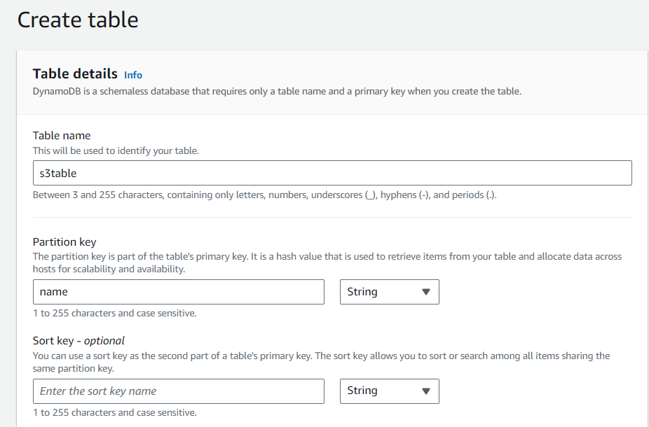

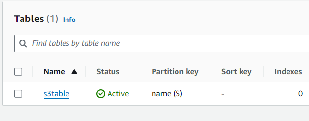

## Step 2: Create an IAM Role for Lambda

- Go to the IAM service in the AWS Management Console.
- Click on "Roles" and then "Create role".
- Select "AWS service" as the trusted entity and choose "Lambda" as the service that will use this role.
- Attach policies to grant necessary permissions, such as access to S3 and DynamoDB.
- Review and name your role, then click "Create role".

## Step 3: Create a Lambda Function for Create Object Event

- Go to the Lambda service in the AWS Management Console.
- Click on "Create function" and choose "Author from scratch".
- Provide a name for your function (e.g., s3lambda).
- Choose the runtime (e.g., Python, Node.js, etc.) and select the IAM role created in Step 2.
- Write your Lambda function code to handle S3 object creation events and write metadata to DynamoDB.
- Click "Deploy" to create your Lambda function.

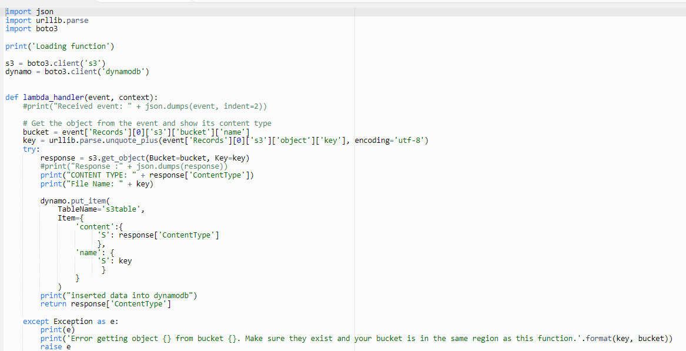

## Step 4: Create a Lambda Function for Delete Object Event

- You can put deletion logic also in same function, but it is better to create a separate function for delete object events.
- Go to the Lambda service in the AWS Management Console.
- Click on "Create function" and choose "Author from scratch".
- Provide a name for your function (e.g., s3lambda).
- Choose the runtime (e.g., Python, Node.js, etc.) and select the IAM role created in Step 2.
- Write your Lambda function code to handle S3 object removal events and remove item from DynamoDB.
- Click "Deploy" to create your Lambda function.

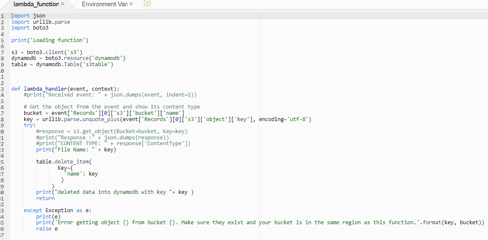

## Step 5: Configure S3 Bucket to Trigger Lambda on object creation

- Go to the S3 service in the AWS Management Console.
- Select the bucket where objects will be uploaded.
- Navigate to the "Properties" tab and click on "Events".
- Click "Add notification" and configure an event for "All object create events".

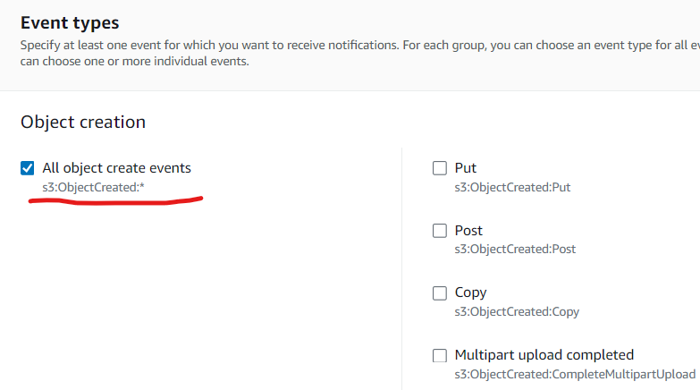

- Choose the Lambda function created in Step 3 for create object events as the destination.
  
  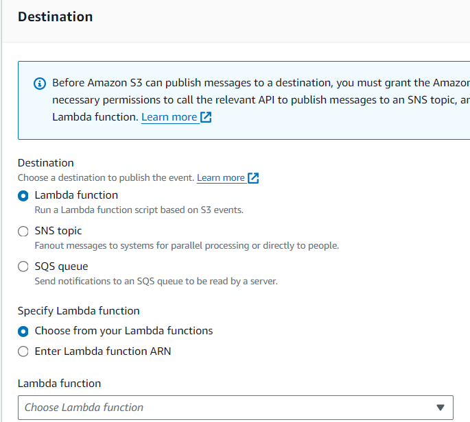

- Save your configuration.

## Step : Configure S3 Bucket to Trigger Lambda on object deletion

- Go to the S3 service in the AWS Management Console.
- Select the bucket where objects will be uploaded.
- Navigate to the "Properties" tab and click on "Events".
- Click "Add notification" and configure an event for "All object removal events" this time.

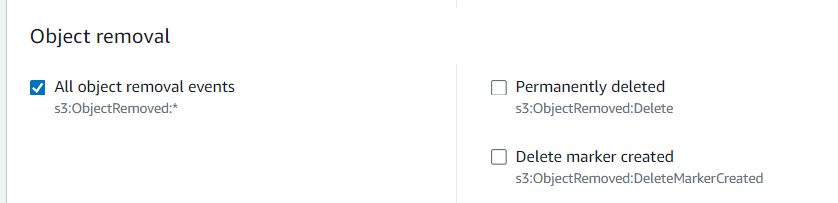

- Choose the Lambda function created in Step 4 for delete object events as the destination.
- Save your configuration.
- Both triggers are in place now.
  
  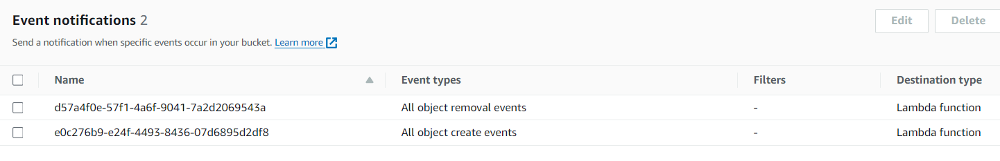

## Step 7: Test Your Setup

- Upload an object to your S3 bucket. I uploaded testing-s3-lambda.txt.
  
 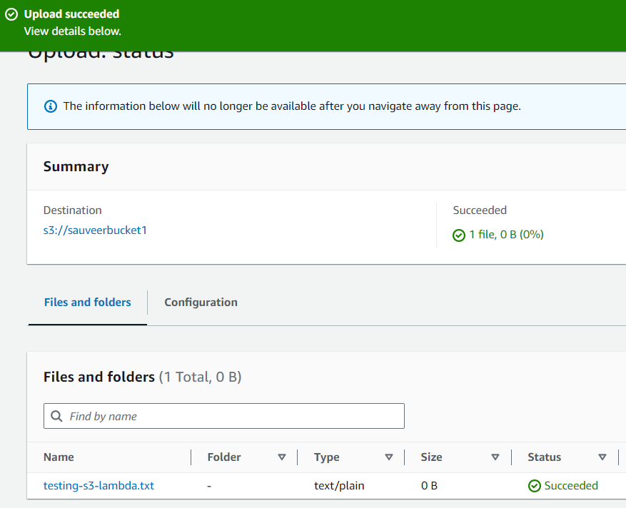

- Verify that the crate object Lambda function is triggered in logs.
  
  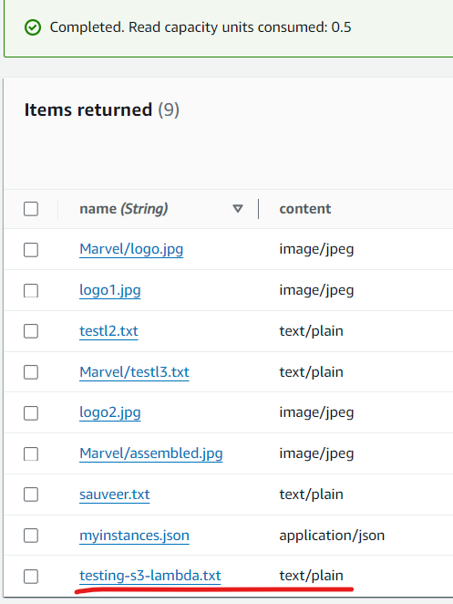

- Check the DynamoDB table to ensure that the object metadata is successfully written.
  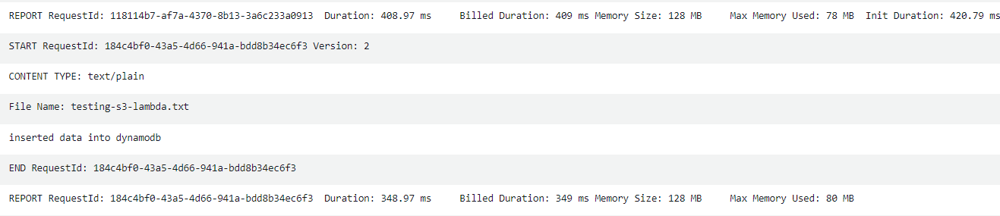

- Delete above object from your S3 bucket. I deleted testing-s3-lambda.
  
  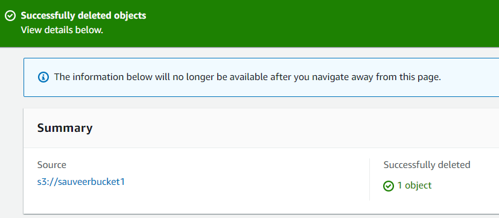
  
- Verify that the delete object Lambda function is triggered in logs.
  
  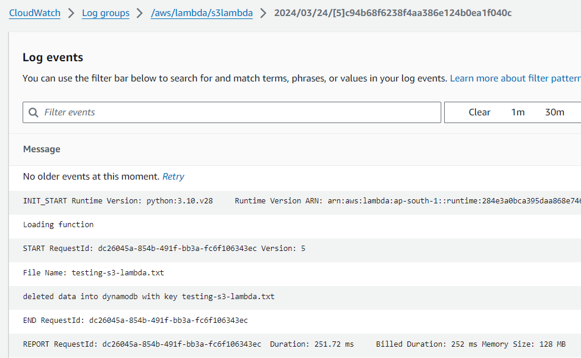
  
- Check the DynamoDB table to ensure that the object metadata item is successfully deleted.
  
  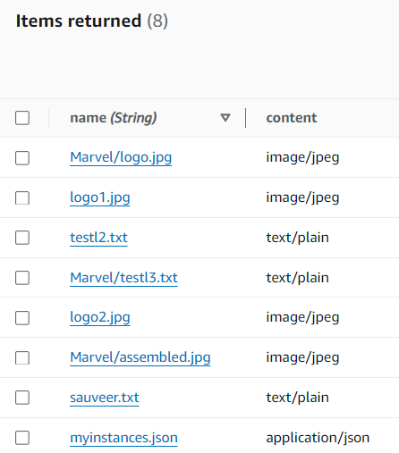

## Step 8: Monitor and Troubleshoot

- Monitor your Lambda function's execution logs for any errors or issues.
- Use CloudWatch metrics and logs to track the performance of your Lambda function.
- Troubleshoot any issues encountered during testing or production usage.

Congratulations! You have successfully deployed a Lambda function that writes S3 object metadata to DynamoDB upon object upload events and deletes metadata from DynamoDB upon object delete events.

