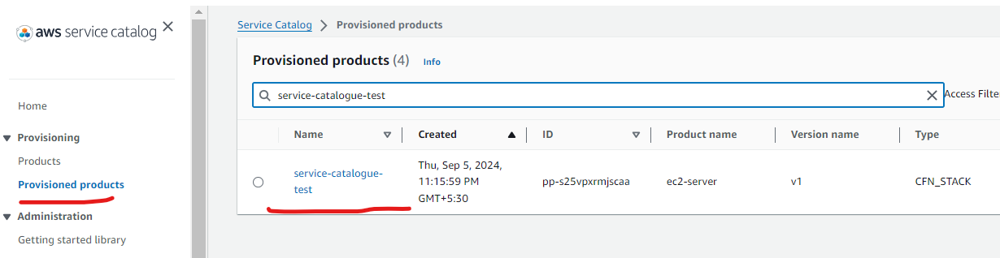

# Hands-on Deployment of AWS Service Catalog Product for EC2 Server Across Multiple Accounts

Service Catalog enables organizations to create and manage catalogs of IT services that are approved for AWS. These IT services can include everything from virtual machine images, servers, software, databases, and more to complete multi-tier application architectures.

Service Catalog allows organizations to centrally manage commonly deployed IT services through hub and spoke model, integrated with CI/CD pipeline, and helps organizations achieve consistent governance and meet compliance requirements. End users can quickly deploy only the approved IT services they need, following the constraints set by your organization.


It provides a secure way for self-service, where users can choose and deploy approved products without getting direct access to those services, e.g., ec2 server or S3 bucket. 

Service Catalouge can also be integrated with ITSM tools like Service Now. Users can submit Service Now requests which will trigger creation of the product in AWS.

This guide provides a hands-on tutorial to deploy an ec2 server using AWS Service Catalog. The Service Catalog product will be shared across multiple AWS accounts within an organization, demonstrating deployment from both a central management account and a target account.


## Step 1: Create a CloudFormation Template for EC2 Server

This is the CloudFormation template for an ec2 server. We have configured instance type as a parameter and an accepted set of values is given here.

```yaml
AWSTemplateFormatVersion: '2010-09-09'
Description: 'CloudFormation Template for EC2 Instance Deployment'

Parameters:
  InstanceType:
    Description: 'EC2 instance type (e.g., t2.micro, t3.medium)'
    Type: String
    Default: 't2.micro'
    AllowedValues: 
      - t2.micro
      - t2.small
      - t2.medium
      - t3.micro
      - t3.small
      - t3.medium
    ConstraintDescription: 'Must be a valid EC2 instance type.'

Resources:
  EC2Instance:
    Type: 'AWS::EC2::Instance'
    Properties: 
      InstanceType: !Ref InstanceType
      ImageId: !FindInMap 
        - RegionMap
        - !Ref 'AWS::Region'
        - AMI
      KeyName: 
        Ref: 'AWS::NoValue' # This assumes no key pair by default. You can modify to include a default key pair.
      SecurityGroups: 
        - !Ref InstanceSecurityGroup

  InstanceSecurityGroup:
    Type: 'AWS::EC2::SecurityGroup'
    Properties:
      GroupDescription: 'Enable SSH and HTTP access'
      SecurityGroupIngress:
        - IpProtocol: tcp
          FromPort: '22'
          ToPort: '22'
          CidrIp: 0.0.0.0/0
        - IpProtocol: tcp
          FromPort: '80'
          ToPort: '80'
          CidrIp: 0.0.0.0/0

Mappings:
  RegionMap:
    us-east-1:
      AMI: 'ami-0c55b159cbfafe1f0' # Amazon Linux 2 AMI for us-east-1
    us-west-1:
      AMI: 'ami-01e24be29428c15b2' # Amazon Linux 2 AMI for us-west-1
    eu-west-1:
      AMI: 'ami-047bb4163c506cd98' # Amazon Linux 2 AMI for eu-west-1
    ap-south-1:
      AMI: 'ami-08ee1453725d19cdb' # Amazon Linux 2 AMI for ap-south-1

Outputs:
  InstanceId:
    Description: 'Instance ID of the EC2 instance'
    Value: !Ref EC2Instance

  PublicIP:
    Description: 'Public IP of the EC2 instance'
    Value: !GetAtt EC2Instance.PublicIp

  SecurityGroupId:
    Description: 'Security Group ID'
    Value: !Ref InstanceSecurityGroup

```

## Step 2: Create Service Catalog Product and Portfolio in Hub Account

- Create a portfolio. I have created EC2-portfolio.


- Create a product (ec2, rds, s3, etc.). This will require a Cloudformation or Terraform teamplate. I have created an ec2 product using Cloudformation. 


- Add this product to above portfolio.


- Go to portfolio page and grant access. We can grant access to users, groups or roles. I added my group "sc-admins" here. It has AWS managed IAM policy AWSServiceCatalogEndUserFullAccess attached to it, there are other managed policies, we can create custom policies also to grant granular access.


## Step 3: Create an EC2 Server in Hub Account Using this Product

- Now, I can see this product under provisioning section and launch it.


- We have configured instance type as a parameter and an accepted set of values is given there. I have chosen t2.micro. This is a good way to keep costs in control by restricting what end users can create.


- Few minutes after launch, we can see the provisioned product.




-  We can also check the ec2 server in ec2 console. If we had added a Name tag in service catalogue, it would have reflected here. We will do it in next section. 
We can provide tags in multiple ways - while provisioning a product, as configurable values in cloudformation template underlying the product, TagOption feature, etc.


## Step 4: Share the Portofolio with Spoke Account

- We can share the portfolio with other accounts, OUs or entire organization. 


- Here, we will share it with entire organization. TagOptions are set of tags which can be optionally shared. If we select organization or OU, it will also give option to select Principal Sharing, e.g., if we choose a group in hub account, a group with same name in spoke accounts will also be granted access in the spoke account after portfolio is shared with it. 


- When you share a portfolio using account-to-account sharing or Organizations, you are sharing a reference of that portfolio. The products and constraints in the imported portfolio stay in sync with changes that you make to the shared portfolio, the original portfolio that you shared. The recipient cannot change the products or constraints, but can add AWS IAM access for end users.

- As an administrator, you can create a Portfolio share that includes Principal Names. Principal Names are names for groups, roles and users that administrators can specify in a Portfolio, and then share with the portfolio. When you share the portfolio, AWS Service Catalog verifies if those Principal Names already exist. If they do exist, AWS Service Catalog automatically associates the matching IAM Principals with the shared Portfolio to grant access to users. 

## Step 5: Use the Portfolio in Spoke Account

- In spoke account, I can see this portfolio, under imported portfolios now. Go to the access section of the portfolio and add entitites to grant access, if the access is not already provisioned because of principal sharing.


- Now, product will be visible under Provisioning section. We can select and launch the product.


- Here we will select t3.small. We will also add a Name tag and launch.


- After few minutes, we can see our launched product. We can also naviage to ec2 console and verify.


- This way we have provided flexibility to the end users to launch ec2 instance types from a limited set, without granting them direct ec2 launch access.

## Step 6: Advanced Considerations

- There are many advanced options in Service Catalog. Refer to Service Catalog documentation for more details on these.
  
- Automating Provisioning: Integrate Service Catalog with CI/CD pipelines to automate resource provisioning and governance. AWS CodeDeploy natively supports Service Catalog as a deployment target. Organizations integrate Service Catalog with ITSM tools like Service Now also.

- Granular Permission Control: Use IAM roles and resource-based policies to control access to Service Catalog products and limit who can launch products in various accounts.

- Service Actions: It enables you to reduce administrative maintenance and end user training while adhering to compliance and security measures. With service actions, we can enable end users to perform operational tasks, troubleshoot issues, run approved commands, or request permissions in AWS Service Catalog. We use AWS Systems Manager documents to define service actions. The AWS Systems Manager documents provide access to pre-defined actions that implement AWS best practices, such as Amazon EC2 stop and reboot, and we can define custom actions too.  

- Version Management: Maintain multiple versions of a product and enable smooth transitions between product updates, leveraging provisioning artifacts. Integrate this with CI/CD pipeline.

- Constraints: Constraints control the ways that you can deploy specific AWS resources for a product. You can use them to apply limits to products for governance or cost control. There are different types of AWS Service Catalog constraints: launch constraints, notification constraints, and template constraints.

- Budget: We can associate budgets with portfolios and products to get alerts and keep track of usage and cost.
  
- The recipient administrator can add products from the imported portfolio to a local portfolio, a separate portfolio that the recipient administrator creates and that belongs to their AWS account. The recipient administrator then adds users, groups, and roles to that local portfolio. Any constraints originally applied to products in the shared portfolio are also present in the local portfolio. The local portfolio recipient administrator can add additional constraints, but cannot remove the constraints that were originally imported from the shared portfolio.


