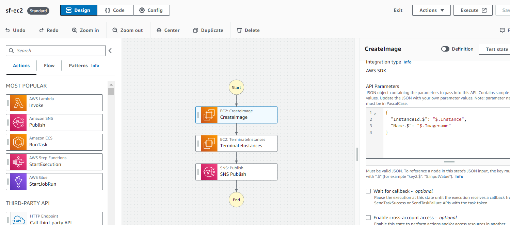
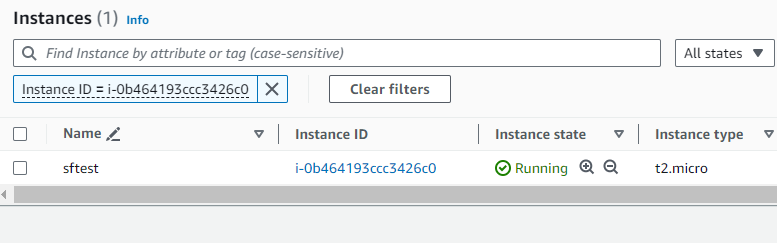
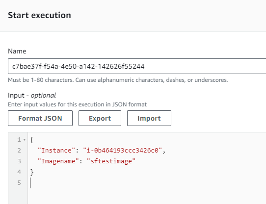
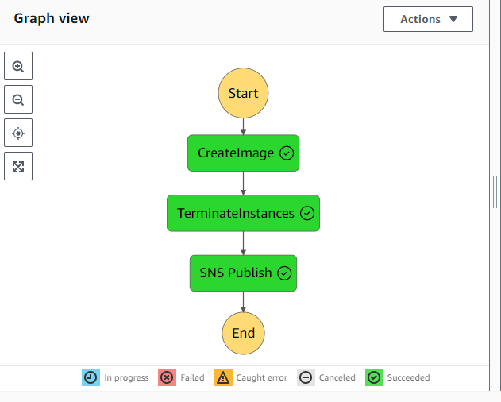
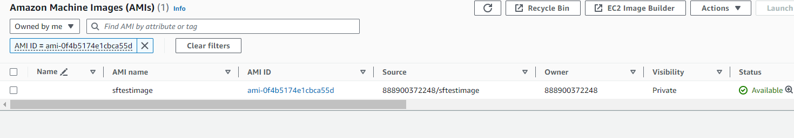
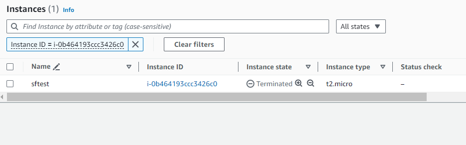
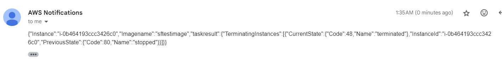

# AWS Step Function: Create AMI, Terminate EC2, and Send SNS Notification

- Step Functions are a great way to orchestrate workflows where we have to integrate multiple AWS services together.

- In this example, step function is taking an AMI of the instance for backup before terminating and is sending a notfication email afterwards to inform about the result. 

## Step 1: Creat a Step function
   - AWS console provides a great visual canvas to create step functions. We can drag and drop components from left hand panel and create the workflow. Step functions integrate with most of the AWS services.
  
  - I have created the required workflow, which takes as input instance ID and image name.
  
  

## Step 2: Create an ec2 instance
   - Create an ec2 instance in normal way using whatever method you prefer.
  

## Step 3: Run state function
   - Run the state function, pass instance id and image name as parameters.
  
{
  "Instance": "i-0b464193ccc3426c0",
  "Imagename": "sftestimage"
}

## Step 4: Verify the Execution
 - Verify in the console that execution has succeded
  
  
 
 - Verify that Image with name sftestimage has been created
   
   

- Verify that instance i-0b464193ccc3426c0 has been terminated
  
  

- Verify your notification message 
  
 

 ## Step 5: Additional Considerations

 - SNS is just sending the result from previous step as notification. We can modify it to make it more clearly legible to a layperson. 
  
- This is very simple and straightforward step function. A production function will have error handling logic using retry and catch also.

  