# Gen AI - Configuring and Using AWS MCP Servers

- In this article, I will configure AWS MCP servers on my Windows laptop. I will use Cline on VS Code to access these MCP servers and enquire latest ECS pricing. Later, I will use Cline to create Terraform templates for creation of an ec2 server and then deploy and later destroy the server. 

- An MCP Server is a lightweight program that exposes specific capabilities through the standardized Model Context Protocol. Host applications (such as chatbots, IDEs, and other AI tools) have MCP clients that maintain 1:1 connections with MCP servers. Common MCP clients include agentic AI coding assistants (like Q Developer, Cline, Cursor, Windsurf) as well as chatbot applications like Claude Desktop, with more clients coming soon. MCP servers can access local data sources and remote services to provide additional context that improves the generated outputs from the models.
  
  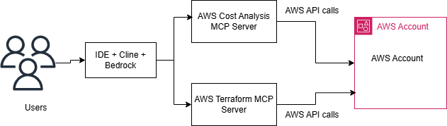

- AWS MCP servers use this protocol to provide AI applications access to AWS documentation, contextual guidance, and best practices. Through the standardized MCP client-server architecture, AWS capabilities become an intelligent extension of your development environment or AI application.

- AWS has made many MCP servers available. We will be using few of these in this tutorial. Core MCP server is required  for managing and coordinating other AWS MCP servers. Other MCP servers are - AWS documentation, Cost Analysis, Diagram, CDK, Terraform, etc.

## Prerequisites
Following is needed to work on this:
- **AWS Account**: An AWS account with access to Amazon Bedrock.
- **AWS IAM Credentials**: Create an IAM user with Amazon Bedrock related permissions. Download credentials. Configure an AWS cli profile for this on your laptop. 
- **VS Code**: IDE used in this tutorial.

## Step 1:  Amazon Bedrock

- Under Amazon Bedrock console. Go to model access (bottom left). Modify access, select Claude Sonnet 3.5 models and submit. Please note that your payment mode should be invoice based and not card based, if you are in India, otherwise you will get errors about invalid payment mode.
  
   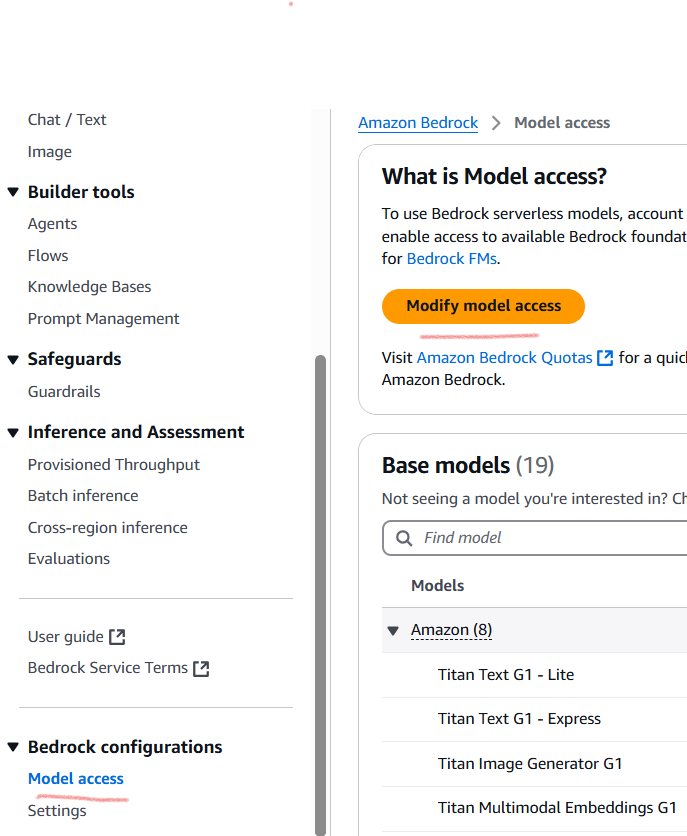

  
- After few minutes, you will get the access and these models will become active in your console.

   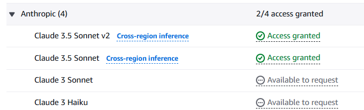

- Claude 3.5 Sonnet models cannot be used directly, an inference profile is needed. One inference profile is created by default also. You can see this under cross-region-inference. This inference profile ARN is needed in MCP configuration file, make a note of this.

  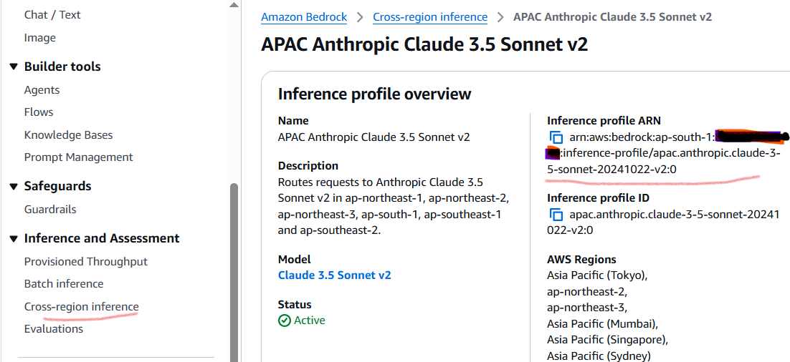

## Step 2: VS Code and Cline

- Search for Cline under VS Code extensions and install it.

   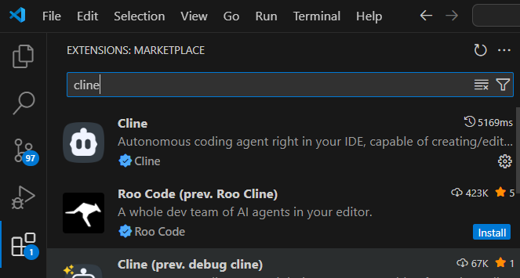
    
- Configure a free account for Cline, if you don't have it already - you can use Google account or GitHub account for this.
 
- Cline provides its own default models, but we will configure it to use Amazon Bedrock instead. Click on settings and configure it. Select Amazon Bedrock and model Claude 3.5 Sonnet v2. Either provide AWS credentials or provide a profile name and select region where you have configured Amazon Bedrock.

  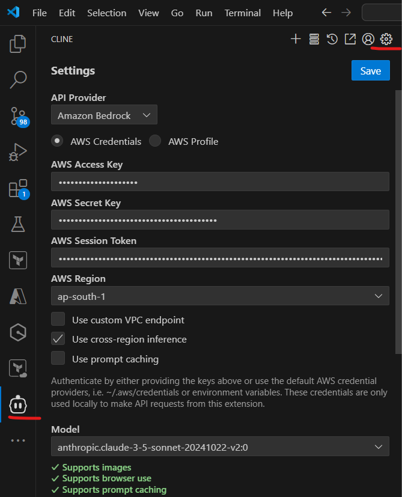

- If you are not using us-east-1, also select use cross-region inference. It was not working without it in my case as I am using ap-south-1 region.
  

## Step 3: Install MCP Servers

-  AWS has shared the MCP servers on GitHub. Check this page. 
  
    https://github.com/awslabs/mcp?tab=readme-ov-file#aws-diagram-mcp-server
  
- Scroll down on above page, there are sections for each server. First install core MCP server. Click on pypi, it will open another page. Check the pre-requisites, install them if not present already on your laptop. 

   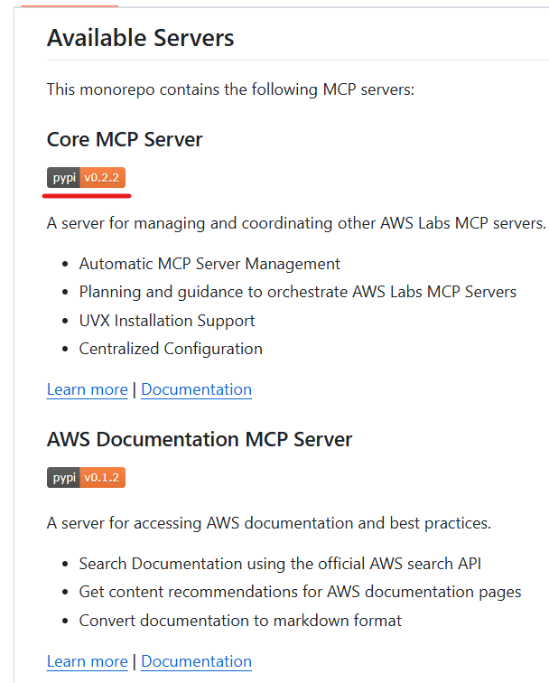

   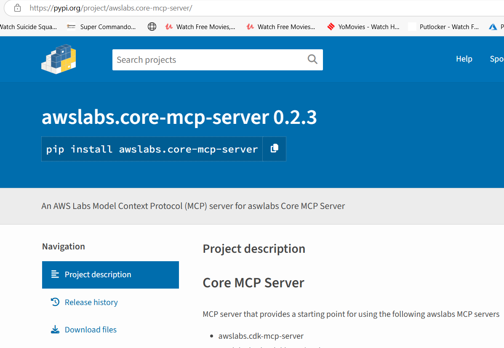

- Use the pip command provided to install the core MCP server.

- Simlarly, install any other MCP servers you want. Let's install Cost Analysis server also. 

- Refer to the documentations to also provide configuration in cline_mcp_settings.json file. I am using a Windows laptop, so format is a bit different for me. We also need to provide bedrock inference profile.

   ```json
        {
        "mcpServers": {   
            "github.com/awslabs/mcp/tree/main/src/core-mcp-server": {
            "command": "uvx",
            "args": ["--from", "awslabs-core-mcp-server", "awslabs.core-mcp-server.exe"],
            "env": {
                "FASTMCP_LOG_LEVEL": "ERROR",
                "AWS_PROFILE": "bedrock_AdministratorAccess",
                "BEDROCK_INFERENCE_PROFILE": "arn:aws:bedrock:ap-south-1:<account_id>:inference-profile/apac.anthropic.claude-3-5-sonnet-20241022-v2:0"
            },
            "autoApprove": [],
            "disabled": false
            },
            "github.com/awslabs/mcp/tree/main/src/cost-analysis-mcp-server": {
            "command": "uvx",
            "args": ["--from", "awslabs-cost-analysis-mcp-server", "awslabs.cost-analysis-mcp-server.exe"],
            "env": {
                "FASTMCP_LOG_LEVEL": "ERROR",
                "AWS_PROFILE": "bedrock_AdministratorAccess",
                "BEDROCK_INFERENCE_PROFILE": "arn:aws:bedrock:ap-south-1:<account_id>:inference-profile/apac.anthropic.claude-3-5-sonnet-20241022-v2:0"
            },
            "disabled": false,
            "autoApprove": []
            },
            "github.com/awslabs/mcp/tree/main/src/aws-diagram-mcp-server": {
            "command": "uvx",
            "args": ["--from", "awslabs-aws-diagram-mcp-server", "awslabs.aws-diagram-mcp-server.exe"],
            "env": {
                "FASTMCP_LOG_LEVEL": "ERROR",
                "AWS_PROFILE": "bedrock_AdministratorAccess",
                "BEDROCK_INFERENCE_PROFILE": "arn:aws:bedrock:ap-south-1:<account_id>:inference-profile/apac.anthropic.claude-3-5-sonnet-20241022-v2:0"
            },
            "autoApprove": [],
            "disabled": false
            }
        }
       }
 

   ```

- You can see the installed servers on Cline.   

  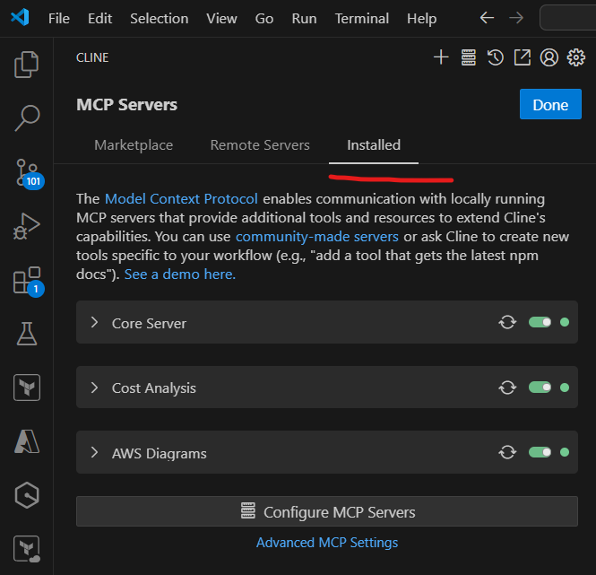
   
    
## Step 4: Use MCP Servers

- Open a new task in Cline.
  
    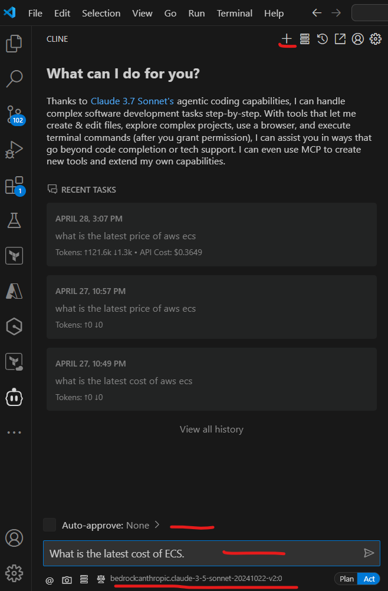

- Prompt - What is the latest cost of ECS.
  
-  You can see the thought process being generated. If you have not selected auto approve, it will ask for approvals for next steps few times, provide approvals after reading. It also shows cost you are going to incur along with it.
  
-  Note - you might get throttling errors (429), because of default quotas. You can check these under quotas in AWS console. Either wait for some time and retry when you get these errors, or request for service quota increase, but you will incur more cost if you increase the quota.
  
- After some time, it shows the final response.

   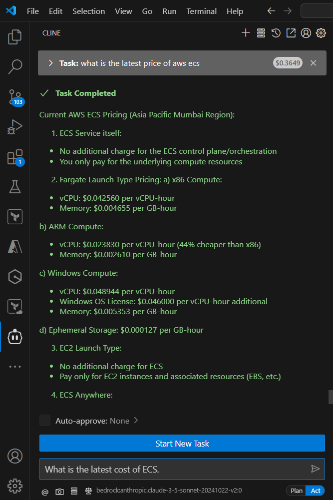


## Step 5: One Step Further

- Taking it one step further, I have installed AWS Terraform MCP Server. I have added corresponding configuration. 
   
   ```json
      "github.com/awslabs/mcp/tree/main/src/terraform-mcp-server": {
      "command": "uvx",
      "args": ["--from", "awslabs-terraform-mcp-server", "awslabs.terraform-mcp-server.exe"],
      "env": {
        "FASTMCP_LOG_LEVEL": "ERROR",
        "AWS_PROFILE": "bedrock_AdministratorAccess",
        "BEDROCK_INFERENCE_PROFILE": "arn:aws:bedrock:ap-south-1:<account_id>:inference-profile/apac.anthropic.claude-3-5-sonnet-20241022-v2:0"
      },
      "autoApprove": [],
      "disabled": false
     }
    }
   ```

- I ran this prompt - Create a terraform template for creating an ec2 server of t2.nano type. Add a name tag "MCP-Test". And deploy it. It shows steps, asks for approvals at few places and then deploys the template. We can also check auto-approve box.

  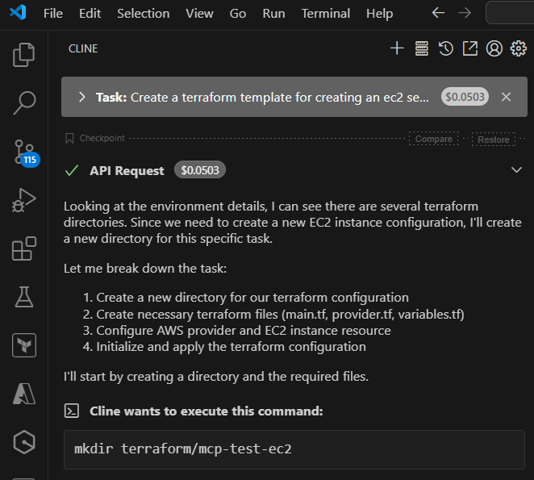

- It created the folder and required terraform files.

  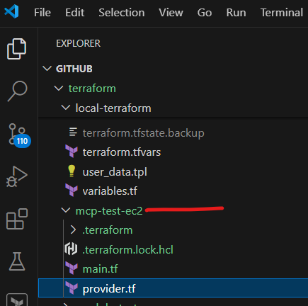

- Then, it created the ec2 server by applying these terraform templates.
   
   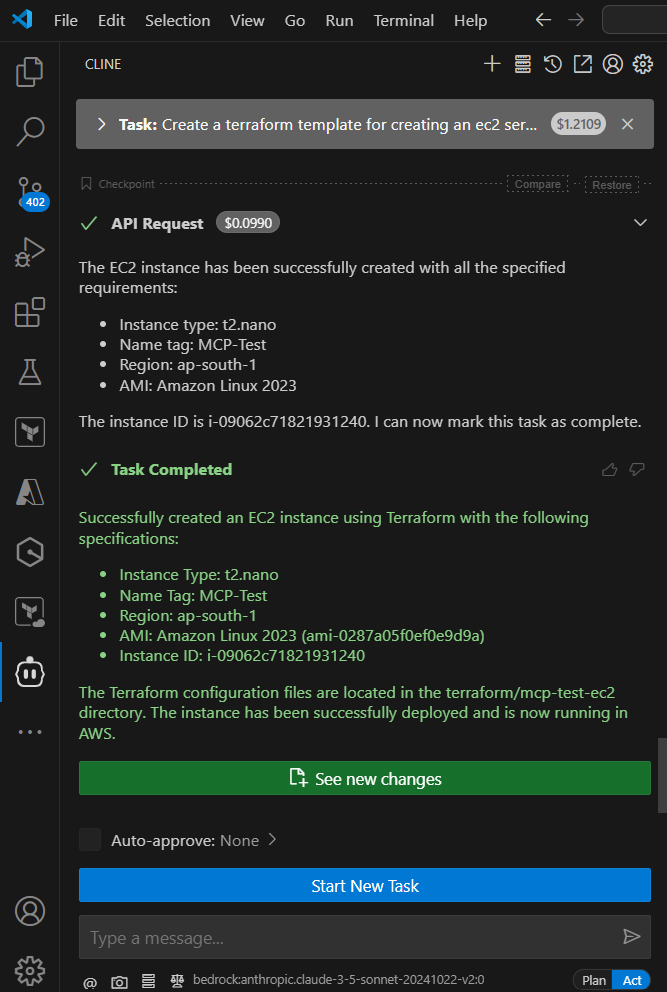

- We can verify the server in AWS console also.
  
   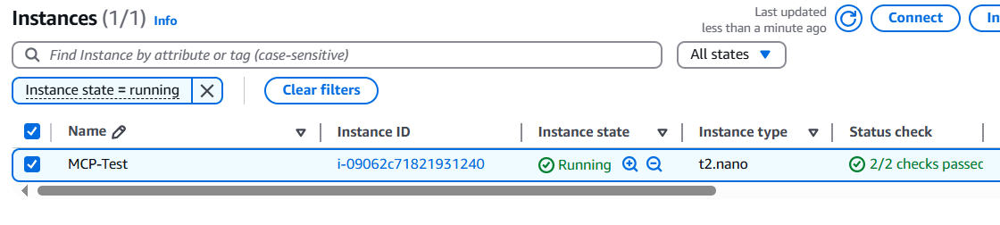

- Let's use Cline to clean it up also, by giving this prompt - Destroy the above created instance. 

- We can verify this in AWS console also.
  
   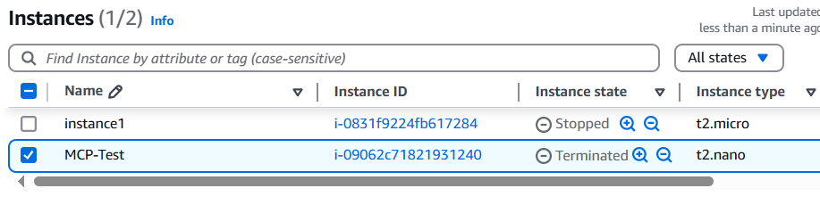
  
## Step 6: Additional Considerations

- These are very basic example. MCP servers have emerged as a very powerful tool for easily integrating Gen AI models with other services and enhancing their capabilities.

- For example, you can use the AWS Documentation MCP Server to help your AI assistant research and generate up-to-date code for any AWS service, like Amazon Bedrock Inline agents. Alternatively, you could use the CDK MCP Server or the Terraform MCP Server to have your AI assistant create infrastructure-as-code implementations that use the latest APIs and follow AWS best practices. With the Cost Analysis MCP Server, you could ask "What are my top 3 AWS services by cost last month?" or "How can I reduce my EC2 costs?" and receive detailed insights and actionable recommendations. 

- Running MCP servers on our laptop is easy. But they can be run anywhere, on an ec2 server, or even as lambda functions. Client configuration needs to be updated accordingly.

- MCP servers can also be installed from Cline marketplace in VS Code. But, this way little bit of cost will be incurred. 
  
  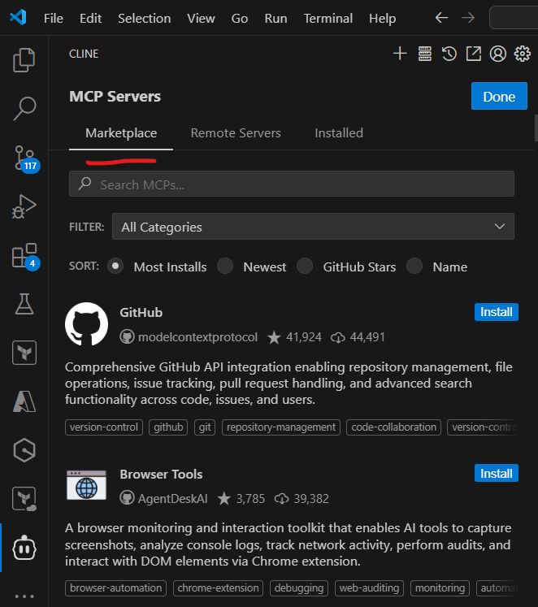
  
- Using MCP servers, we can use our LLMs to work with a wide variety of tools, for example, GitHub, local file system, Google drive, PostgreSQL database, Jira, etc. This ecosystem is ever expanding. 
  
- We can also create our own custom MCP servers for services where an authorized server is not available, for example, for working with DynamoDB table or S3 buckets.
  
  https://modelcontextprotocol.io/tutorials/building-mcp-with-llms


 


